# Multi-Agent System Architectures: Fundamental Patterns for Coordinating Autonomous Systems

> **Stop Building Fragile Agents: 8 Architectures for Resilient AI Systems**
>
> **Core Principle:** When multiple agents must work together toward a common goal, the architecture you choose determines whether the system succeeds or collapses. This isn't about trends or specific tools—these patterns emerge from fundamental constraints of coordination, and they apply to any domain where autonomous systems must collaborate.

---

## The Coordination Problem

Most systems begin with a single agent trying to do everything: think through problems, make decisions, take action, and learn from results. This works until it doesn't.

The moment you deploy a single agent at scale, you hit a fundamental wall:

- **The bottleneck**: One agent cannot think about legal contracts, analyze cybersecurity threats, and manage customer relationships simultaneously. The system becomes as slow as its slowest responsibility.
- **The error cascade**: When an agent makes a mistake in one domain, it affects everything downstream. A calculation error in financial analysis corrupts customer data.
- **The expertise limit**: No single agent can be expert at everything. Specialization improves accuracy.
- **The brittleness**: Changes to requirements force rewrites of the entire system.

The obvious solution is to use multiple agents. But this creates a new problem: **How do independent agents coordinate to achieve a common goal?**

This problem isn't new. Emergency dispatch systems coordinate multiple responders. Manufacturing companies coordinate assembly lines. Military organizations coordinate specialized units. When you abstract away the domain details, you find the same patterns appearing everywhere autonomous systems must work together.

---

## Understanding the Fundamental Trade-offs

Before understanding specific patterns, you must understand the constraints they navigate. These constraints are universal, not specific to AI agents.

### The Coordination Dimensions

When agents coordinate, they must balance fundamental trade-offs:

**1. Centralization vs. Distribution**
- **Centralized**: One coordinator makes all routing decisions. Simple to reason about, single point of failure. If the coordinator fails, everything fails.
- **Distributed**: Agents coordinate peer-to-peer. Resilient, complex to reason about. Difficult to guarantee consistency.

**2. Specialization vs. Generalization**
- **Specialized agents**: Each agent excels at one narrow domain. Effective, inflexible. Cannot handle edge cases outside their domain.
- **General-purpose agents**: Can handle anything. Flexible, less effective. Cannot achieve deep expertise.

**3. Speed vs. Reliability**
- **Fast execution**: Make decisions quickly, accept occasional errors. Good for low-stakes decisions.
- **Slow verification**: Verify thoroughly before acting. Required for high-stakes decisions, but customers may see delays.

**4. Simplicity vs. Flexibility**
- **Simple patterns**: Easy to implement and reason about. Handle common cases well, fail on edge cases.
- **Complex patterns**: Handle many scenarios, difficult to understand and debug.

These trade-offs are **irreducible**. No architecture can eliminate them all. Every system must choose which trade-offs to accept.

### Evaluation Criteria

When comparing approaches to agent coordination, consider:

- **Reliability**: Can the system recover from failures? Do errors compound?
- **Latency**: How quickly does the system respond to requests?
- **Throughput**: How many concurrent operations can it handle?
- **Debuggability**: When something fails, can you determine what went wrong?
- **Adaptability**: Can the system learn and improve over time?
- **Governance**: Can you apply consistent policies (security, compliance) across all agents?

Different patterns optimize for different criteria. None excel at everything.

---

## Pattern 1: Sequential Pipeline — Linear Workflow Coordination

**How It Works**: Agents arranged like an assembly line. Work flows from one agent to the next. Each agent takes the output of the previous agent, transforms it, and passes it to the next.

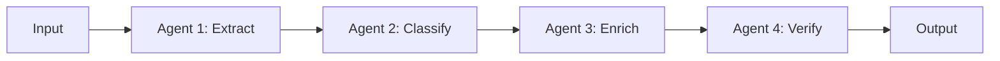

**Fundamental Mechanism**: This pattern leverages the principle of **separation of concerns**. Each stage has a single, well-defined responsibility. Information flows unidirectionally: no backtracking, no branching.

**State Management**: State is passed linearly (`State(t) = f(State(t-1))`). Each agent receives the output of the previous stage, processes it, and passes the new state forward. No shared memory is required.

**Why This Pattern Emerges**: Whenever work naturally decomposes into sequential stages, this pattern is optimal. Legal document processing: extract the legal issue → search relevant law → analyze precedents → synthesize conclusions. Each step depends on the previous one, and each agent can become expert in their narrow task.

**Strengths**:
- **Simplicity**: Straightforward logic, easy to reason about
- **Specialization**: Each agent becomes expert at their specific stage
- **Debuggability**: Errors are localized to specific stages
- **Testability**: Each stage can be tested independently

**Weaknesses**:
- **Inflexibility**: Only works for genuinely linear workflows
- **Latency**: Slowest agent in the pipeline becomes the bottleneck
- **Error propagation**: Errors in early stages propagate through all subsequent stages
- **Scaling**: Adding complexity forces adding more agents, increasing latency

**When to Use It**:
- Your workflow is genuinely sequential (stage N requires output from stage N-1)
- Each stage has distinct requirements
- Errors are easily detected and corrected
- Linear throughput is acceptable

**When NOT to Use It**:
- Work can happen in parallel
- Stages need to loop back (e.g., refinement cycles)
- Some stages are optional depending on input
- You need sub-second response times

**Real-World Pattern Recognition**: Document processing pipelines, diagnostic workflows (symptom → test → analysis → diagnosis), and content approval systems (create → review → correct → publish) all use this pattern naturally because the work is genuinely sequential.

---

## Pattern 2: Coordinator/Dispatcher — Centralized Routing

**How It Works**: One agent acts as a "coordinator." It receives requests, analyzes what type of work they are, and routes them to the appropriate specialist agent. Specialists handle the work independently, then return results to the coordinator for synthesis.

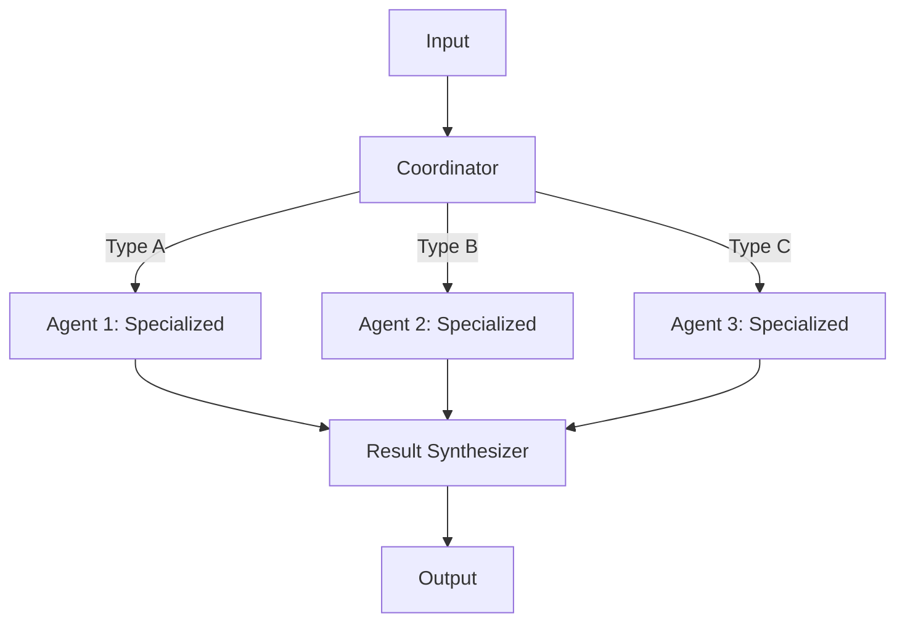

**Fundamental Mechanism**: This pattern leverages **specialization through decomposition by type**. Instead of sequential stages, you decompose by problem domain: billing questions go to one agent, technical questions go to another, account issues go to a third.

**State Management**: State is centralized during the routing phase. The Coordinator holds the request context, passes a slice of it to the specialist, and the Synthesizer recombines the results. Specialists are typically stateless.

**Why This Pattern Emerges**: When different types of requests require fundamentally different expertise, routing becomes necessary. A customer support system cannot handle billing, technical support, and account management equally well with a single agent. Specialization improves accuracy and expertise.

**Strengths**:
- **Specialization**: Each agent can develop deep expertise in one domain
- **Parallelization**: Multiple agents handle requests simultaneously
- **Scalability**: Adding new specialist agents doesn't affect existing ones
- **Flexibility**: Routing logic can be updated without changing specialists

**Weaknesses**:
- **Coordinator dependency**: If the coordinator fails, the entire system fails
- **Routing complexity**: The coordinator must accurately classify requests
- **Misrouting**: Requests routed to wrong agent cause poor responses
- **Overhead**: Every request goes through routing, adding latency

**When to Use It**:
- You have multiple distinct domains or specialties
- Different domains require different knowledge bases
- Requests come unclassified (system must determine type)
- Specialist accuracy matters more than latency

**When NOT to Use It**:
- You have only one or two types of work
- All work requires the same knowledge
- Latency is critical (routing adds overhead)
- Requests can be pre-classified

**Real-World Pattern Recognition**: Emergency dispatch (fire vs. medical vs. police), customer service routing, hospital triage systems, and technical support routing all use this pattern because different problems require different expertise.

---

## Pattern 3: Parallel Fan-Out and Gather — Concurrent Investigation

**How It Works**: One orchestrator agent breaks a complex problem into independent sub-problems. Multiple specialist agents investigate these in parallel. Results are gathered and synthesized into a comprehensive answer.

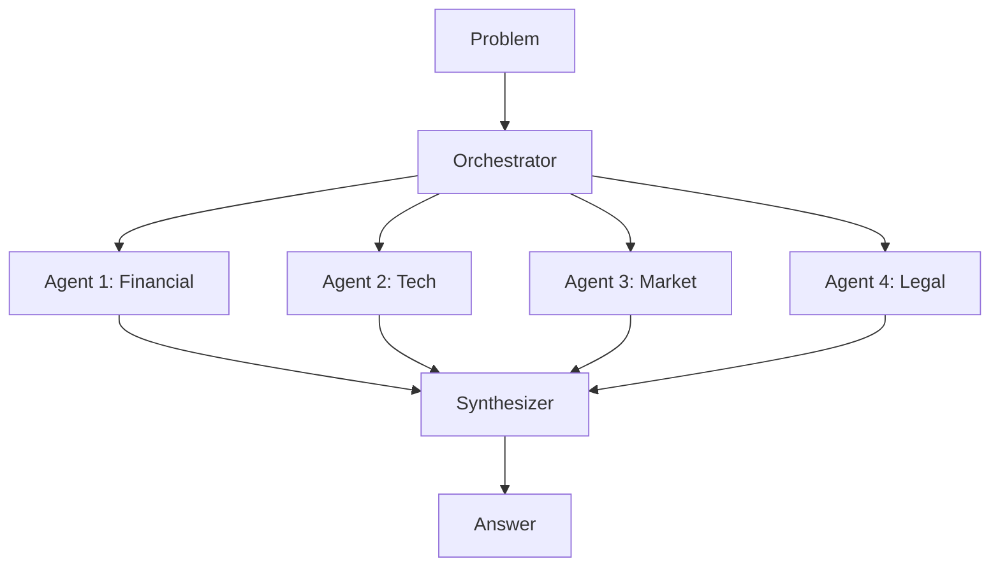

**Fundamental Mechanism**: This pattern leverages **parallelization of independent work**. Unlike sequential pipelines, these investigations don't depend on each other. They can run simultaneously, reducing total time.

**State Management**: State is "forked" and "joined". The Orchestrator broadcasts the initial state (problem definition) to all agents. Each agent maintains its own working state. The Synthesizer merges these disjoint states into a final consistent state.

**Why This Pattern Emerges**: When you need comprehensive coverage of a problem and speed matters, parallelization provides better answers faster. Acquisition due diligence requires financial analysis, technology assessment, market analysis, and team evaluation. These can happen simultaneously rather than sequentially.

**Strengths**:
- **Speed**: N parallel investigations take 1/N the time of sequential
- **Comprehensiveness**: Multiple perspectives provide better analysis
- **Resilience**: One investigator's failure doesn't stop others
- **Quality**: Synthesized results are better than any single investigation

**Weaknesses**:
- **Complexity**: Orchestrating parallel work is harder than sequential
- **Coordination overhead**: Waiting for all agents to complete
- **Idle time**: Some agents finish before others (resource waste)
- **Synthesis challenge**: Combining different formats and conclusions

**When to Use It**:
- Problem naturally decomposes into independent sub-problems
- Speed is important
- Comprehensive coverage matters
- You have multiple specialist agents available

**When NOT to Use It**:
- Sub-problems are interdependent
- You have only one agent type
- Latency variability is unacceptable (slowest agent determines total time)
- Synthesis is too complex

**Real-World Pattern Recognition**: Security threat analysis (analyze network patterns in parallel with malware databases, historical incidents, and system configuration), acquisition due diligence, competitive analysis, and research synthesis all use this pattern because multiple independent investigations provide better results faster.

---

## Pattern 4: Generator-Critic — Iterative Quality Improvement

**How It Works**: One agent generates an output. Another agent critiques it against quality criteria. If quality is insufficient, the critic provides feedback to the generator, which revises. This loop continues until quality reaches threshold.

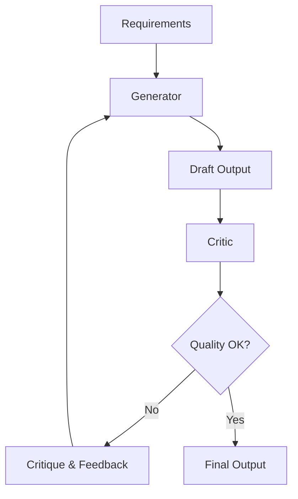

**Fundamental Mechanism**: This pattern leverages **iterative refinement through specialized feedback**. Separating generation from criticism allows each to be optimized independently. The generator focuses on creativity and output; the critic focuses on quality and consistency.

**State Management**: State is versioned. The system retains a history of drafts and feedback (State V1, Critique, State V2, etc.). This allows the system to detect if it is cycling or converging.

**Why This Pattern Emerges**: When outputs are too important to get right the first time, iteration becomes necessary. Legal contracts must be precise. Code must pass tests. Financial analyses must be accurate. Building quality in gradually through feedback is more reliable than trying to get it perfect initially.

**Strengths**:
- **Quality assurance**: No low-quality output ships
- **Specialization**: Generator optimizes for creation, critic optimizes for quality
- **Transparency**: Quality criteria are explicit and measurable
- **Learning**: Each iteration improves the output

**Weaknesses**:
- **Latency**: Iteration adds delay (multiple cycles × time per cycle)
- **Complexity**: Feedback mechanism must be well-designed
- **Convergence uncertainty**: May never reach quality threshold (infinite loops)
- **Resource consumption**: Multiple iterations consume resources

**When to Use It**:
- Quality thresholds are clear and measurable
- First-pass accuracy is low
- Cost of failures is high
- You can define quality criteria algorithmically

**When NOT to Use It**:
- Speed is critical (iteration adds delay)
- Quality criteria are subjective
- First-pass accuracy is already high
- Resource consumption is constrained

**Real-World Pattern Recognition**: Code generation with test suites, document generation with policy review, content creation with editorial review, and algorithmic output with consistency checking all use this pattern because quality matters more than speed.

---

## Pattern 5: Human-in-the-Loop — Bounded Autonomy with Oversight

**How It Works**: Agents operate autonomously for routine decisions. High-stakes decisions are flagged for human review before execution. Humans approve, reject, or request revision. The system learns from human decisions.

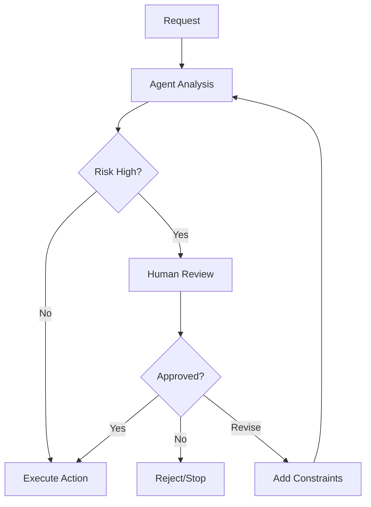

**Fundamental Mechanism**: This pattern leverages **bounded autonomy with human judgment**. Agents handle routine, low-stakes decisions where they're reliable. Humans handle edge cases and high-stakes decisions where judgment matters.

**State Management**: State acts as a "checkpoint". The system state includes a status flag (pending_review, approved, rejected). When "pending_review", the state persists until an external signal (human API call) updates it.

**Why This Pattern Emerges**: Autonomous systems are reliable on routine decisions but unpredictable on novel situations. Humans are flexible and responsible but slow. Combining them optimizes both: speed for routine cases, reliability for important cases.

**Strengths**:
- **Risk mitigation**: High-stakes decisions don't fail silently
- **Accountability**: Humans remain responsible for critical decisions
- **Compliance**: Audit trails show human oversight
- **Trust building**: Transparency increases user confidence
- **Learning**: System learns from human corrections

**Weaknesses**:
- **Latency**: Human review adds delay
- **Bottleneck**: Humans can become bottleneck if too many cases need review
- **Consistency**: Humans make inconsistent decisions (same case, different human, different outcome)
- **Scalability**: Doesn't scale with volume (humans can only review so many)

**When to Use It**:
- High-stakes decisions (financial, legal, safety)
- Regulatory requirements demand human oversight
- Cost of agent failure is high
- Trust is more important than speed

**When NOT to Use It**:
- Decisions are routine and low-stakes
- Scale requires decisions faster than humans can review
- Human judgment is unreliable on the domain
- System is fully autonomous by design

**Real-World Pattern Recognition**: Insurance claim approval (routine claims auto-approved, complex claims reviewed by humans), financial transaction authorization (normal transactions instant, unusual transactions flagged), medical diagnosis (routine cases reviewed quickly, complex cases reviewed thoroughly), and legal document approval all use this pattern because high-stakes decisions require human judgment.

---

## Pattern 6: Hierarchical Delegation — Recursive Task Decomposition

**How It Works**: High-level coordinator breaks down a complex goal into major sub-goals and delegates to intermediate agents. Those agents break their sub-goals into smaller tasks and delegate to specialists. Information flows up the hierarchy as results complete.

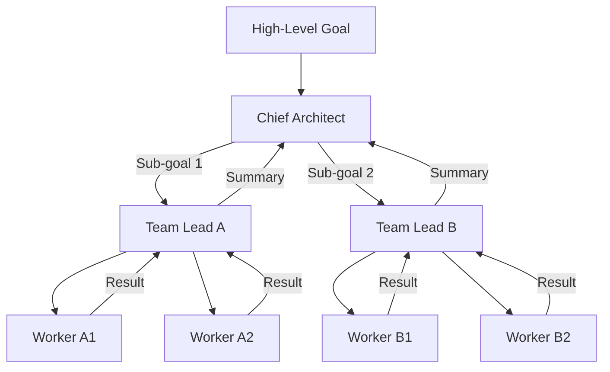

**Fundamental Mechanism**: This pattern leverages **recursive decomposition**. Complex problems that can't be solved by single agents or in parallel are broken down recursively until each piece is simple enough for a specialist agent.

**State Management**: State is tree-structured. Parent nodes maintain the "plan" and status of child nodes. Information flows down as directives (goal definitions) and up as results (summarized reports). Intermediate nodes must synthesize child results before reporting up.

**Why This Pattern Emerges**: Some problems are too large and complex for flat patterns. Product launches, system migrations, and complex research projects naturally decompose into hierarchies: goals → initiatives → projects → tasks → subtasks.

**Strengths**:
- **Handles complexity**: Can manage problems with many levels
- **Clear responsibility**: Each level knows what it owns
- **Parallel execution**: Different branches can work independently
- **Scalability**: Grows naturally with problem complexity

**Weaknesses**:
- **Coordination overhead**: Many agents must coordinate
- **Information loss**: High-level goals may get lost in details
- **Debugging difficulty**: Finding which level failed is hard
- **Synchronization**: Waiting for all branches to complete

**When to Use It**:
- Problem naturally decomposes hierarchically
- Different decomposition levels require different expertise
- Volume is large enough to warrant multiple levels
- Dependencies can be managed

**When NOT to Use It**:
- Problem is flat (no natural hierarchy)
- All parts require the same specialist
- Latency is critical
- Problem is too simple (flat coordinator works)

**Real-World Pattern Recognition**: Large project management, complex scientific research, organizational decision-making, and disaster response coordination all use hierarchical delegation because some problems genuinely require multiple levels of coordination.

---

## Pattern 7: Router — Intelligent Classification and Dispatch

**How It Works**: A specialized agent analyzes incoming requests, classifies what they're asking for, and routes them to the appropriate handler. This differs from the Coordinator in that routing is based on intent/content classification, not simple type detection.

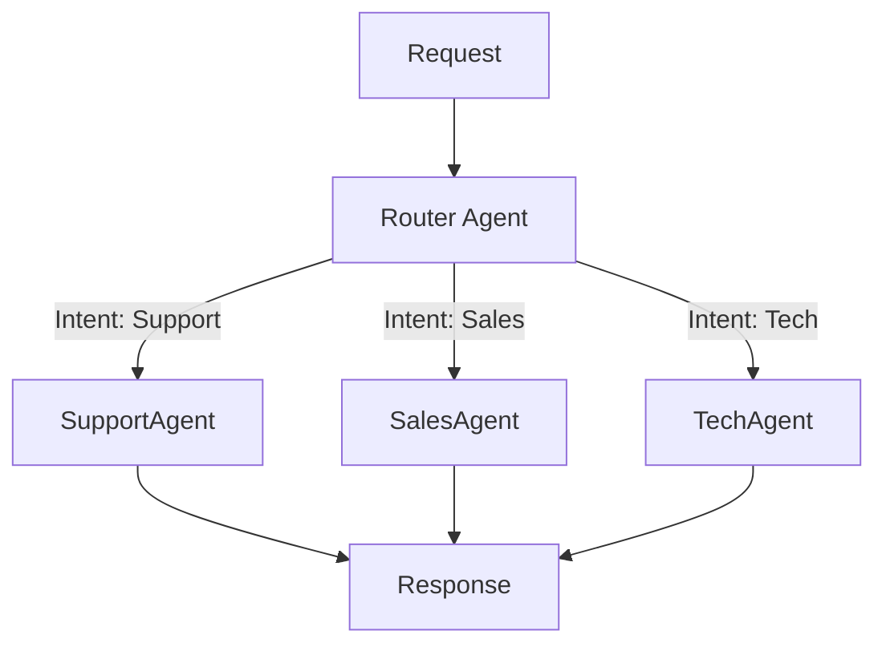

**Fundamental Mechanism**: This pattern leverages **semantic understanding for routing**. Unlike simple type-based routing, semantic routing understands nuance: "I was charged twice" goes to billing, but "Why was I charged?" might go to finance education.

**State Management**: State is transient. The router calculates a vector embedding or classification score, determines the path, and then discards the state. The chosen route handles the persistent interaction.

**Why This Pattern Emerges**: When requests come in natural language or unstructured format, simple rules fail. Semantic routing improves accuracy by understanding what the request is really asking.

**Strengths**:
- **Accuracy**: Semantic understanding reduces misrouting
- **Flexibility**: Can handle ambiguous requests
- **Scalability**: Adding new intents doesn't require retraining router
- **User experience**: System understands what users actually mean

**Weaknesses**:
- **Complexity**: Semantic classification is harder than type matching
- **Brittleness**: Edge cases cause misclassification
- **Latency**: Classification takes time
- **False confidence**: Router may be confident in wrong classification

**When to Use It**:
- Requests come unstructured or in natural language
- Intent classification is non-obvious
- Misrouting cost is high
- You can train/maintain a good classifier

**When NOT to Use It**:
- Requests are pre-structured and typed
- Intent is obvious from metadata
- Latency is critical
- You don't have good training data for classifier

**Real-World Pattern Recognition**: Customer service systems handling natural language queries, search engines routing queries to specialized indexes, and data analytics systems understanding what users want to know all use router patterns because request intent is often non-obvious from structure.

---

## Pattern 8: Iterative Refinement — Continuous Improvement Cycles

**How It Works**: A system produces output, measures quality against metrics, captures feedback on what's wrong, and iterates. Each iteration improves the output based on feedback. Different from Generator-Critic because feedback comes from external quality metrics or actual users, not a separate critic agent.

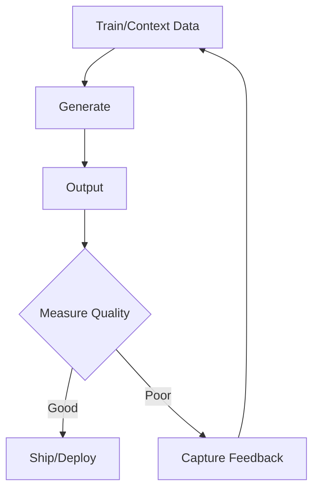

**Fundamental Mechanism**: This pattern leverages **empirical feedback for improvement**. Rather than trying to get it right through iteration (Generator-Critic), this pattern learns from usage: how do users actually interact with the system? What feedback do they give?

**State Management**: State is persistent and cumulative. The "knowledge base" identifies state. Every iteration updates the shared memory (improving the prompt, fine-tuning the model, or updating the retrieval database). State exists *across* requests, not just within them.

**Why This Pattern Emerges**: Some outputs improve through usage data and feedback rather than pre-defined quality criteria. Documentation gets clearer when authors see what confuses users. Analysis improves when analysts see what questions users actually ask.

**Strengths**:
- **Real-world grounding**: Improves based on actual usage, not pre-defined criteria
- **Continuous improvement**: Can improve over time with feedback loops
- **Adaptive**: Learns from changing requirements
- **Resilience**: Failures become learning opportunities

**Weaknesses**:
- **Delay**: Improvement lags behind deployment
- **Measurement challenge**: How do you measure "quality"?
- **Convergence**: May reach local optimum, not global
- **Data requirements**: Need volume of feedback to learn

**When to Use It**:
- Quality criteria are subjective or discovered through usage
- You can measure feedback quantitatively
- Continuous improvement is acceptable
- You have data pipeline to capture usage metrics

**When NOT to Use It**:
- Quality standards are pre-defined and absolute
- You don't have feedback mechanisms
- Errors are unacceptable (can't learn by failing)
- You need immediate high quality

**Real-World Pattern Recognition**: Search engine ranking, recommendation systems, documentation improvement, and customer support systems all use iterative refinement because these systems improve through use and feedback rather than pre-defined specifications.

---

## The Sense-Plan-Act-Learn Cycle: The Irreducible Core

All eight patterns instantiate variations of a useful control loop. In practice, most coordinated systems implement some version of this cycle (explicitly or implicitly):

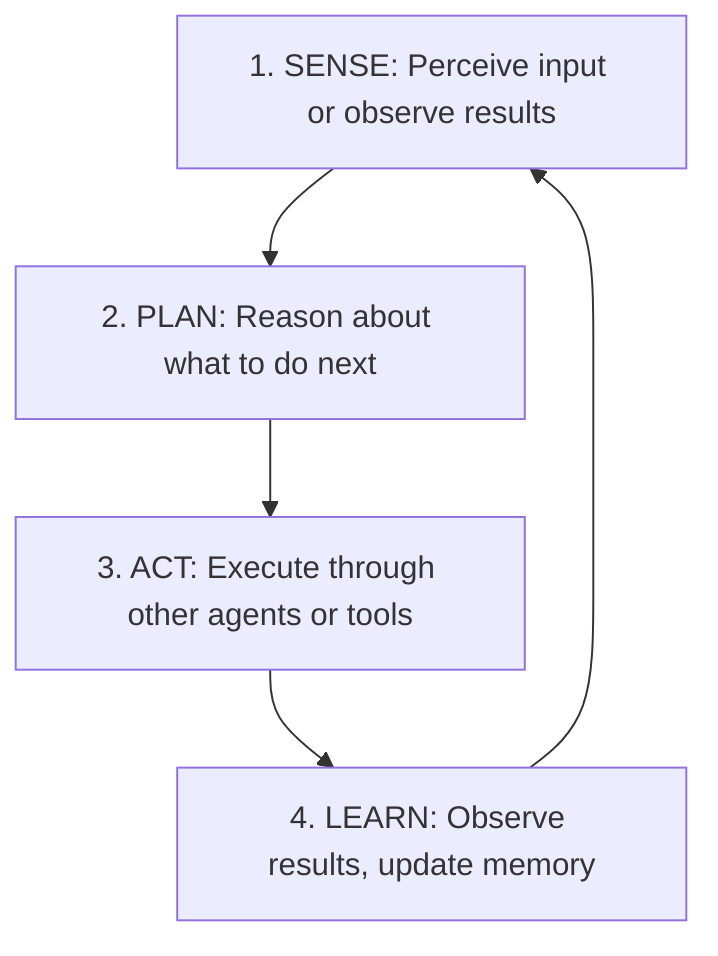

This cycle is universal, not specific to AI agents:
- **Sequential Pipeline**: Sense (previous output) → Plan (transform needed) → Act (invoke next stage) → Learn (verify completion)
- **Coordinator**: Sense (request type) → Plan (routing decision) → Act (send to specialist) → Learn (aggregate results)
- **Router**: Sense (request content) → Plan (classify intent) → Act (route to handler) → Learn (feedback on accuracy)

If you remove a step entirely, you typically reintroduce it somewhere else (e.g., in a coordinator, in downstream services, or in human operational work). The difference is *where* the failure modes appear.

### The Five Irreducible Capabilities

In practice, coordinated systems tend to require these capabilities in some form; when one is missing, coordination usually degrades (more errors, retries, escalations, or manual work):

1. **Perception/Sensing**: Acquire environmental data (user input, tool results, system events)
2. **Planning/Reasoning**: Formulate strategies and make decisions
3. **Action/Execution**: Perform tasks or delegate to other agents
4. **Tool/Resource Access**: Invoke external systems (databases, APIs, tools)
5. **Memory Management**: Maintain state and learn from interactions

These aren't implementation details. They're fundamental requirements for any coordinated system.

---

## Comparing Approaches: Trade-off Matrix

Different patterns optimize for different criteria. None excel at everything.

> Note: this matrix is intentionally qualitative. Treat it as a starting point for discussion, not a measurement.

| Criterion | Sequential | Coordinator | Fan-Out/Gather | Generator-Critic | Human-in-Loop | Hierarchical | Router | Iterative |
|-----------|-----------|-------------|-----------------|------------------|---------------|-------------|--------|-----------|
| **Speed** | Moderate | Fast | Fast | Slow (iteration) | Slow (human review) | Moderate | Moderate | Moderate |
| **Reliability** | Moderate | High | High | High | Very High | Moderate | High | Moderate |
| **Simplicity** | High | High | Moderate | High | High | Low | Moderate | Moderate |
| **Specialization** | High | High | High | Moderate | High | High | High | Low |
| **Scalability** | Moderate | High | High | Moderate | Low | High | High | High |
| **Learning/Adaptation** | Low | Low | Low | Moderate | High | Low | Moderate | High |
| **Governance** | Moderate | High | Moderate | High | Very High | High | High | Low |

**How to read this:**
- **High** = usually a strength of the pattern
- **Moderate** = workable with trade-offs
- **Low** = often expensive or fragile without extra engineering

---

## Evidence and Grounding (What’s “Proven” vs. Heuristic)

This article mixes two kinds of knowledge:

1. **Evidence-backed observations** (useful for motivating investments):
    - Continuous delivery and DevOps research (popularized via *Accelerate*) argues that high-performing delivery organizations can achieve both speed and stability rather than trading one for the other. See: https://itrevolution.com/product/accelerate/ and https://continuousdelivery.com/

2. **Architectural heuristics** (useful for design decisions, but context-dependent):
    - The pattern descriptions and the trade-off matrix are frameworks for reasoning about coordination. Their “scores” will shift with your domain, your tooling, and your operational maturity.

3. **Modern multi-agent workflow references** (useful as concrete examples of agent interaction patterns):
    - Recent papers like AutoGen and CAMEL describe multi-agent conversation frameworks and role-based coordination patterns. These help validate that the patterns are implementable in today’s LLM era, but they’re not a substitute for production telemetry. See: https://arxiv.org/abs/2308.08155 and https://arxiv.org/abs/2303.17760

### Decision Framework: Which Pattern to Use?

**Use Sequential Pipeline when:**
- Work flows naturally in stages
- Each stage requires previous output
- Specialization is valuable
- Speed is acceptable
- Workflow is stable

**Use Coordinator when:**
- You have distinct domains/specialties
- Different work types require different expertise
- Scalability matters
- Adding new specialties won't break existing system

**Use Parallel Fan-Out/Gather when:**
- Problem decomposes into independent sub-problems
- Speed matters more than complexity
- Multiple perspectives improve quality
- You have enough specialist agents

**Use Generator-Critic when:**
- Quality thresholds are clear and measurable
- First-pass accuracy is low
- Cost of failure is high
- Speed is less important than correctness

**Use Human-in-the-Loop when:**
- High-stakes decisions require human judgment
- Regulatory compliance demands oversight
- Cost of agent error is significant
- Accountability matters

**Use Hierarchical Delegation when:**
- Problem naturally decomposes into levels
- Different organizational levels have different scope
- Volume is large enough for multiple levels
- Dependencies can be managed

**Use Router when:**
- Requests come unstructured (natural language)
- Intent classification is important
- Simple type-based routing fails
- Accuracy of routing matters

**Use Iterative Refinement when:**
- Quality criteria are discovered through usage
- Continuous improvement is acceptable
- You can measure feedback quantitatively
- System will be in production for extended period

### Visual Selection Guide

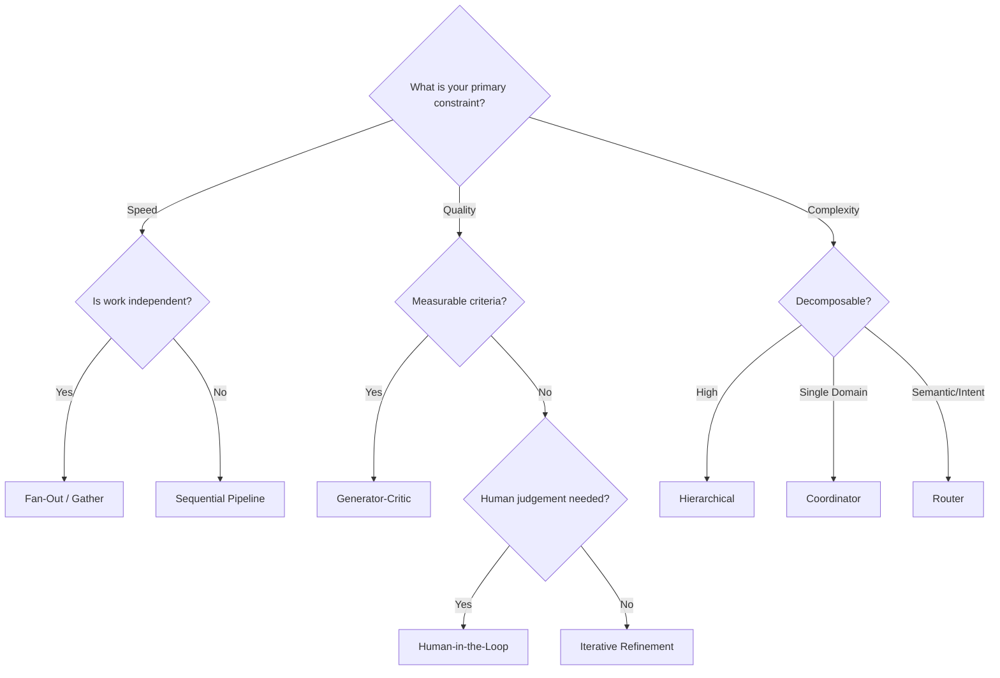

### Visualizing the Ecosystem: Complexity vs. Capability

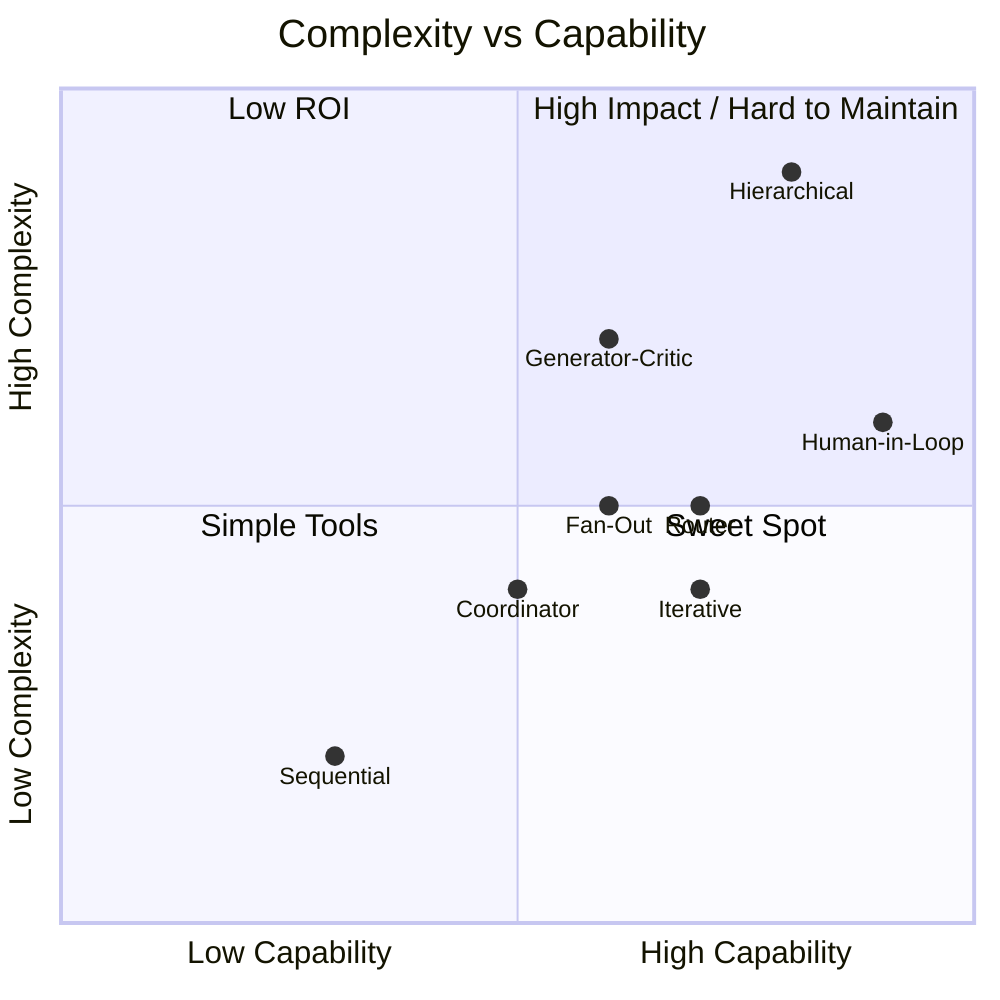

---

## Hybrid Approaches

Real systems rarely use a single pattern. They combine multiple patterns:

**Example: Customer Support System**
1. **Router** classifies incoming request by intent
2. **Coordinator** routes to appropriate specialist based on routing decision
3. **Sequential Pipeline** within each specialist (gather context → generate response → verify quality)
4. **Human-in-the-Loop** for escalations and complex cases
5. **Iterative Refinement** over time (tracking which responses satisfied customers)

**Example: Content Analysis System**
1. **Parallel Fan-Out/Gather** to analyze content from multiple angles simultaneously
2. **Generator-Critic** to ensure analysis meets quality standards
3. **Sequential Pipeline** to transform analysis into publishable format
4. **Human-in-the-Loop** for sensitive findings

Combining patterns allows you to optimize different parts of your system for different criteria.

---

## What Stays the Same, What Changes

### Will These Patterns Still Matter in 5-10 Years?

**These patterns are fundamental, not tied to a specific agent framework.**

Consider their analogs:
- **Manufacturing**: Assembly lines (sequential), quality control (generator-critic), inspection points (human-in-the-loop) have persisted for decades, even as technology changed
- **Military**: Command hierarchies (hierarchical delegation), specialist units (coordinator), task forces (parallel fan-out) have persisted across long time horizons
- **Software**: Microservices (coordinator), pipelines (sequential), and reliability practices (human oversight/guardrails) have become common patterns in modern systems

These patterns solve recurring coordination problems. They’re likely to remain useful as long as systems must coordinate multiple autonomous actors.

**What will change:**
- **Implementation mechanisms**: The specific protocols used (how agents communicate)
- **Tools and platforms**: The frameworks used to build systems
- **Standardization**: How patterns are encoded and shared
- **Optimization**: How efficiently patterns execute

**What won't change:**
- **Core patterns**: These eight patterns are fundamental
- **Trade-offs**: Centralization vs. distribution, speed vs. reliability
- **Requirements**: Need for sensing, planning, acting, memory
- **Evaluation criteria**: Reliability, latency, throughput, debuggability

---

## Conclusion: Thinking About Coordination

The fundamental insight: **coordinating multiple autonomous agents requires choosing between unavoidable trade-offs.**

Whether you use Large Language Models, classical AI, human teams, or something not yet invented, you'll face the same architectural choices:

- **Centralize or distribute** control?
- **Specialize or generalize** capabilities?
- **Optimize for speed or reliability**?
- **Keep it simple or build flexibility**?

The eight patterns represent stable solutions to these trade-offs. They work because they align with fundamental constraints of coordination, not because they're fashionable.

When approaching similar problems, ask yourself:

1. **What naturally flows sequentially?** (Sequential Pipeline)
2. **What requires routing to specialists?** (Coordinator or Router)
3. **What can be parallelized?** (Parallel Fan-Out/Gather)
4. **What needs iterative improvement?** (Generator-Critic or Iterative Refinement)
5. **Where do humans need oversight?** (Human-in-the-Loop)
6. **What decomposes hierarchically?** (Hierarchical Delegation)

Your system will likely combine multiple patterns, trading off different qualities in different areas. That's not a problem—it's the right way to design complex systems.

---

## References

### Classic Architecture & Coordination Theory
1. Conway, M. E. (1968). *How Do Committees Invent?* (background + citation trail: https://en.wikipedia.org/wiki/Conway%27s_law)
2. Dijkstra, E. W. (1975). *Guarded Commands, Nondeterminacy and Formal Derivation of Programs.* (work + DOI listed here: https://en.wikipedia.org/wiki/Edsger_W._Dijkstra)
3. Parnas, D. L. (1972). *On the Criteria to Be Used in Decomposing Systems into Modules.* (work + DOI listed here: https://en.wikipedia.org/wiki/David_Parnas)
4. Jackson, M. A. (1975). *Principles of Program Design.* (catalog record: https://openlibrary.org/books/OL30282123M/Principles_of_Program_Design)

### Distributed Systems & Coordination
5. Lamport, L. (1978). *Time, Clocks, and the Ordering of Events in a Distributed System.* (overview + links: https://en.wikipedia.org/wiki/Time,_Clocks,_and_the_Ordering_of_Events_in_a_Distributed_System)
6. CAP theorem (Brewer, 2000; later formalizations/clarifications). (overview + refs: https://en.wikipedia.org/wiki/CAP_theorem)
7. Kleppmann, M. (2017). *Designing Data-Intensive Applications.* (publisher page: https://www.oreilly.com/library/view/designing-data-intensive-applications/9781491903063/)

### Multi-Agent Systems & Agentic Workflows
8. Russell, S. & Norvig, P. *Artificial Intelligence: A Modern Approach.* (overview: https://en.wikipedia.org/wiki/Artificial_Intelligence:_A_Modern_Approach)
9. Wooldridge, M. (2009). *An Introduction to MultiAgent Systems (2nd ed.).* (author page: https://www.cs.ox.ac.uk/people/michael.wooldridge/pubs/imas/IMAS2e.html)
10. Wu, Q., et al. (2023). *AutoGen: Enabling Next-Gen LLM Applications via Multi-Agent Conversation.* (arXiv: https://arxiv.org/abs/2308.08155)
11. Li, G., et al. (2023). *CAMEL: Communicative Agents for "Mind" Exploration of Large Language Model Society.* (arXiv: https://arxiv.org/abs/2303.17760)

### Production System Architecture
12. Rotem-Gal-Oz, A. (2012). *SOA Patterns.* (publisher page: https://www.manning.com/books/soa-patterns)
13. Newman, S. (2015). *Building Microservices.* (publisher page: https://www.oreilly.com/library/view/building-microservices/9781491950340/)
14. Forsgren, N., Humble, J., & Kim, G. (2018). *Accelerate.* (publisher page: https://itrevolution.com/product/accelerate/)
15. Humble, J. & Farley, D. (2010). *Continuous Delivery.* (overview: https://continuousdelivery.com/)

### Practical Experiences with Coordination
16. Cockcroft, A. (2023). *Microservices Retrospective – What We Learned (and Didn’t Learn) from Netflix.* (transcript: https://www.infoq.com/presentations/microservices-netflix-industry/)

---

## Further Exploration

To deepen your understanding of coordination, explore these foundational concepts:

- **Consensus algorithms** (Paxos, Raft): How distributed systems achieve agreement despite failures
- **Queueing theory**: Why buffering and wait times are inherent in coordinated systems
- **Game theory**: How incentives affect agent behavior in multi-agent systems
- **Organizational design**: How human organizations solve the same coordination problems
- **Complex adaptive systems**: Why emergent behavior arises from simple interaction rules
