# The Art of Sharding — Part I: The Foundation (Easy)


> *"The secret to building large systems is not building large systems. It is building small systems that work together."*

> **System Design Reality**: If you want to build Instagram, don't just add more RAM. Teach your data to live across a thousand servers. This is Sharding.

## Preface: The Breaking Point

Imagine your startup has just gone viral.

Your single database server is a hero. It has served you well from 0 to 100,000 users. But today, the CPU is pegged at 100%. Queries are timing out. You buy the biggest server AWS offers—128 cores, 4TB RAM—but a week later, even that monster is choking.

You have hit the physical limits of **Vertical Scaling**. You can't make the hardware bigger.

You have only one choice left: **Divide and Conquer**.

You must break your monolithic database into pieces (shards) and scatter them across a fleet of commodity servers. This transition—from a single comfortable database to a distributed fleet—is the specialized art of **Sharding**.

This guide is your map through that transition. It starts with the basics (Easy), moves to valid architectural patterns (Medium), and finally tackles the nightmares that keep engineers awake at night (Hard).

---

## Table of Contents

- [Preface: The Breaking Point](#preface-the-breaking-point)
- [Overview: Splitting the Infinite Library](#overview-splitting-the-infinite-library)
- [The Three Promises of Sharding](#the-three-promises-of-sharding)
- [EASY #1: The Golden Rule (Shard Key)](#easy-1-the-golden-rule-shard-key)
- [EASY #2: The Simple Path (Hash-Based Sharding)](#easy-2-the-simple-path-hash-based-sharding)
- [EASY #3: The Decision (When to Apply)](#easy-3-the-decision-when-to-apply)

### Other Parts

- [Part II: The Architecture (Medium)](sharding-core-concept-part2-architecture.md)
- [Part III: The Expert Zone (Hard)](sharding-core-concept-part3-expert-zone.md)
- [Part IV: The Final Test (System Design)](sharding-core-concept-part4-final-test.md)

---

## Overview: Splitting the Infinite Library

**Sharding** (or horizontal partitioning) is best understood through the analogy of a library.

Imagine a library so large that no single building can hold all the books. To expand, you don't build a 500-story skyscraper library (Vertical Scaling) because the elevator lines would be infinite. Instead, you build **branch libraries** across the city (Horizontal Scaling).

- **Shard**: Each branch library.
- **Shard Key**: The rule that decides which book goes to which branch (e.g., "Authors A-M go to the North Branch").
- **Routing**: The catalog system that tells you where to drive.

In database terms, you split your 1TB dataset into ten 100GB chunks and host them on 10 cheap servers.

**Who uses this?** Everyone you know: Instagram (user ID sharding), Uber (geo-sharding), Discord (channel sharding).

### When to Use This Guide

This guide is designed for **System Design Interviews**. In 45 minutes, you need to prove you can take a system from "works on my laptop" to "works for a billion users."

**Interview Tip**: Do not lead with sharding. Sharding is complex. It is the "nuclear option" when caching and replication are no longer enough.

### The Architecture of Scale


## The Three Promises of Sharding

Why go through the pain of splitting your database?

1.  **Infinite Scale**: You are no longer bound by the size of a single server. Need more space? Add another commodity server.
2.  **Blazing Speed**: Instead of searching a haystack of 1 billion rows, your query searches a neat pile of 1 million rows. Small indexes = fast searches.
3.  **Blast Radius Containment**: If Shard #3 crashes, only 10% of your users are affected. The other 90% don't even notice.

---

## EASY #1: The Golden Rule (Shard Key)

> **Interview Tip**: If you get the Shard Key wrong, your system *will* fail effectively. It's not a performance tuning parameter; it's the foundation of your architecture.

The **Shard Key** is the logic that decides where a specific row of data lives. Think of it as the "Sorting Hat" for your data.

### The "Sorting Hat" Problem

You have 100 million users and 10 servers. Where does `User: Alice` go?

-   **Bad Choice (Low Cardinality)**: "Boys go to Server A, Girls go to Server B".
    -   *Result*: You only have 2 servers. Server A is overloaded.
-   **Bad Choice (Uneven Distribution)**: "US users go to Server A, Others go to Server B".
    -   *Result*: Server A melts down when the US wakes up. Server B is bored.
-   **Good Choice (High Cardinality)**: "Hash the User ID".
    -   *Result*: Alice goes to Server #4 based on math. Users are spread evenly like butter on toast.

### Visual: The Celebrity Problem (Hot Spots)

```mermaid
graph TB
    subgraph "❌ Bad Key: Country"
        B1["Shard USA<br/>(60% of traffic)<br/>🔥 FIRE 🔥"]
        B2["Shard UK<br/>(10% of traffic)"]
        B3["Shard India<br/>(25% of traffic)"]
    end

    subgraph "✅ Good Key: UserID Hash"
        G1["Shard 1<br/>(25% traffic)<br/>❄️ Cool"]
        G2["Shard 2<br/>(25% traffic)<br/>❄️ Cool"]
        G3["Shard 3<br/>(25% traffic)<br/>❄️ Cool"]
    end

    style B1 fill:#f55,stroke:#d00,stroke-width:4px
    style G1 fill:#dfd,stroke:#0a0,stroke-width:2px
    style G2 fill:#dfd,stroke:#0a0,stroke-width:2px
    style G3 fill:#dfd,stroke:#0a0,stroke-width:2px
```



### The 5 Laws of Shard Keys

| Law | Interpretation | Good Example | Bad Example |
|-----|----------------|--------------|-------------|
| **1. High Cardinality** | You need many possible values. | `user_id` | `gender` |
| **2. Even Distribution** | Data should spread evenly naturally. | `uuid` | `region` |
| **3. Immutable** | The key should never change. | `creation_date` | `user_status` |
| **4. Query Alignment** | Shard by what you search by. | `author_id` (for blogs) | `post_id` (for user feeds) |
| **5. Co-location** | Keep related data together. | `order_id` + `line_items` | Sharding them separately |

### Interview Reality Check: Picking the Key

#### Scenario 1: Twitter (Read-Heavy)
**The Trap**: Shard by `TweetID`.
** The Fail**: To build a user's timeline, you have to query *every single shard* to find their follows' tweets.
**The Win**: Shard by `UserID`. All tweets for a user live together. Fetching a timeline is one query to one shard.

#### Scenario 2: Logs (Write-Heavy)
**The Trap**: Shard by `Hostname`.
**The Fail**: One noisy server will kill one shard.
**The Win**: Shard by `Timestamp`. Today's logs go to Shard A. Tomorrow's go to Shard B. Easy to delete old data (just drop Shard A).

---

Question: "How would you shard user data?"

WEAK Answer:
  "Shard by country" → Hot partitions (USA has 60% of users)

STRONG Answer:
  "Shard by user_id using consistent hashing
   - User profile: hash(user_id) % N_shards
   - User posts: hash(user_id) % N_shards  (co-located!)
   - User followers: hash(user_id) % N_shards (co-located!)
   
   This allows:
   - Fast 'get my profile' (single shard)
   - Fast 'get my posts' (single shard)
   - Even distribution (hash prevents hot spots)"

#### Domain 2: E-Commerce (Amazon)

Question: "How would you shard order data?"

WEAK Answer:
  "Shard by product_id" → Hot products cause hot shards

STRONG Answer:
  "Shard by user_id (not product_id!)
   - Query 'show user's orders' hits one shard (fast)
   - Query 'show sales for product' is scatter-gather (acceptable)
   - Only 20% are product-centric: 'product details' (different table)"

#### Domain 3: Time-Series Data (Logs/Metrics)

Question: "How would you shard time-series logs?"

WEAK Answer:
  "Shard by hostname" → Hot servers become hot shards

STRONG Answer:
  "Shard by timestamp using range-based sharding
   - Shard 1: 2024-01-01 to 2024-03-31 (Q1)
   - Shard 2: 2024-04-01 to 2024-06-30 (Q2)
   
   Why timestamp?
   - 90% of queries are time-range: 'logs from last 24 hours'
   - Allows partition pruning (skip old shards)
   - Enables TTL-based deletion (drop old quarter)"

### Design Considerations for Shard Key


---

## EASY #2: The Simple Path (Hash-Based Sharding)

> **The Problem**: You don't want to maintain a giant "map" of where every user is stored. You want to *calculate* where they are instantly.

**The Solution**: Use the modulo operator (`%`) and a hash function. This is the default strategy for most distributed databases like DynamoDB and Cassandra.

### The "Card Dealer" Analogy

Imagine dealing a deck of cards to 4 players.
- Card 1 → Player 1
- Card 2 → Player 2
- Card 5 → Player 1 (Round Robin)

In Sharding, we do using math (Round Robin Distribution):
1.  **Input**: `userID = "alice"`
2.  **Hash**: `md5("alice") = 9823...` (turn string into a big number)
3.  **Modulo**: `9823 % 4 (servers) = 3`
4.  **Result**: Alice *always* lives on Server 3.

### Visualization: The Magic Calculation


### Code Implementation

```python
import hashlib

class HashBasedSharding:
    def __init__(self, num_shards):
        self.num_shards = num_shards
        self.shards = {i: [] for i in range(num_shards)}

    def get_shard_id(self, key):
        """Deterministic hash-based shard assignment"""
        hash_value = int(hashlib.md5(key.encode()).hexdigest(), 16)
        return hash_value % self.num_shards

    def insert(self, key, data):
        """Insert data into the appropriate shard"""
        shard_id = self.get_shard_id(key)
        self.shards[shard_id].append({**data, 'key': key})
        return shard_id

    def get(self, key):
        """Retrieve data from the appropriate shard"""
        shard_id = self.get_shard_id(key)
        for item in self.shards[shard_id]:
            if item['key'] == key:
                return item
        return None

# Example: Sharding user profiles across 4 database servers
sharding = HashBasedSharding(num_shards=4)

users = [
    {'id': 'user_1001', 'name': 'Alice', 'email': 'alice@example.com'},
    {'id': 'user_2002', 'name': 'Bob', 'email': 'bob@example.com'},
    {'id': 'user_3003', 'name': 'Charlie', 'email': 'charlie@example.com'},
]

print("=== Inserting Users ===")
for user in users:
    shard = sharding.insert(user['id'], user)
    print(f"User {user['name']} → Shard {shard}")

print("\n=== Retrieving User Data ===")
result = sharding.get('user_1001')
print(f"Retrieved: {result}")
```

**Output:**
```
=== Inserting Users ===
User Alice → Shard 2
User Bob → Shard 1
User Charlie → Shard 3

=== Retrieving User Data ===
Retrieved: {'id': 'user_1001', 'name': 'Alice', 'email': 'alice@example.com', 'key': 'user_1001'}
```

### Pros & Cons

| Aspect | Details |
|--------|---------|
| **✅ Advantages** | • Even data distribution<br/>• Simple to implement<br/>• Deterministic (same key → same shard always)<br/>• Prevents hot partitions |
| **❌ Disadvantages** | • Range queries are impossible (e.g., "find users aged 20-30")<br/>• Rebalancing is expensive (adding a new shard requires migrating most data)<br/>• No data locality |
| **Best For** | User profiles, session stores, caches, lookups |
| **Used By** | DynamoDB, Cassandra, Redis Cluster, MongoDB |

### When Hash-Based Sharding in Interviews?

**Good Interview Answer:**
```
"For Twitter user profiles, I'd use hash-based sharding:

shard_id = hash(user_id) % NUM_SHARDS

Reasons:
1. Most queries are by user_id (get my profile, my tweets)
2. Hash ensures even distribution (users spread evenly)
3. Simple routing logic
4. No need for range queries (users don't query 'all users aged 20-30')"
```

**Red Flag (Avoid in Interviews):**
```
Using hash-based sharding when you need frequent range queries!
Example: "Shard logs by hash(log_id) % 4"
Problem: Can't efficiently query "logs from last 24 hours"
Solution: Use range-based sharding on timestamp instead
```

---

## EASY #3: The Decision (When to Apply)

> "The first rule of distributed systems: Don't distribute your system until you have to."

Imagine you run a small coffee shop. Initially, one barista (database) handles all orders. As customers increase, you could hire a second barista and split the orders between them (sharding). But now you have overhead:
- Which barista has my order?
- What if I want to combine an order from both?
- What if one barista is faster than the other?

Sharding is **complex**. It is the nuclear option of database scaling. Before you push the button, you must exhaust all other options.

### The Decision Matrix

When an interviewer asks, "How do we scale this?" do **not** jump straight to "Let's shard it!" Use this decision flow instead:


### Interview Scenario Examples

#### Scenario 1: The Twitter Trap
**Interviewer:** "Design Twitter for 1 billion users."  
**You:** "I'll immediately shard by User ID because 1 billion is a lot."  
**Verdict:** ❌ **Fail**. You optimized prematurely.  

**Better Answer:**  
1.  **Start Small:** "For the first 100k users, a single Postgres instance is fine."
2.  **Scale Reads:** "As we grow to 10M users, reads will heavily outnumber writes (people read 100x more tweets than they post). I'll add Read Replicas and a Redis Cache."
3.  **Scale Writes (Sharding):** "At 100M+ users, the *write* volume (new tweets) might finally overwhelm the primary database. *Now* we shard."

#### Scenario 2: The Analytics Flood
**Interviewer:** "Design a system to store 10 billion events per day."  
**You:** "That's ~115,000 writes per second. A single database instance can't handle that write load reliably. We need to shard immediately."  
**Verdict:** ✅ **Pass**. You identified that write volume is the immediate bottleneck.

---
