# The Art of Sharding — Part II: The Architecture (Medium)


You've mastered the basics (Sharding Keys & Hashing). Now, let's look at how real-world systems organize massive datasets appropriately.

## Table of Contents

- [MEDIUM #4: Range-Based Sharding](#medium-4-the-encyclopedia-range-based-sharding)
- [MEDIUM #5: Directory-Based Sharding](#medium-5-the-map-directory-based)
- [MEDIUM #6: Consistent Hashing](#medium-6-consistent-hashing---minimize-data-movement)

## MEDIUM #4: The Encyclopedia (Range-Based Sharding)

> "How do you find 'Zebra' in an encyclopedia? You don't scan random pages. You grab the volume marked 'T-Z'."

**Concept**: Instead of scattering data randomly (hashing), we group it by a natural order—like time, alphabet, or numeric IDs.

**The Logic**:
- **Shard 1**: Users A-F
- **Shard 2**: Users G-M
- **Shard 3**: Users N-Z

This is the default strategy for **BigTable**, **HBase**, and **Google Spanner**.

### Why Use It? (The "Logs" Example)
Imagine you are building a logging system. You almost always query logs by time: *"Show me errors from the last hour."*

- **Hash-Sharding approach:**
    - `hash(log_id) % 3` → Logs for "10:00 AM" are scattered across Shard 1, 2, and 3.
    - Querying "10:00 AM" requires checking **all** shards. This is slow (Scatter-Gather).
- **Range-Sharding approach:**
    - **Shard A**: Jan 2024
    - **Shard B**: Feb 2024
    - Querying "Feb 2024" hits **only** Shard B. This is incredibly fast.

```mermaid
graph TB
    subgraph "Query: 'Logs from Feb 2024'"
        Q["User Query"]
    end

    subgraph "The Encyclopedia (Range Shards)"
        S1["📅 Shard 1<br/>(Jan 2024)<br/>Ignored"]
        S2["📅 Shard 2<br/>(Feb 2024)<br/>✅ MATCH"]
        S3["📅 Shard 3<br/>(Mar 2024)<br/>Ignored"]
    end

    Q --> S2
    Q -.->|Pruned| S1
    Q -.->|Pruned| S3

    style S2 fill:#9f9,stroke:#333,stroke-width:3px
    style S1 fill:#ddd,stroke:#999
    style S3 fill:#ddd,stroke:#999
```



### The "Hot Spot" Danger
The problem with encyclopedias is that volume sizes vary.
- **Scenario**: You shard by FIRST_NAME.
    - **Shard A (A-D)**: Gets Alice, Bob, Charlie... (Very full)
    - **Shard X (X-Z)**: Gets Xander, Zuckerberg... (Nearly empty)
- **Result**: "Shard A" becomes a hot spot and crashes, while "Shard X" is bored.

> **Key Takeaway**: Range sharding is great for **Range Queries** (Time-series), but bad for **Uniform Distribution**.

---

## MEDIUM #5: The Map (Directory-Based)

> "How do you find 'Zebra' in an unfamiliar library? You ask the librarian."

**Concept**: Instead of knowing where every book is, you have a **directory** (map) that tells you where to find it.

- **Directory Service**: The librarian. It knows where every shard is.
- **Client**: The library visitor. They just want to find a book.

This is used by systems like **Google Cloud Spanner** and **Apache Cassandra**.

### Why Use It? (The "Multi-Tenant SaaS" Example)
Imagine you're building a SaaS platform like **Dropbox** or **Shopify**. You have:
- Small users (1GB data)
- Medium users (10GB data)
- Large users (100GB data)

You don't want to:
- Over-provision shards for small users.
- Have a complex rebalancing act when a medium user grows.

**Solution**: Use a directory-based approach.
- **Directory Service**: Maps `tenant_id` to shard.
- Small users share shards. Large users get dedicated shards.
- Easy to move a tenant to a different shard as they grow.


#### Code Example

```python
class DirectoryBasedSharding:
    def __init__(self, num_shards):
        self.num_shards = num_shards
        self.shards = {f'shard_{i}': [] for i in range(num_shards)}
        self.directory = {}  # Maps key to shard_name

    def assign_shard(self, key, shard_name=None):
        """Assign a key to a specific shard (flexible assignment)"""
        if shard_name is None:
            # Auto-assign to least loaded shard
            shard_name = min(self.shards.keys(),
                           key=lambda s: len(self.shards[s]))

        self.directory[key] = shard_name
        return shard_name

    def insert(self, key, data, shard_name=None):
        """Insert data into appropriate shard based on range"""
        shard_name = self.assign_shard(key, shard_name)
        self.shards[shard_name]['data'].append(data)
        print(f"Inserted '{key}' into {shard_name} (range: {self.shards[shard_name]['range']})")

    def range_query(self, start_key, end_key):
        """Efficiently query a range - only hits relevant shards"""
        results = []
        for shard_name, shard_info in self.shards.items():
            shard_start, shard_end = shard_info['range']
            # Check if this shard overlaps with query range
            if start_key[0].upper() <= shard_end and end_key[0].upper() >= shard_start:
                print(f"Querying {shard_name}")
                results.extend(shard_info['data'])
        return results

# Example usage
sharding = RangeBasedSharding()

# Insert cities
cities = ['Amsterdam', 'Boston', 'Chicago', 'Houston', 'Mumbai', 'Tokyo', 'Zurich']
for city in cities:
    sharding.insert(city, {'name': city, 'population': 1000000})

print("\nRange Query: Cities from A to D")
results = sharding.range_query('A', 'D')
```

**Output:**
```
Inserted 'Amsterdam' into shard_1 (range: ('A', 'F'))
Inserted 'Boston' into shard_1 (range: ('A', 'F'))
Inserted 'Chicago' into shard_1 (range: ('A', 'F'))
Inserted 'Houston' into shard_2 (range: ('G', 'M'))
Inserted 'Mumbai' into shard_2 (range: ('G', 'M'))
Inserted 'Tokyo' into shard_4 (range: ('T', 'Z'))
Inserted 'Zurich' into shard_4 (range: ('T', 'Z'))

Range Query: Cities from A to D
Querying shard_1
```

**Advantages**:
- Efficient range queries (e.g., dates, alphabetical ranges)
- Simple to understand and implement
- Natural data organization

**Disadvantages**:
- Risk of hot partitions (uneven distribution)
- Requires careful range boundary selection
- May need manual rebalancing

**Use Cases**: Time-series data, logs, alphabetical data (names, locations)

---

### C. Directory-Based Sharding (Lookup Service)

**How it works**: Maintain a lookup table/service that maps each entity to its shard


#### Code Example

```python
class DirectoryBasedSharding:
    def __init__(self, num_shards):
        self.num_shards = num_shards
        self.shards = {f'shard_{i}': {'data': [], 'capacity': 0} 
                      for i in range(num_shards)}
        self.directory = {}  # Maps tenant_id → shard_name

    def assign_shard(self, tenant_id, shard_name=None):
        """Assign tenant to specific shard or auto-assign to least loaded"""
        if shard_name is None:
            # Auto-assign to least loaded shard
            shard_name = min(self.shards.keys(),
                           key=lambda s: len(self.shards[s]['data']))
        self.directory[tenant_id] = shard_name
        return assigned_shard

    def insert(self, tenant_id, data, shard_name=None):
        """Insert data with flexible shard assignment"""
        assigned_shard = self.assign_shard(tenant_id, shard_name)
        self.shards[assigned_shard]['data'].append(data)
        print(f"Tenant {tenant_id} → {assigned_shard}")
        return assigned_shard

    def query(self, tenant_id):
        """Query using directory lookup"""
        if tenant_id not in self.directory:
            return None
        shard_name = self.directory[tenant_id]
        print(f"Directory: {tenant_id} → {shard_name}")
        return [item for item in self.shards[shard_name]['data']]

    def migrate_tenant(self, tenant_id, new_shard):
        """Migrate tenant to different shard (load balancing)"""
        old_shard = self.directory.get(tenant_id)
        if not old_shard:
            return
        
        # Move data
        data = [item for item in self.shards[old_shard]['data']]
        self.shards[old_shard]['data'] = []
        self.shards[new_shard]['data'].extend(data)
        self.directory[tenant_id] = new_shard
        print(f"Migrated {tenant_id}: {old_shard} → {new_shard}")

# Multi-tenant system: Facebook/Uber-scale
sharding = DirectoryBasedSharding(num_shards=3)

# Large tenant (Airbnb) gets dedicated shard
sharding.insert('airbnb_corp', 
               {'tenant': 'airbnb_corp', 'users': 50000000},
               shard_name='shard_0')

# Medium tenants share shards
sharding.insert('booking_com',
               {'tenant': 'booking_com', 'users': 5000000})

# Small tenants also share
sharding.insert('vrbo',
               {'tenant': 'vrbo', 'users': 1000000})

# Query tenant
print("\nQuerying tenants:")
sharding.query('airbnb_corp')
sharding.query('booking_com')

# Load balance: Move Booking to shard_2
sharding.migrate_tenant('booking_com', 'shard_2')
```

**Output:**
```
Inserted 'tenant_enterprise_corp' into shard_0
Inserted 'tenant_startup_a' into shard_1
Inserted 'tenant_startup_b' into shard_1
Directory lookup: 'tenant_enterprise_corp' → shard_0
Migrated 'tenant_startup_a' from shard_1 to shard_2
```

**Advantages**:
- Flexible data distribution
- Easy to implement custom sharding logic
- Can change mappings without moving data initially

**Disadvantages**:
- Lookup service is a single point of failure
- Additional latency for lookup
- Lookup table itself needs to scale and be replicated
- Additional operational complexity

**Use Cases**: Multi-tenant systems with varying tenant sizes, custom business logic

**Implementation**: ZooKeeper, etcd, Consul for configuration storage

---

### D. Geographic-Based Sharding (Geo Sharding)

**How it works**: Partition data by geographic location or region


#### Code Example

```python
import time

class GeoBasedSharding:
    def __init__(self):
        self.shards = {
            'us_west': {'location': 'San Francisco', 'latency_ms': 5, 'data': []},
            'us_east': {'location': 'Virginia', 'latency_ms': 8, 'data': []},
            'eu': {'location': 'London', 'latency_ms': 3, 'data': []},
            'apac': {'location': 'Singapore', 'latency_ms': 10, 'data': []},
        }

        self.region_mapping = {
            'US-CA': 'us_west', 'US-WA': 'us_west', 'US-OR': 'us_west',
            'US-NY': 'us_east', 'US-VA': 'us_east', 'US-FL': 'us_east',
            'UK': 'eu', 'DE': 'eu', 'FR': 'eu',
            'SG': 'apac', 'JP': 'apac', 'IN': 'apac',
        }

    def get_shard(self, user_region):
        """Get appropriate shard based on user's geographic region"""
        return self.region_mapping.get(user_region, 'us_west')

    def insert(self, user_id, user_region, data):
        """Insert user data into geographically close shard"""
        shard_name = self.get_shard(user_region)
        shard = self.shards[shard_name]
        shard['data'].append(data)

        print(f"User {user_id} from {user_region} → {shard_name} "
              f"({shard['location']}) - Latency: {shard['latency_ms']}ms")

    def query(self, user_id, user_region):
        """Query with region-specific routing"""
        shard_name = self.get_shard(user_region)
        shard = self.shards[shard_name]
        print(f"Querying {shard_name} for user {user_id} "
              f"(latency: {shard['latency_ms']}ms)")
        return [item for item in shard['data'] if item['user_id'] == user_id]

    def cross_region_query(self, user_id):
        """Query all regions (expensive operation)"""
        print(f"Cross-region query for user {user_id} across all shards")
        total_latency = 0
        results = []
        for shard_name, shard in self.shards.items():
            total_latency += shard['latency_ms'] + 100  # +100ms for cross-region
            results.extend([item for item in shard['data']
                          if item['user_id'] == user_id])
        print(f"Total latency: {total_latency}ms (expensive!)")
        return results

# Example usage
geo_sharding = GeoBasedSharding()

# Insert users in their regions
geo_sharding.insert('user_1', 'US-CA', {'user_id': 'user_1', 'name': 'Alice'})
geo_sharding.insert('user_2', 'UK', {'user_id': 'user_2', 'name': 'Bob'})
geo_sharding.insert('user_3', 'SG', {'user_id': 'user_3', 'name': 'Charlie'})

print("\n--- Local Query (Fast) ---")
geo_sharding.query('user_1', 'US-CA')

print("\n--- Cross-Region Query (Slow) ---")
geo_sharding.cross_region_query('user_1')
```

**Output:**
```
User user_1 from US-CA → us_west (San Francisco) - Latency: 5ms
User user_2 from UK → eu (London) - Latency: 3ms
User user_3 from SG → apac (Singapore) - Latency: 10ms

--- Local Query (Fast) ---
Querying us_west for user user_1 (latency: 5ms)

--- Cross-Region Query (Slow) ---
Cross-region query for user user_1 across all shards
Total latency: 426ms (expensive!)
```

**Advantages**:
- Reduced latency (data closer to users)
- Compliance with data residency laws (GDPR, etc.)
- Natural geographic fault isolation

**Disadvantages**:
- Uneven data distribution (population differences)
- Cross-region queries are expensive
- Migration challenges when users move

**Use Cases**: Global applications, content delivery, regional services

---

## MEDIUM #5: Directory-Based Sharding - For Flexible Routing

> **Interview Context**: Use when you have custom requirements (multi-tenant with varying sizes, rolling updates) or need to change shard mappings without code deployment.

**How it works**: Maintain a lookup table/service that maps each entity to its shard

### Visualization

```mermaid
sequenceDiagram
    participant Client
    participant Directory["Directory Service<br/>(ZooKeeper/etcd)"]
    participant Shard1["Shard 1"]
    participant Shard2["Shard 2"]
    participant Shard3["Shard 3"]

    Client->>Directory: "Where is user_12345?"
    Directory->>Directory: Lookup mapping
    Directory->>Client: "Shard 2"
    Client->>Shard2: Query user_12345
    Shard2->>Client: Return user data

    Note over Directory: Directory:<br/>user_12345 → Shard 2<br/>user_67890 → Shard 1<br/>user_99999 → Shard 3
```

### Real-World Example: Multi-Tenant Sharding

```python
class DirectoryBasedSharding:
    def __init__(self, num_shards):
        self.num_shards = num_shards
        self.shards = {f'shard_{i}': {'data': [], 'capacity': 0} 
                      for i in range(num_shards)}
        self.directory = {}  # Maps tenant_id → shard_name

    def assign_shard(self, tenant_id, tenant_tier):
        """Assign tenant to specific shard or auto-assign to least loaded"""
        if tenant_tier == 'enterprise':
            # Dedicated shard for enterprise
            shard = self.provision_new_shard()
        elif tenant_tier == 'medium':
            # Find least loaded shared shard
            shard = self.get_least_loaded_shard()
        else:  # small
            # Place multiple small tenants on same shard
            shard = self.get_small_tenant_shard()

        self.directory[tenant_id] = shard
        return assigned_shard

    def insert(self, tenant_id, data, shard_name=None):
        """Insert data with flexible shard assignment"""
        assigned_shard = self.assign_shard(tenant_id, tenant_tier)
        self.shards[assigned_shard]['data'].append(data)
        print(f"Tenant {tenant_id} → {assigned_shard}")
        return assigned_shard

    def query(self, tenant_id):
        """Query using directory lookup"""
        if tenant_id not in self.directory:
            return None
        shard_name = self.directory[tenant_id]
        print(f"Directory: {tenant_id} → {shard_name}")
        return [item for item in self.shards[shard_name]['data']]

    def migrate_tenant(self, tenant_id, new_shard):
        """Migrate tenant to different shard (load balancing)"""
        old_shard = self.directory.get(tenant_id)
        if not old_shard:
            return
        
        # Move data
        data = [item for item in self.shards[old_shard]['data']]
        self.shards[old_shard]['data'] = []
        self.shards[new_shard]['data'].extend(data)
        self.directory[tenant_id] = new_shard
        print(f"Migrated {tenant_id}: {old_shard} → {new_shard}")

# Multi-tenant system: Facebook/Uber-scale
sharding = DirectoryBasedSharding(num_shards=3)

# Large tenant (Airbnb) gets dedicated shard
sharding.insert('airbnb_corp', 
               {'tenant': 'airbnb_corp', 'users': 50000000},
               shard_name='shard_0')

# Medium tenants share shards
sharding.insert('booking_com',
               {'tenant': 'booking_com', 'users': 5000000})

# Small tenants also share
sharding.insert('vrbo',
               {'tenant': 'vrbo', 'users': 1000000})

# Query tenant
print("\nQuerying tenants:")
sharding.query('airbnb_corp')
sharding.query('booking_com')

# Load balance: Move Booking to shard_2
sharding.migrate_tenant('booking_com', 'shard_2')
```

**Output:**
```
Inserted 'tenant_enterprise_corp' into shard_0
Inserted 'tenant_startup_a' into shard_1
Inserted 'tenant_startup_b' into shard_1
Directory lookup: 'tenant_enterprise_corp' → shard_0
Migrated 'tenant_startup_a' from shard_1 to shard_2
```

**Advantages**:
- Flexible data distribution
- Easy to implement custom sharding logic
- Can change mappings without moving data initially

**Disadvantages**:
- Lookup service is a single point of failure
- Additional latency for lookup
- Lookup table itself needs to scale and be replicated
- Additional operational complexity

**Use Cases**: Multi-tenant systems with varying tenant sizes, custom business logic

**Implementation**: ZooKeeper, etcd, Consul for configuration storage

---

### D. Geographic-Based Sharding (Geo Sharding)

**How it works**: Partition data by geographic location or region


#### Code Example

```python
import time

class GeoBasedSharding:
    def __init__(self):
        self.shards = {
            'us_west': {'location': 'San Francisco', 'latency_ms': 5, 'data': []},
            'us_east': {'location': 'Virginia', 'latency_ms': 8, 'data': []},
            'eu': {'location': 'London', 'latency_ms': 3, 'data': []},
            'apac': {'location': 'Singapore', 'latency_ms': 10, 'data': []},
        }

        self.region_mapping = {
            'US-CA': 'us_west', 'US-WA': 'us_west', 'US-OR': 'us_west',
            'US-NY': 'us_east', 'US-VA': 'us_east', 'US-FL': 'us_east',
            'UK': 'eu', 'DE': 'eu', 'FR': 'eu',
            'SG': 'apac', 'JP': 'apac', 'IN': 'apac',
        }

    def get_shard(self, user_region):
        """Get appropriate shard based on user's geographic region"""
        return self.region_mapping.get(user_region, 'us_west')

    def insert(self, user_id, user_region, data):
        """Insert user data into geographically close shard"""
        shard_name = self.get_shard(user_region)
        shard = self.shards[shard_name]
        shard['data'].append(data)

        print(f"User {user_id} from {user_region} → {shard_name} "
              f"({shard['location']}) - Latency: {shard['latency_ms']}ms")

    def query(self, user_id, user_region):
        """Query with region-specific routing"""
        shard_name = self.get_shard(user_region)
        shard = self.shards[shard_name]
        print(f"Querying {shard_name} for user {user_id} "
              f"(latency: {shard['latency_ms']}ms)")
        return [item for item in shard['data'] if item['user_id'] == user_id]

    def cross_region_query(self, user_id):
        """Query all regions (expensive operation)"""
        print(f"Cross-region query for user {user_id} across all shards")
        total_latency = 0
        results = []
        for shard_name, shard in self.shards.items():
            total_latency += shard['latency_ms'] + 100  # +100ms for cross-region
            results.extend([item for item in shard['data']
                          if item['user_id'] == user_id])
        print(f"Total latency: {total_latency}ms (expensive!)")
        return results

# Example usage
geo_sharding = GeoBasedSharding()

# Insert users in their regions
geo_sharding.insert('user_1', 'US-CA', {'user_id': 'user_1', 'name': 'Alice'})
geo_sharding.insert('user_2', 'UK', {'user_id': 'user_2', 'name': 'Bob'})
geo_sharding.insert('user_3', 'SG', {'user_id': 'user_3', 'name': 'Charlie'})

print("\n--- Local Query (Fast) ---")
geo_sharding.query('user_1', 'US-CA')

print("\n--- Cross-Region Query (Slow) ---")
geo_sharding.cross_region_query('user_1')
```

**Output:**
```
User user_1 from US-CA → us_west (San Francisco) - Latency: 5ms
User user_2 from UK → eu (London) - Latency: 3ms
User user_3 from SG → apac (Singapore) - Latency: 10ms

--- Local Query (Fast) ---
Querying us_west for user user_1 (latency: 5ms)

--- Cross-Region Query (Slow) ---
Cross-region query for user user_1 across all shards
Total latency: 426ms (expensive!)
```

**Advantages**:
- Reduced latency (data closer to users)
- Compliance with data residency laws (GDPR, etc.)
- Natural geographic fault isolation

**Disadvantages**:
- Uneven data distribution (population differences)
- Cross-region queries are expensive
- Migration challenges when users move

**Use Cases**: Global applications, content delivery, regional services

---

## MEDIUM #5: Directory-Based Sharding - For Flexible Routing

> **Interview Context**: Use when you have custom requirements (multi-tenant with varying sizes, rolling updates) or need to change shard mappings without code deployment.

**How it works**: Maintain a lookup table/service that maps each entity to its shard

### Visualization

```mermaid
sequenceDiagram
    participant Client
    participant Directory["Directory Service<br/>(ZooKeeper/etcd)"]
    participant Shard1["Shard 1"]
    participant Shard2["Shard 2"]
    participant Shard3["Shard 3"]

    Client->>Directory: "Where is user_12345?"
    Directory->>Directory: Lookup mapping
    Directory->>Client: "Shard 2"
    Client->>Shard2: Query user_12345
    Shard2->>Client: Return user data

    Note over Directory: Directory:<br/>user_12345 → Shard 2<br/>user_67890 → Shard 1<br/>user_99999 → Shard 3
```

### Real-World Example: Multi-Tenant Sharding

```python
class DirectoryBasedSharding:
    def __init__(self, num_shards):
        self.num_shards = num_shards
        self.shards = {f'shard_{i}': {'data': [], 'capacity': 0} 
                      for i in range(num_shards)}
        self.directory = {}  # Maps tenant_id → shard_name

    def assign_shard(self, tenant_id, tenant_tier):
        """Assign tenant to specific shard or auto-assign to least loaded"""
        if tenant_tier == 'enterprise':
            # Dedicated shard for enterprise
            shard = self.provision_new_shard()
        elif tenant_tier == 'medium':
            # Find least loaded shared shard
            shard = self.get_least_loaded_shard()
        else:  # small
            # Place multiple small tenants on same shard
            shard = self.get_small_tenant_shard()

        self.directory[tenant_id] = shard
        return assigned_shard

    def insert(self, tenant_id, data, shard_name=None):
        """Insert data with flexible shard assignment"""
        assigned_shard = self.assign_shard(tenant_id, tenant_tier)
        self.shards[assigned_shard]['data'].append(data)
        print(f"Tenant {tenant_id} → {assigned_shard}")
        return assigned_shard

    def query(self, tenant_id):
        """Query using directory lookup"""
        if tenant_id not in self.directory:
            return None
        shard_name = self.directory[tenant_id]
        print(f"Directory: {tenant_id} → {shard_name}")
        return [item for item in self.shards[shard_name]['data']]

    def migrate_tenant(self, tenant_id, new_shard):
        """Migrate tenant to different shard (load balancing)"""
        old_shard = self.directory.get(tenant_id)
        if not old_shard:
            return
        
        # Move data
        data = [item for item in self.shards[old_shard]['data']]
        self.shards[old_shard]['data'] = []
        self.shards[new_shard]['data'].extend(data)
        self.directory[tenant_id] = new_shard
        print(f"Migrated {tenant_id}: {old_shard} → {new_shard}")

# Multi-tenant system: Facebook/Uber-scale
sharding = DirectoryBasedSharding(num_shards=3)

# Large tenant (Airbnb) gets dedicated shard
sharding.insert('airbnb_corp', 
               {'tenant': 'airbnb_corp', 'users': 50000000},
               shard_name='shard_0')

# Medium tenants share shards
sharding.insert('booking_com',
               {'tenant': 'booking_com', 'users': 5000000})

# Small tenants also share
sharding.insert('vrbo',
               {'tenant': 'vrbo', 'users': 1000000})

# Query tenant
print("\nQuerying tenants:")
sharding.query('airbnb_corp')
sharding.query('booking_com')

# Load balance: Move Booking to shard_2
sharding.migrate_tenant('booking_com', 'shard_2')
```

**Output:**
```
Inserted 'tenant_enterprise_corp' into shard_0
Inserted 'tenant_startup_a' into shard_1
Inserted 'tenant_startup_b' into shard_1
Directory lookup: 'tenant_enterprise_corp' → shard_0
Migrated 'tenant_startup_a' from shard_1 to shard_2
```

**Advantages**:
- Flexible data distribution
- Easy to implement custom sharding logic
- Can change mappings without moving data initially

**Disadvantages**:
- Lookup service is a single point of failure
- Additional latency for lookup
- Lookup table itself needs to scale and be replicated
- Additional operational complexity

**Use Cases**: Multi-tenant systems with varying tenant sizes, custom business logic

**Implementation**: ZooKeeper, etcd, Consul for configuration storage

---

### D. Geographic-Based Sharding (Geo Sharding)

**How it works**: Partition data by geographic location or region


#### Code Example

```python
import time

class GeoBasedSharding:
    def __init__(self):
        self.shards = {
            'us_west': {'location': 'San Francisco', 'latency_ms': 5, 'data': []},
            'us_east': {'location': 'Virginia', 'latency_ms': 8, 'data': []},
            'eu': {'location': 'London', 'latency_ms': 3, 'data': []},
            'apac': {'location': 'Singapore', 'latency_ms': 10, 'data': []},
        }

        self.region_mapping = {
            'US-CA': 'us_west', 'US-WA': 'us_west', 'US-OR': 'us_west',
            'US-NY': 'us_east', 'US-VA': 'us_east', 'US-FL': 'us_east',
            'UK': 'eu', 'DE': 'eu', 'FR': 'eu',
            'SG': 'apac', 'JP': 'apac', 'IN': 'apac',
        }

    def get_shard(self, user_region):
        """Get appropriate shard based on user's geographic region"""
        return self.region_mapping.get(user_region, 'us_west')

    def insert(self, user_id, user_region, data):
        """Insert user data into geographically close shard"""
        shard_name = self.get_shard(user_region)
        shard = self.shards[shard_name]
        shard['data'].append(data)

        print(f"User {user_id} from {user_region} → {shard_name} "
              f"({shard['location']}) - Latency: {shard['latency_ms']}ms")

    def query(self, user_id, user_region):
        """Query with region-specific routing"""
        shard_name = self.get_shard(user_region)
        shard = self.shards[shard_name]
        print(f"Querying {shard_name} for user {user_id} "
              f"(latency: {shard['latency_ms']}ms)")
        return [item for item in shard['data'] if item['user_id'] == user_id]

    def cross_region_query(self, user_id):
        """Query all regions (expensive operation)"""
        print(f"Cross-region query for user {user_id} across all shards")
        total_latency = 0
        results = []
        for shard_name, shard in self.shards.items():
            total_latency += shard['latency_ms'] + 100  # +100ms for cross-region
            results.extend([item for item in shard['data']
                          if item['user_id'] == user_id])
        print(f"Total latency: {total_latency}ms (expensive!)")
        return results

# Example usage
geo_sharding = GeoBasedSharding()

# Insert users in their regions
geo_sharding.insert('user_1', 'US-CA', {'user_id': 'user_1', 'name': 'Alice'})
geo_sharding.insert('user_2', 'UK', {'user_id': 'user_2', 'name': 'Bob'})
geo_sharding.insert('user_3', 'SG', {'user_id': 'user_3', 'name': 'Charlie'})

print("\n--- Local Query (Fast) ---")
geo_sharding.query('user_1', 'US-CA')

print("\n--- Cross-Region Query (Slow) ---")
geo_sharding.cross_region_query('user_1')
```

**Output:**
```
User user_1 from US-CA → us_west (San Francisco) - Latency: 5ms
User user_2 from UK → eu (London) - Latency: 3ms
User user_3 from SG → apac (Singapore) - Latency: 10ms

--- Local Query (Fast) ---
Querying us_west for user user_1 (latency: 5ms)

--- Cross-Region Query (Slow) ---
Cross-region query for user user_1 across all shards
Total latency: 426ms (expensive!)
```

**Advantages**:
- Reduced latency (data closer to users)
- Compliance with data residency laws (GDPR, etc.)
- Natural geographic fault isolation

**Disadvantages**:
- Uneven data distribution (population differences)
- Cross-region queries are expensive
- Migration challenges when users move

**Use Cases**: Global applications, content delivery, regional services

---

## MEDIUM #5: Directory-Based Sharding - For Flexible Routing

> **Interview Context**: Use when you have custom requirements (multi-tenant with varying sizes, rolling updates) or need to change shard mappings without code deployment.

**How it works**: Maintain a lookup table/service that maps each entity to its shard

### Visualization

```mermaid
sequenceDiagram
    participant Client
    participant Directory["Directory Service<br/>(ZooKeeper/etcd)"]
    participant Shard1["Shard 1"]
    participant Shard2["Shard 2"]
    participant Shard3["Shard 3"]

    Client->>Directory: "Where is user_12345?"
    Directory->>Directory: Lookup mapping
    Directory->>Client: "Shard 2"
    Client->>Shard2: Query user_12345
    Shard2->>Client: Return user data

    Note over Directory: Directory:<br/>user_12345 → Shard 2<br/>user_67890 → Shard 1<br/>user_99999 → Shard 3
```

### Real-World Example: Multi-Tenant Sharding

```python
class DirectoryBasedSharding:
    def __init__(self, num_shards):
        self.num_shards = num_shards
        self.shards = {f'shard_{i}': {'data': [], 'capacity': 0} 
                      for i in range(num_shards)}
        self.directory = {}  # Maps tenant_id → shard_name

    def assign_shard(self, tenant_id, tenant_tier):
        """Assign tenant to specific shard or auto-assign to least loaded"""
        if tenant_tier == 'enterprise':
            # Dedicated shard for enterprise
            shard = self.provision_new_shard()
        elif tenant_tier == 'medium':
            # Find least loaded shared shard
            shard = self.get_least_loaded_shard()
        else:  # small
            # Place multiple small tenants on same shard
            shard = self.get_small_tenant_shard()

        self.directory[tenant_id] = shard
        return assigned_shard

    def insert(self, tenant_id, data, shard_name=None):
        """Insert data with flexible shard assignment"""
        assigned_shard = self.assign_shard(tenant_id, tenant_tier)
        self.shards[assigned_shard]['data'].append(data)
        print(f"Tenant {tenant_id} → {assigned_shard}")
        return assigned_shard

    def query(self, tenant_id):
        """Query using directory lookup"""
        if tenant_id not in self.directory:
            return None
        shard_name = self.directory[tenant_id]
        print(f"Directory: {tenant_id} → {shard_name}")
        return [item for item in self.shards[shard_name]['data']]

    def migrate_tenant(self, tenant_id, new_shard):
        """Migrate tenant to different shard (load balancing)"""
        old_shard = self.directory.get(tenant_id)
        if not old_shard:
            return
        
        # Move data
        data = [item for item in self.shards[old_shard]['data']]
        self.shards[old_shard]['data'] = []
        self.shards[new_shard]['data'].extend(data)
        self.directory[tenant_id] = new_shard
        print(f"Migrated {tenant_id}: {old_shard} → {new_shard}")

# Multi-tenant system: Facebook/Uber-scale
sharding = DirectoryBasedSharding(num_shards=3)

# Large tenant (Airbnb) gets dedicated shard
sharding.insert('airbnb_corp', 
               {'tenant': 'airbnb_corp', 'users': 50000000},
               shard_name='shard_0')

# Medium tenants share shards
sharding.insert('booking_com',
               {'tenant': 'booking_com', 'users': 5000000})

# Small tenants also share
sharding.insert('vrbo',
               {'tenant': 'vrbo', 'users': 1000000})

# Query tenant
print("\nQuerying tenants:")
sharding.query('airbnb_corp')
sharding.query('booking_com')

# Load balance: Move Booking to shard_2
sharding.migrate_tenant('booking_com', 'shard_2')
```

**Output:**
```
Inserted 'tenant_enterprise_corp' into shard_0
Inserted 'tenant_startup_a' into shard_1
Inserted 'tenant_startup_b' into shard_1
Directory lookup: 'tenant_enterprise_corp' → shard_0
Migrated 'tenant_startup_a' from shard_1 to shard_2
```

**Advantages**:
- Flexible data distribution
- Easy to implement custom sharding logic
- Can change mappings without moving data initially

**Disadvantages**:
- Lookup service is a single point of failure
- Additional latency for lookup
- Lookup table itself needs to scale and be replicated
- Additional operational complexity

**Use Cases**: Multi-tenant systems with varying tenant sizes, custom business logic

**Implementation**: ZooKeeper, etcd, Consul for configuration storage

---

### D. Geographic-Based Sharding (Geo Sharding)

**How it works**: Partition data by geographic location or region


#### Code Example

```python
import time

class GeoBasedSharding:
    def __init__(self):
        self.shards = {
            'us_west': {'location': 'San Francisco', 'latency_ms': 5, 'data': []},
            'us_east': {'location': 'Virginia', 'latency_ms': 8, 'data': []},
            'eu': {'location': 'London', 'latency_ms': 3, 'data': []},
            'apac': {'location': 'Singapore', 'latency_ms': 10, 'data': []},
        }

        self.region_mapping = {
            'US-CA': 'us_west', 'US-WA': 'us_west', 'US-OR': 'us_west',
            'US-NY': 'us_east', 'US-VA': 'us_east', 'US-FL': 'us_east',
            'UK': 'eu', 'DE': 'eu', 'FR': 'eu',
            'SG': 'apac', 'JP': 'apac', 'IN': 'apac',
        }

    def get_shard(self, user_region):
        """Get appropriate shard based on user's geographic region"""
        return self.region_mapping.get(user_region, 'us_west')

    def insert(self, user_id, user_region, data):
        """Insert user data into geographically close shard"""
        shard_name = self.get_shard(user_region)
        shard = self.shards[shard_name]
        shard['data'].append(data)

        print(f"User {user_id} from {user_region} → {shard_name} "
              f"({shard['location']}) - Latency: {shard['latency_ms']}ms")

    def query(self, user_id, user_region):
        """Query with region-specific routing"""
        shard_name = self.get_shard(user_region)
        shard = self.shards[shard_name]
        print(f"Querying {shard_name} for user {user_id} "
              f"(latency: {shard['latency_ms']}ms)")
        return [item for item in shard['data'] if item['user_id'] == user_id]

    def cross_region_query(self, user_id):
        """Query all regions (expensive operation)"""
        print(f"Cross-region query for user {user_id} across all shards")
        total_latency = 0
        results = []
        for shard_name, shard in self.shards.items():
            total_latency += shard['latency_ms'] + 100  # +100ms for cross-region
            results.extend([item for item in shard['data']
                          if item['user_id'] == user_id])
        print(f"Total latency: {total_latency}ms (expensive!)")
        return results

# Example usage
geo_sharding = GeoBasedSharding()

# Insert users in their regions
geo_sharding.insert('user_1', 'US-CA', {'user_id': 'user_1', 'name': 'Alice'})
geo_sharding.insert('user_2', 'UK', {'user_id': 'user_2', 'name': 'Bob'})
geo_sharding.insert('user_3', 'SG', {'user_id': 'user_3', 'name': 'Charlie'})

print("\n--- Local Query (Fast) ---")
geo_sharding.query('user_1', 'US-CA')

print("\n--- Cross-Region Query (Slow) ---")
geo_sharding.cross_region_query('user_1')
```

**Output:**
```
User user_1 from US-CA → us_west (San Francisco) - Latency: 5ms
User user_2 from UK → eu (London) - Latency: 3ms
User user_3 from SG → apac (Singapore) - Latency: 10ms

--- Local Query (Fast) ---
Querying us_west for user user_1 (latency: 5ms)

--- Cross-Region Query (Slow) ---
Cross-region query for user user_1 across all shards
Total latency: 426ms (expensive!)
```

**Advantages**:
- Reduced latency (data closer to users)
- Compliance with data residency laws (GDPR, etc.)
- Natural geographic fault isolation

**Disadvantages**:
- Uneven data distribution (population differences)
- Cross-region queries are expensive
- Migration challenges when users move

**Use Cases**: Global applications, content delivery, regional services

---

## MEDIUM #5: Directory-Based Sharding - For Flexible Routing

> **Interview Context**: Use when you have custom requirements (multi-tenant with varying sizes, rolling updates) or need to change shard mappings without code deployment.

**How it works**: Maintain a lookup table/service that maps each entity to its shard

### Visualization

```mermaid
sequenceDiagram
    participant Client
    participant Directory["Directory Service<br/>(ZooKeeper/etcd)"]
    participant Shard1["Shard 1"]
    participant Shard2["Shard 2"]
    participant Shard3["Shard 3"]

    Client->>Directory: "Where is user_12345?"
    Directory->>Directory: Lookup mapping
    Directory->>Client: "Shard 2"
    Client->>Shard2: Query user_12345
    Shard2->>Client: Return user data

    Note over Directory: Directory:<br/>user_12345 → Shard 2<br/>user_67890 → Shard 1<br/>user_99999 → Shard 3
```

### Real-World Example: Multi-Tenant Sharding

```python
class DirectoryBasedSharding:
    def __init__(self, num_shards):
        self.num_shards = num_shards
        self.shards = {f'shard_{i}': {'data': [], 'capacity': 0} 
                      for i in range(num_shards)}
        self.directory = {}  # Maps tenant_id → shard_name

    def assign_shard(self, tenant_id, tenant_tier):
        """Assign tenant to specific shard or auto-assign to least loaded"""
        if tenant_tier == 'enterprise':
            # Dedicated shard for enterprise
            shard = self.provision_new_shard()
        elif tenant_tier == 'medium':
            # Find least loaded shared shard
            shard = self.get_least_loaded_shard()
        else:  # small
            # Place multiple small tenants on same shard
            shard = self.get_small_tenant_shard()

        self.directory[tenant_id] = shard
        return assigned_shard

    def insert(self, tenant_id, data, shard_name=None):
        """Insert data with flexible shard assignment"""
        assigned_shard = self.assign_shard(tenant_id, tenant_tier)
        self.shards[assigned_shard]['data'].append(data)
        print(f"Tenant {tenant_id} → {assigned_shard}")
        return assigned_shard

    def query(self, tenant_id):
        """Query using directory lookup"""
        if tenant_id not in self.directory:
            return None
        shard_name = self.directory[tenant_id]
        print(f"Directory: {tenant_id} → {shard_name}")
        return [item for item in self.shards[shard_name]['data']]

    def migrate_tenant(self, tenant_id, new_shard):
        """Migrate tenant to different shard (load balancing)"""
        old_shard = self.directory.get(tenant_id)
        if not old_shard:
            return
        
        # Move data
        data = [item for item in self.shards[old_shard]['data']]
        self.shards[old_shard]['data'] = []
        self.shards[new_shard]['data'].extend(data)
        self.directory[tenant_id] = new_shard
        print(f"Migrated {tenant_id}: {old_shard} → {new_shard}")

# Multi-tenant system: Facebook/Uber-scale
sharding = DirectoryBasedSharding(num_shards=3)

# Large tenant (Airbnb) gets dedicated shard
sharding.insert('airbnb_corp', 
               {'tenant': 'airbnb_corp', 'users': 50000000},
               shard_name='shard_0')

# Medium tenants share shards
sharding.insert('booking_com',
               {'tenant': 'booking_com', 'users':  5000000})

# Small tenants also share
sharding.insert('vrbo',
               {'tenant': 'vrbo', 'users': 1000000})

# Query tenant
print("\nQuerying tenants:")
sharding.query('airbnb_corp')
sharding.query('booking_com')

# Load balance: Move Booking to shard_2
sharding.migrate_tenant('booking_com', 'shard_2')
```

**Output:**
```
Inserted 'tenant_enterprise_corp' into shard_0
Inserted 'tenant_startup_a' into shard_1
Inserted 'tenant_startup_b' into shard_1
Directory lookup: 'tenant_enterprise_corp' → shard_0
Migrated 'tenant_startup_a' from shard_1 to shard_2
```

**Advantages**:
- Flexible data distribution
- Easy to implement custom sharding logic
- Can change mappings without moving data initially

**Disadvantages**:
- Lookup service is a single point of failure
- Additional latency for lookup
- Lookup table itself needs to scale and be replicated
- Additional operational complexity

**Use Cases**: Multi-tenant systems with varying tenant sizes, custom business logic

**Implementation**: ZooKeeper, etcd, Consul for configuration storage

---

### D. Geographic-Based Sharding (Geo Sharding)

**How it works**: Partition data by geographic location or region


#### Code Example

```python
import time

class GeoBasedSharding:
    def __init__(self):
        self.shards = {
            'us_west': {'location': 'San Francisco', 'latency_ms': 5, 'data': []},
            'us_east': {'location': 'Virginia', 'latency_ms': 8, 'data': []},
            'eu': {'location': 'London', 'latency_ms': 3, 'data': []},
            'apac': {'location': 'Singapore', 'latency_ms': 10, 'data': []},
        }

        self.region_mapping = {
            'US-CA': 'us_west', 'US-WA': 'us_west', 'US-OR': 'us_west',
            'US-NY': 'us_east', 'US-VA': 'us_east', 'US-FL': 'us_east',
            'UK': 'eu', 'DE': 'eu', 'FR': 'eu',
            'SG': 'apac', 'JP': 'apac', 'IN': 'apac',
        }

    def get_shard(self, user_region):
        """Get appropriate shard based on user's geographic region"""
        return self.region_mapping.get(user_region, 'us_west')

    def insert(self, user_id, user_region, data):
        """Insert user data into geographically close shard"""
        shard_name = self.get_shard(user_region)
        shard = self.shards[shard_name]
        shard['data'].append(data)

        print(f"User {user_id} from {user_region} → {shard_name} "
              f"({shard['location']}) - Latency: {shard['latency_ms']}ms")

    def query(self, user_id, user_region):
        """Query with region-specific routing"""
        shard_name = self.get_shard(user_region)
        shard = self.shards[shard_name]
        print(f"Querying {shard_name} for user {user_id} "
              f"(latency: {shard['latency_ms']}ms)")
        return [item for item in shard['data'] if item['user_id'] == user_id]

    def cross_region_query(self, user_id):
        """Query all regions (expensive operation)"""
        print(f"Cross-region query for user {user_id} across all shards")
        total_latency = 0
        results = []
        for shard_name, shard in self.shards.items():
            total_latency += shard['latency_ms'] + 100  # +100ms for cross-region
            results.extend([item for item in shard['data']
                          if item['user_id'] == user_id])
        print(f"Total latency: {total_latency}ms (expensive!)")
        return results

# Example usage
geo_sharding = GeoBasedSharding()

# Insert users in their regions
geo_sharding.insert('user_1', 'US-CA', {'user_id': 'user_1', 'name': 'Alice'})
geo_sharding.insert('user_2', 'UK', {'user_id': 'user_2', 'name': 'Bob'})
geo_sharding.insert('user_3', 'SG', {'user_id': 'user_3', 'name': 'Charlie'})

print("\n--- Local Query (Fast) ---")
geo_sharding.query('user_1', 'US-CA')

print("\n--- Cross-Region Query (Slow) ---")
geo_sharding.cross_region_query('user_1')
```

**Output:**
```
User user_1 from US-CA → us_west (San Francisco) - Latency: 5ms
User user_2 from UK → eu (London) - Latency: 3ms
User user_3 from SG → apac (Singapore) - Latency: 10ms

--- Local Query (Fast) ---
Querying us_west for user user_1 (latency: 5ms)

--- Cross-Region Query (Slow) ---
Cross-region query for user user_1 across all shards
Total latency: 426ms (expensive!)
```

**Advantages**:
- Reduced latency (data closer to users)
- Compliance with data residency laws (GDPR, etc.)
- Natural geographic fault isolation

**Disadvantages**:
- Uneven data distribution (population differences)
- Cross-region queries are expensive
- Migration challenges when users move

**Use Cases**: Global applications, content delivery, regional services

---

## MEDIUM #5: Directory-Based Sharding - For Flexible Routing

> **Interview Context**: Use when you have custom requirements (multi-tenant with varying sizes, rolling updates) or need to change shard mappings without code deployment.

**How it works**: Maintain a lookup table/service that maps each entity to its shard

### Visualization

```mermaid
sequenceDiagram
    participant Client
    participant Directory["Directory Service<br/>(ZooKeeper/etcd)"]
    participant Shard1["Shard 1"]
    participant Shard2["Shard 2"]
    participant Shard3["Shard 3"]

    Client->>Directory: "Where is user_12345?"
    Directory->>Directory: Lookup mapping
    Directory->>Client: "Shard 2"
    Client->>Shard2: Query user_12345
    Shard2->>Client: Return user data

    Note over Directory: Directory:<br/>user_12345 → Shard 2<br/>user_67890 → Shard 1<br/>user_99999 → Shard 3
```

### Real-World Example: Multi-Tenant Sharding

```python
class DirectoryBasedSharding:
    def __init__(self, num_shards):
        self.num_shards = num_shards
        self.shards = {f'shard_{i}': {'data': [], 'capacity': 0} 
                      for i in range(num_shards)}
        self.directory = {}  # Maps tenant_id → shard_name

    def assign_shard(self, tenant_id, tenant_tier):
        """Assign tenant to specific shard or auto-assign to least loaded"""
        if tenant_tier == 'enterprise':
            # Dedicated shard for enterprise
            shard = self.provision_new_shard()
        elif tenant_tier == 'medium':
            # Find least loaded shared shard
            shard = self.get_least_loaded_shard()
        else:  # small
            # Place multiple small tenants on same shard
            shard = self.get_small_tenant_shard()

        self.directory[tenant_id] = shard
        return assigned_shard

    def insert(self, tenant_id, data, shard_name=None):
        """Insert data with flexible shard assignment"""
        assigned_shard = self.assign_shard(tenant_id, tenant_tier)
        self.shards[assigned_shard]['data'].append(data)
        print(f"Tenant {tenant_id} → {assigned_shard}")
        return assigned_shard

    def query(self, tenant_id):
        """Query using directory lookup"""
        if tenant_id not in self.directory:
            return None
        shard_name = self.directory[tenant_id]
        print(f"Directory: {tenant_id} → {shard_name}")
        return [item for item in self.shards[shard_name]['data']]

    def migrate_tenant(self, tenant_id, new_shard):
        """Migrate tenant to different shard (load balancing)"""
        old_shard = self.directory.get(tenant_id)
        if not old_shard:
            return
        
        # Move data
        data = [item for item in self.shards[old_shard]['data']]
        self.shards[old_shard]['data'] = []
        self.shards[new_shard]['data'].extend(data)
        self.directory[tenant_id] = new_shard
        print(f"Migrated {tenant_id}: {old_shard} → {new_shard}")

# Multi-tenant system: Facebook/Uber-scale
sharding = DirectoryBasedSharding(num_shards=3)

# Large tenant (Airbnb) gets dedicated shard
sharding.insert('airbnb_corp', 
               {'tenant': 'airbnb_corp', 'users': 50000000},
               shard_name='shard_0')

# Medium tenants share shards
sharding.insert('booking_com',
               {'tenant': 'booking_com', 'users': 5000000})

# Small tenants also share
sharding.insert('vrbo',
               {'tenant': 'vrbo', 'users': 1000000})

# Query tenant
print("\nQuerying tenants:")
sharding.query('airbnb_corp')
sharding.query('booking_com')

# Load balance: Move Booking to shard_2
sharding.migrate_tenant('booking_com', 'shard_2')
```

**Output:**
```
Inserted 'tenant_enterprise_corp' into shard_0
Inserted 'tenant_startup_a' into shard_1
Inserted 'tenant_startup_b' into shard_1
Directory lookup: 'tenant_enterprise_corp' → shard_0
Migrated 'tenant_startup_a' from shard_1 to shard_2
```

**Advantages**:
- Flexible data distribution
- Easy to implement custom sharding logic
- Can change mappings without moving data initially

**Disadvantages**:
- Lookup service is a single point of failure
- Additional latency for lookup
- Lookup table itself needs to scale and be replicated
- Additional operational complexity

**Use Cases**: Multi-tenant systems with varying tenant sizes, custom business logic

**Implementation**: ZooKeeper, etcd, Consul for configuration storage

---

## MEDIUM #6: Consistent Hashing - Minimize Data Movement

> **Interview Context**: Mention when asked how to scale databases **without rebalancing the entire dataset**. This is what makes production systems practical.

The fundamental problem: When you add a shard to a system using traditional `hash(key) % N_shards`, almost all keys need to move.

### The Problem with Traditional Hashing

```mermaid
graph TB
    subgraph "Scenario: Add New Shard"
        S1["Before: 3 Shards<br/>hash(key) % 3"]
        S2["After: 4 Shards<br/>hash(key) % 4"]
    end

    subgraph "Data Movement"
        D1["❌ PROBLEM:<br/>Key X: 0 % 3 = 0 (Shard 0)<br/>Key X: 0 % 4 = 0 (Shard 0) ← Same ✓<br/><br/>But Most Keys:<br/>Key Y: 5 % 3 = 2 (Shard 2)<br/>Key Y: 5 % 4 = 1 (Shard 1) ← MOVED ❌<br/><br/>Result: 75% of keys need migration!"]
    end

    style D1 fill:#f99,stroke:#d00,stroke-width:3px
```



### Consistent Hashing Solution

**Key Idea**: Arrange hash space in a circle. Each node occupies a position on the circle. A key maps to the closest node **clockwise** on the ring.

```mermaid
graph TB
    subgraph "Consistent Hash Ring"
        direction TB
        R["Hash Ring: 0 to 2^32-1<br/>(arranged in a circle)"]
        
        N1["Node A<br/>hash=100"]
        N2["Node B<br/>hash=200"]
        N3["Node C<br/>hash=300"]
        
        K1["Key X (hash=50)<br/>→ Next node clockwise<br/>→ Node A"]
        K2["Key Y (hash=150)<br/>→ Next node clockwise<br/>→ Node B"]
        K3["Key Z (hash=250)<br/>→ Next node clockwise<br/>→ Node C"]
    end

    style N1 fill:#9f9,stroke:#333,stroke-width:2px
    style N2 fill:#9f9,stroke:#333,stroke-width:2px
    style N3 fill:#9f9,stroke:#333,stroke-width:2px
```



### Adding a New Shard: Minimal Data Movement

```mermaid
graph TB
    subgraph "Before Adding Node D"
        B["3 Nodes on Ring<br/>A (pos 100) - owns 0-100<br/>B (pos 200) - owns 100-200<br/>C (pos 300) - owns 200-300<br/><br/>Keys: 1000 total"]
    end

    subgraph "After Adding Node D at position 150"
        A["4 Nodes on Ring<br/>A (pos 100)<br/>D (pos 150) ← NEW<br/>B (pos 200)<br/>C (pos 300)<br/><br/>Only keys 100-150 move from B to D<br/>≈ 25% of keys!"]
    end

    B -->|"Only 25% moved<br/>vs 75% with<br/>traditional hashing"| A

    style A fill:#fcc,stroke:#333
    style A fill:#afa,stroke:#0a0,stroke-width:3px
```



### Code Implementation

```python
import hashlib
import bisect

class ConsistentHashing:
    def __init__(self, num_virtual_nodes=150):
        """
        Virtual nodes: Multiple hash positions per physical node.
        Prevents uneven load when nodes have different capacities.
        """
        self.num_virtual_nodes = num_virtual_nodes
        self.ring = {}  # hash_position → node_name
        self.sorted_keys = []  # Sorted list of hash positions
        self.nodes = set()

    def add_node(self, node_name):
        """Add a node with virtual replicas on the ring"""
        self.nodes.add(node_name)
        for i in range(self.num_virtual_nodes):
            virtual_key = f"{node_name}:{i}"
            hash_value = int(hashlib.md5(virtual_key.encode()).hexdigest(), 16)
            self.ring[hash_value] = node_name
        
        self.sorted_keys = sorted(self.ring.keys())
        print(f"Added node '{node_name}' with {self.num_virtual_nodes} virtual nodes")

    def remove_node(self, node_name):
        """Remove a node from the ring"""
        self.nodes.discard(node_name)
        keys_to_remove = [k for k, v in self.ring.items() if v == node_name]
        for key in keys_to_remove:
            del self.ring[key]
        self.sorted_keys = sorted(self.ring.keys())
        print(f"Removed node '{node_name}'")

    def get_node(self, key):
        """Find which node should store this key"""
        if not self.ring:
            return None
        
        hash_value = int(hashlib.md5(key.encode()).hexdigest(), 16)
        # Find the first node with hash >= key's hash
        idx = bisect.bisect_left(self.sorted_keys, hash_value)
        # Wrap around if needed
        return self.ring[self.sorted_keys[idx % len(self.sorted_keys)]]

    def distribute_keys(self, keys):
        """Show distribution of keys across nodes"""
        distribution = {node: [] for node in self.nodes}
        for key in keys:
            node = self.get_node(key)
            distribution[node].append(key)
        return distribution

# Example: Scale from 3 to 4 nodes
print("=== Initial: 3 Nodes ===")
ch = ConsistentHashing(num_virtual_nodes=150)
ch.add_node("Node_A")
ch.add_node("Node_B")
ch.add_node("Node_C")

# Generate test keys
keys = [f"key_{i}" for i in range(1000)]
distribution_before = ch.distribute_keys(keys)

print("\nDistribution before adding Node_D:")
for node in sorted(distribution_before.keys()):
    print(f"  {node}: {len(distribution_before[node])} keys ({len(distribution_before[node])/10:.1f}%)")

# Add a new node
print("\n=== Adding Node_D ===")
ch.add_node("Node_D")
distribution_after = ch.distribute_keys(keys)

# Calculate moved keys
moved_keys = 0
for key in keys:
    node_before = None
    node_after = None
    for node, node_keys in distribution_before.items():
        if key in node_keys:
            node_before = node
    for node, node_keys in distribution_after.items():
        if key in node_keys:
            node_after = node
    if node_before != node_after:
        moved_keys += 1

print(f"\n{'='*50}")
print(f"Only {moved_keys} out of {len(keys)} keys moved ({moved_keys/len(keys)*100:.1f}%)")
print(f"Theoretical minimum: {len(keys)/4:.0f} keys ({25}%)")
print(f"{'='*50}")
```

**Output:**
```
=== Initial: 3 Nodes ===
Added node 'Node_A' with 150 virtual nodes
Added node 'Node_B' with 150 virtual nodes
Added node 'Node_C' with 150 virtual nodes

Key Distribution:
  Node_A: 338 keys - ['key_0', 'key_1', 'key_3', 'key_4', 'key_7']...
  Node_B: 331 keys - ['key_2', 'key_5', 'key_11', 'key_12', 'key_14']...
  Node_C: 331 keys - ['key_6', 'key_8', 'key_9', 'key_10', 'key_13']...

=== Adding Node_D ===
Added node 'Node_D' with 150 virtual nodes

Key Distribution:
  Node_A: 254 keys - ['key_0', 'key_1', 'key_3', 'key_4', 'key_7']...
  Node_B: 249 keys - ['key_2', 'key_5', 'key_12', 'key_14', 'key_15']...
  Node_C: 248 keys - ['key_6', 'key_8', 'key_9', 'key_10', 'key_13']...
  Node_D: 249 keys - ['key_11', 'key_17', 'key_19', 'key_22', 'key_23']...

==================================================
Only 249 out of 1000 keys moved (24.9%)
Theoretical minimum: 250 keys (25%)
==================================================
```

### Pros & Cons

| Aspect | Details |
|--------|---------|
| **✅ Advantages** | • Minimal rebalancing: Only K/N keys move (K=total keys, N=nodes)<br/>• Supports dynamic cluster changes<br/>• Load-balanced with virtual nodes<br/>• Standard in all major distributed systems |
| **❌ Disadvantages** | • More complex to implement<br/>• Still requires data migration (just minimized)<br/>• Need to handle virtual node configuration |
| **Best For** | Any scalable distributed system needing dynamic node changes |
| **Used By** | DynamoDB, Cassandra, Redis Cluster, Memcached, Discord |

### Interview Answer: Consistent Hashing

```
Interviewer: "How do you scale from 3 to 4 database shards without downtime?"

WEAK Answer:
  "Use hash(key) % num_shards
   Oh wait, adding a shard requires migrating most data..."

STRONG Answer:
  "Use consistent hashing with virtual nodes:
  
  How it works:
  1. Arrange hash space in a circle (0 to 2^32)
  2. Each node has 150 virtual positions on ring
  3. Key maps to next node clockwise
  4. When adding Node D, only ~25% of keys move (K/N)
  
  Comparison:
  - Traditional hashing: 75% of keys move
  - Consistent hashing: 25% of keys move
  
  This is how Cassandra, DynamoDB, Redis scale."
```

---
