# The Art of Sharding — Part III: The Expert Zone (Hard)

## Table of Contents

- [4. Rebalancing Strategies](#4-rebalancing-strategies)
- [5. Cross-Shard Operations](#5-cross-shard-operations)
- [6. Shard Management](#6-shard-management)
- [7. High Availability per Shard](#7-high-availability-per-shard)
- [8. Data Locality & Co-location](#8-data-locality--co-location)
- [9. Indexing Strategies](#9-indexing-strategies)
- [10. Transaction Management](#10-transaction-management)
- [11. Monitoring & Observability](#11-monitoring--observability)

## 4. Rebalancing Strategies

### Rebalancing Process

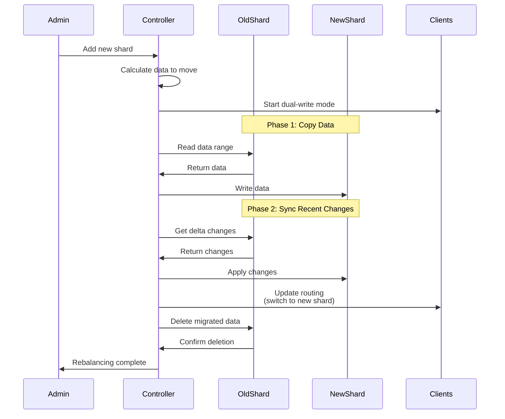

### Fixed Partitions Strategy

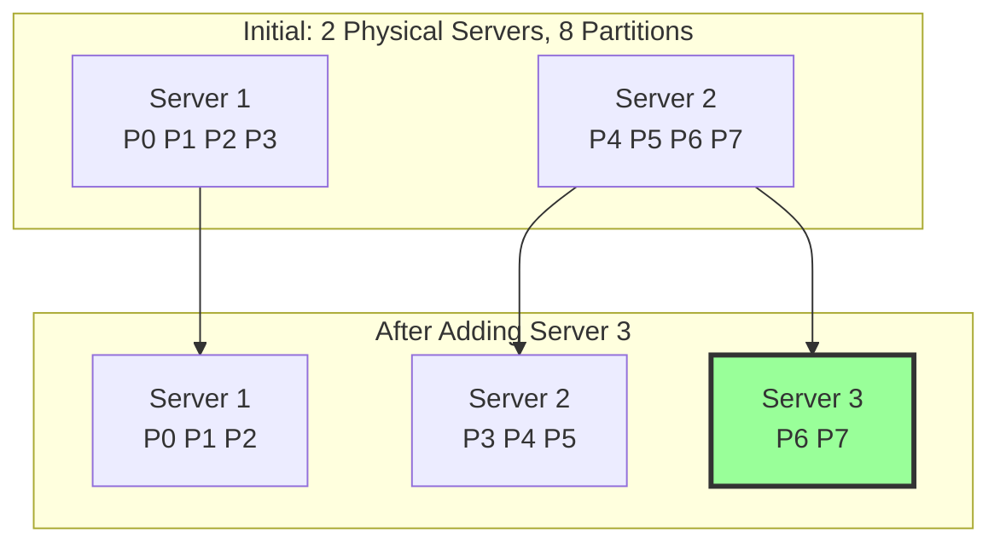

### When Rebalancing is Needed

- Adding new shards (scaling out)
- Removing failed/decommissioned shards
- Fixing hot partitions
- Optimizing uneven data distribution

### Techniques

#### Fixed Number of Partitions
- Create many more partitions than nodes upfront
- Assign multiple partitions to each node
- Move entire partitions when rebalancing
- **Example**: Elasticsearch, Kafka (partition reassignment)

#### Virtual Partitioning
- Shard keys map to virtual shards
- Virtual shards map to fewer physical servers
- Change mappings without code modifications
- Reduces impact during rebalancing

#### Automatic Rebalancing
- Database handles migration automatically
- Consistent hashing enables self-organization
- **Examples**: Cassandra, DynamoDB, Vitess

### Rebalancing Challenges

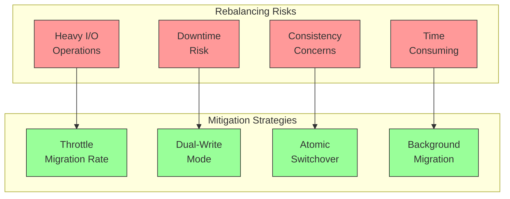

---

## 5. Cross-Shard Operations

### The Challenge

Queries requiring data from multiple shards are complex and expensive.

### Scatter-Gather Pattern

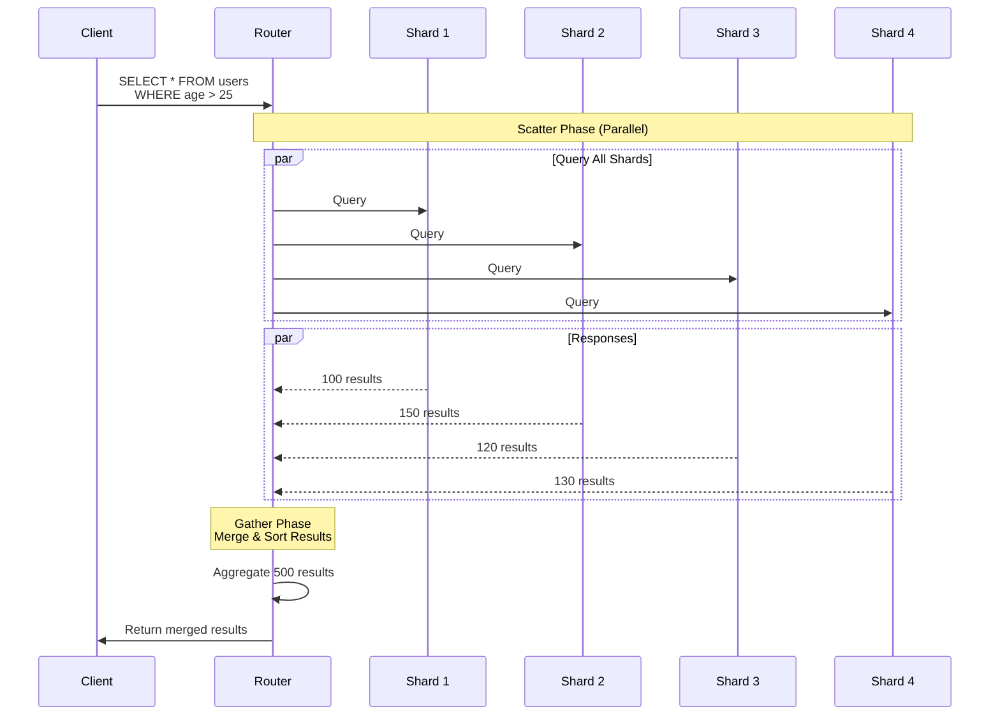

#### Code Example

```python
import threading
from concurrent.futures import ThreadPoolExecutor
import time

class ScatterGatherQuery:
    def __init__(self, num_shards):
        self.shards = {f'shard_{i}': self._create_sample_data(i)
                      for i in range(num_shards)}

    def _create_sample_data(self, shard_id):
        """Create sample user data for each shard"""
        return [
            {'user_id': f's{shard_id}_u{i}', 'age': 20 + (i % 40),
             'name': f'User_{shard_id}_{i}'}
            for i in range(100)
        ]

    def query_shard(self, shard_name, condition):
        """Query a single shard (simulates network latency)"""
        time.sleep(0.1)  # Simulate network latency
        results = [user for user in self.shards[shard_name]
                  if condition(user)]
        print(f"{shard_name}: found {len(results)} results")
        return results

    def scatter_gather(self, condition):
        """Execute query across all shards in parallel"""
        print(f"Executing scatter-gather across {len(self.shards)} shards...")
        start_time = time.time()

        # Scatter: Query all shards in parallel
        with ThreadPoolExecutor(max_workers=len(self.shards)) as executor:
            futures = {
                shard_name: executor.submit(self.query_shard, shard_name, condition)
                for shard_name in self.shards
            }

            # Gather: Collect results
            all_results = []
            for shard_name, future in futures.items():
                all_results.extend(future.result())

        elapsed_time = time.time() - start_time
        print(f"Gathered {len(all_results)} total results in {elapsed_time:.2f}s")
        return all_results

# Example usage
sg = ScatterGatherQuery(num_shards=4)

# Query: Find all users older than 30
results = sg.scatter_gather(lambda user: user['age'] > 30)
print(f"\nFound {len(results)} users older than 30")

# Show some results
print("\nSample results:")
for user in results[:5]:
    print(f"  {user['user_id']}: {user['name']}, age {user['age']}")
```

**Output:**
```
Executing scatter-gather across 4 shards...
shard_0: found 60 results
shard_1: found 60 results
shard_2: found 60 results
shard_3: found 60 results
Gathered 240 total results in 0.11s

Found 240 users older than 30

Sample results:
  s0_u11: User_0_11, age 31
  s0_u12: User_0_12, age 32
  s0_u13: User_0_13, age 33
  s0_u14: User_0_14, age 34
  s0_u15: User_0_15, age 35
```

### Patterns

#### Scatter-Gather
- Query all relevant shards in parallel
- Aggregate results at application layer
- **Trade-off**: Higher latency, more network traffic

#### Denormalization
- Duplicate data across shards to avoid joins
- Store complete records where needed
- **Trade-off**: Storage overhead, consistency complexity

#### Application-Level Joins
- Fetch data from multiple shards separately
- Join in application memory
- **Trade-off**: Application complexity, memory usage

### Cross-Shard Join Example

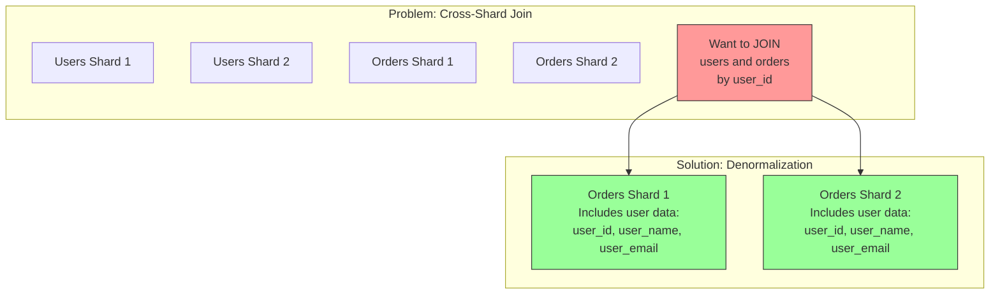

---

## 6. Shard Management

### Routing Architectures

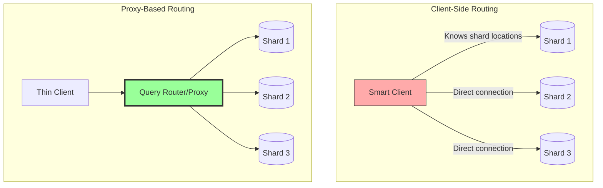

### Configuration Service

Tracks shard topology and routing information:
- **What it stores**: Shard locations, mappings, health status
- **Technologies**: ZooKeeper, etcd, Consul
- **Purpose**: Service discovery, configuration management

### Routing Layer (Query Router)

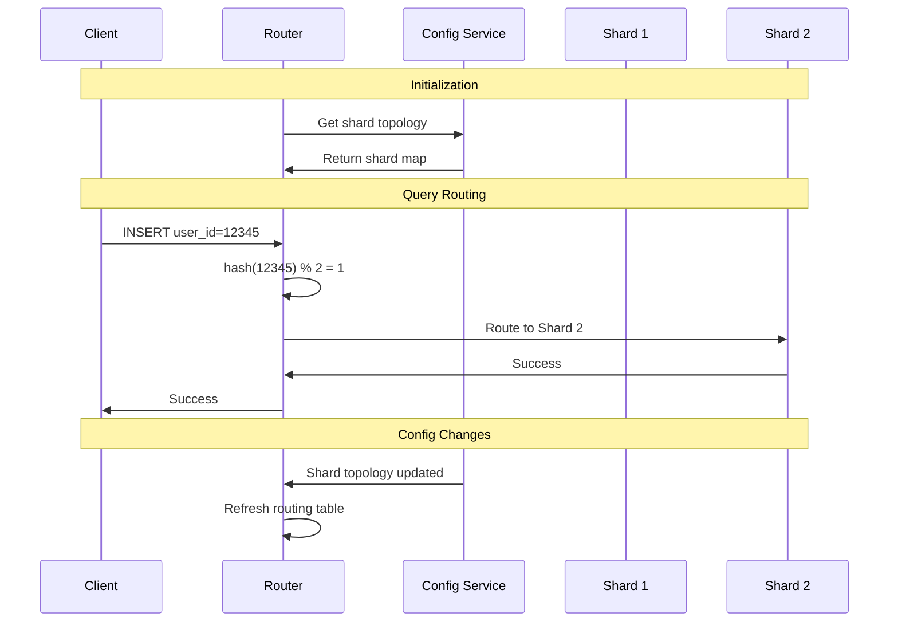

#### Client-Side Routing
- Application knows shard topology
- No proxy overhead
- **Example**: Cassandra native drivers

#### Proxy-Based Routing (Server-Side)
- Centralized routing logic
- Client unaware of sharding
- **Examples**: ProxySQL, Vitess, MongoDB mongos, MySQL Router

---

## 7. High Availability per Shard

### Shard Replication Architecture

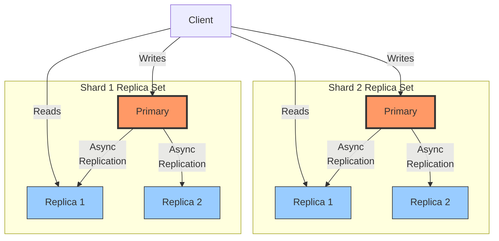

### Auto-Failover Process

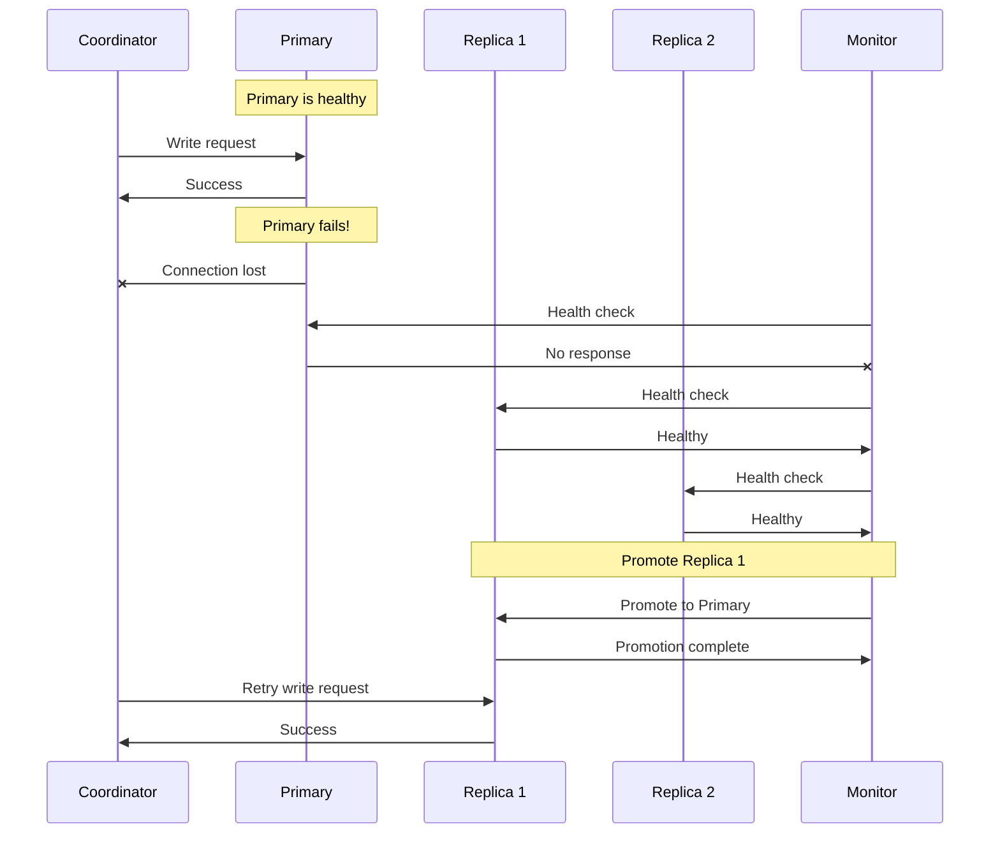

### Replication

- **Primary-Replica (Master-Slave)**: Writes to primary, reads from replicas
- **Multi-Primary**: Multiple write-capable nodes
- **Quorum-based**: Require majority consensus for operations

### Consensus Protocols

- **Raft**: Leader election, log replication
- **Paxos**: Distributed consensus
- **Purpose**: Maintain consistency across replicas

---

## 8. Data Locality & Co-location

### Tenant-Based Sharding

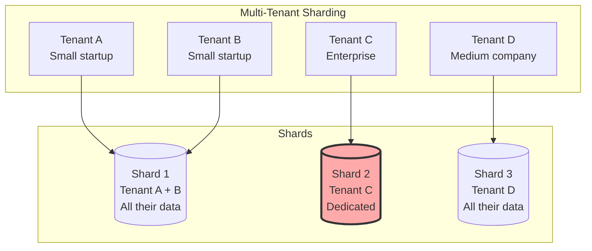

### Entity Group Co-location

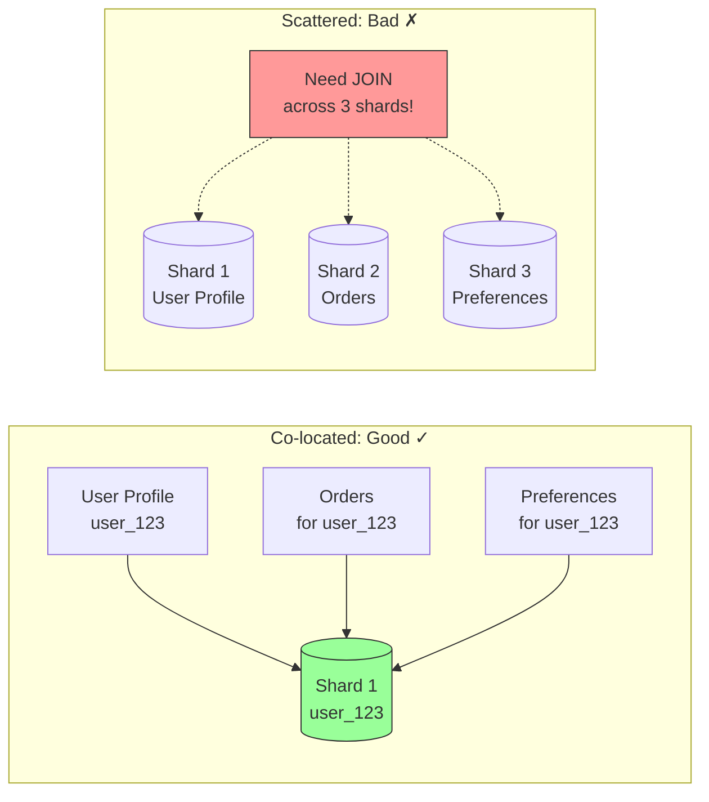

### Benefits

- **Performance**: Minimize network hops
- **Transactions**: Enable ACID within shard
- **Cost**: Reduce cross-shard query overhead

---

## 9. Indexing Strategies

### Local vs Global Secondary Indexes

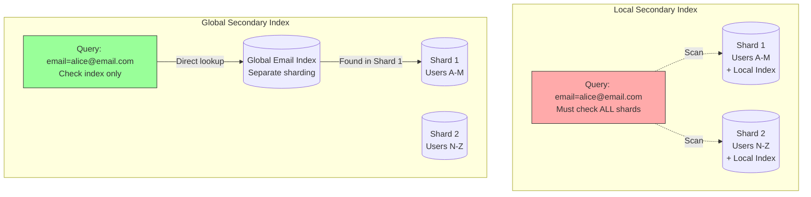

### Local Secondary Indexes

**How it works**: Each shard maintains its own indexes

**Advantages**:
- Fast writes (update only one shard)
- Simpler consistency model
- Lower coordination overhead

**Disadvantages**:
- Queries may need to hit all shards (scatter-gather)
- Slower reads for non-shard-key queries

**Use case**: Write-heavy workloads

### Global Secondary Indexes

**How it works**: Index spans across all shards, separately partitioned

**Advantages**:
- Fast reads (query only relevant index shards)
- Efficient for non-shard-key queries

**Disadvantages**:
- Slower writes (update multiple index shards)
- Complex consistency management
- Higher coordination overhead

**Use case**: Read-heavy workloads with diverse query patterns

**Example**: DynamoDB Global Secondary Indexes

---

## 10. Transaction Management

### Single-Shard vs Cross-Shard Transactions

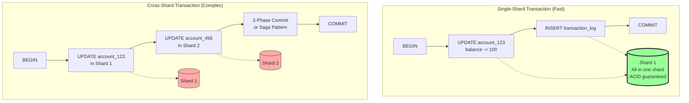

### Two-Phase Commit (2PC)

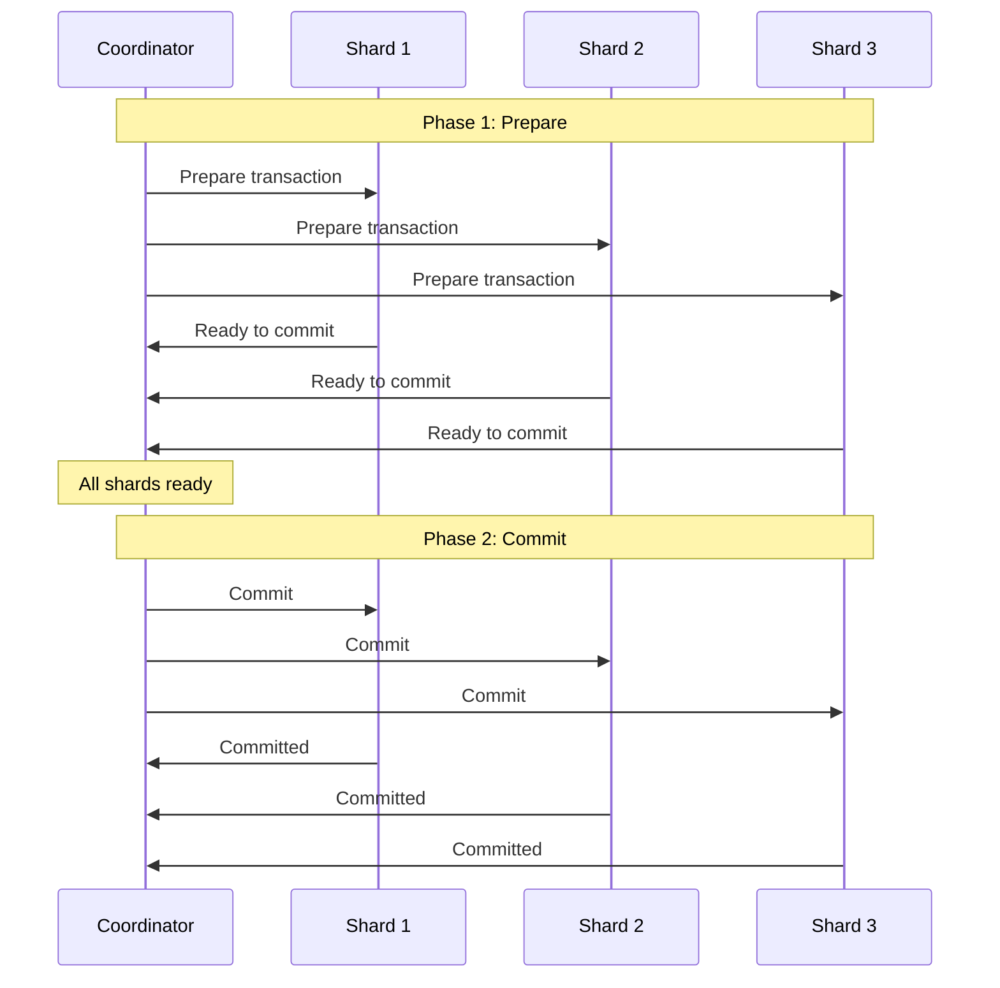

### Saga Pattern

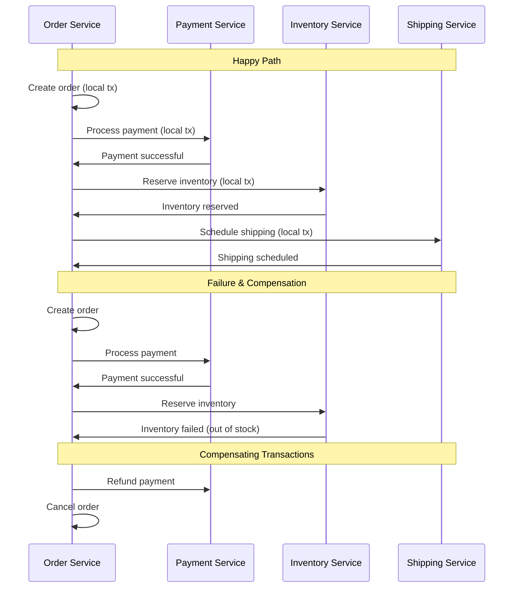

### Single-Shard Transactions

- Full ACID guarantees within a shard
- Use traditional database transactions
- Fast and simple
- **Design principle**: Shard key should enable single-shard transactions

### Cross-Shard Transactions

#### Two-Phase Commit (2PC)
- Coordinator ensures atomic commits across shards
- **Disadvantages**: Blocking, coordinator is SPOF, high latency

#### Saga Pattern
- Break transaction into local transactions per shard
- Compensating transactions for rollback
- Eventual consistency model

---

## 11. Monitoring & Observability

### Monitoring Dashboard

```mermaid
graph TB
    subgraph "Metrics Collection"
        M1[Data Distribution<br/>Size, row count per shard]
        M2[Performance<br/>Latency, throughput]
        M3[Health<br/>Uptime, replication lag]
        M4[Hotspot Detection<br/>Query patterns]
    end

    subgraph "Alerting"
        A1[Imbalanced Shards<br/>(>20% difference)]
        A2[High Latency<br/>(>100ms p99)]
        A3[Replication Lag<br/>(>5 seconds)]
        A4[Hot Partition<br/>(>2x avg load)]
    end

    M1 --> A1
    M2 --> A2
    M3 --> A3
    M4 --> A4

    style A1 fill:#f99,stroke:#333
    style A2 fill:#f99,stroke:#333
    style A3 fill:#f99,stroke:#333
    style A4 fill:#f99,stroke:#333
```

### Key Metrics

#### Data Distribution
- Size per shard
- Row count per shard
- Growth rate per shard
- Identify imbalanced shards

#### Performance Metrics
- Query latency per shard
- Throughput (reads/writes per second)
- CPU, memory, disk I/O per shard
- Cache hit rates

#### Health Monitoring
- Shard availability/uptime
- Replication lag
- Failed queries
- Connection pool status

### Tools

- Prometheus + Grafana for metrics
- Distributed tracing (Jaeger, Zipkin)
- Database-specific tools (MongoDB Atlas, Vitess VTGate metrics)

---
