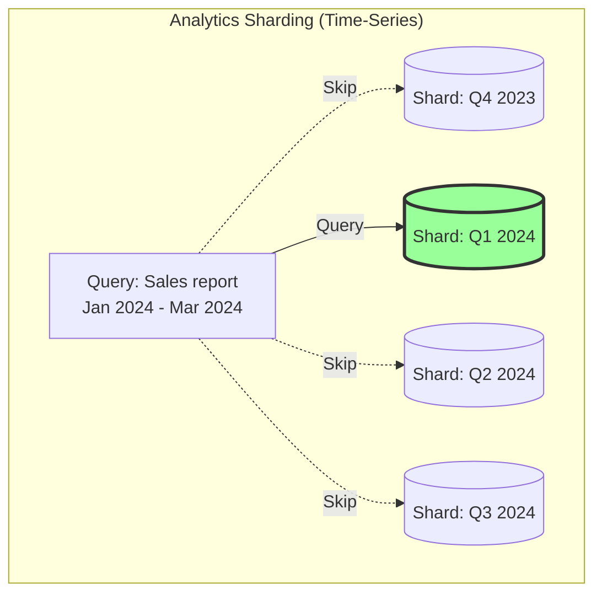

# The Art of Sharding — Part IV: The Final Test (System Design)

## Table of Contents

- [12. System Design: Which Sharding Concepts to Use](#12-system-design-which-sharding-concepts-to-use)
- [13. Challenges & Trade-offs](#13-challenges--trade-offs)
- [14. When to Use Sharding](#14-when-to-use-sharding)
- [15. Real-World Examples](#15-real-world-examples)
- [16. Best Practices Summary](#16-best-practices-summary)

## 12. System Design: Which Sharding Concepts to Use

### URL Shortener


**Recommended Sharding Concepts:**

1. **Shard Key**: `short_url` (high cardinality, even distribution)
2. **Strategy**: Range-based or Hash-based
   - Range: First character of short URL (a-z, 0-9)
   - Hash: Hash of short URL
3. **Why**: Read-heavy, single-key lookups
4. **Avoid**: Cross-shard queries not needed

```sql
-- Shard assignment example
SELECT * FROM urls WHERE short_url = 'abc123'
-- Routes to: hash('abc123') % 4 = Shard 1
```

---

### Social Media (Twitter/Instagram)


**Recommended Sharding Concepts:**

1. **Shard Key**: `user_id` for user data, posts, follows
2. **Strategy**: Hash-based sharding
3. **Data Locality**: User + their posts + followers on same shard
4. **Timeline**: Separate shards with pre-computed feeds
5. **Denormalization**: Duplicate user info in posts to avoid joins

```python
# Shard assignment
def get_user_shard(user_id):
    return hash(user_id) % NUM_SHARDS

# Co-locate related data
# - User profile: shard_id = get_user_shard(user_id)
# - User's posts: shard_id = get_user_shard(author_id)
# - User's followers: shard_id = get_user_shard(followee_id)
```

**Challenge**: Celebrity problem (hot partitions)
- **Solution**: Separate handling for celebrity accounts
- Use composite key: `(user_id, timestamp)` for posts

---

### E-commerce Platform


**Recommended Sharding Concepts:**

1. **User Data Shard Key**: `user_id`
   - Strategy: Hash-based
   - Contains: user profile, addresses, payment methods

2. **Order Data Shard Key**: `user_id` (not order_id!)
   - Strategy: Hash-based on user_id
   - Co-location: User's orders with user data
   - Enables: Fast "my orders" queries

3. **Product Catalog Shard Key**: `product_id`
   - Strategy: Hash-based
   - Separate from user data (different access patterns)

4. **Inventory Shard Key**: `warehouse_id` or `region`
   - Strategy: Geographic sharding
   - Close to fulfillment centers

```python
# Co-location strategy
class EcommercSharding:
    def get_user_shard(self, user_id):
        return hash(user_id) % USER_SHARDS

    def get_order_shard(self, order):
        # Shard by user_id, not order_id!
        # Allows fast "get my orders" without scatter-gather
        return hash(order.user_id) % USER_SHARDS

    def get_product_shard(self, product_id):
        return hash(product_id) % PRODUCT_SHARDS

    def get_inventory_shard(self, warehouse_id):
        # Geographic sharding
        return WAREHOUSE_TO_SHARD[warehouse_id]

# Example queries
# Fast: Get user's orders (single shard)
SELECT * FROM orders WHERE user_id = 12345
# -> Routes to user's shard, co-located!

# Slow: Get all orders for product (scatter-gather)
SELECT * FROM orders WHERE product_id = 789
# -> Must query all user shards
```

**Denormalization**: Store product details in orders
```sql
-- Denormalized order table
CREATE TABLE orders (
    order_id BIGINT,
    user_id BIGINT,  -- Shard key
    product_id BIGINT,
    -- Denormalized product info (avoid join)
    product_name VARCHAR(255),
    product_price DECIMAL,
    product_image_url VARCHAR(500)
);
```

---

### Chat Application (WhatsApp/Slack)


**Recommended Sharding Concepts:**

1. **Shard Key**: `conversation_id` (group_id or channel_id)
2. **Strategy**: Hash-based sharding
3. **Data Locality**: All messages for a conversation on same shard
4. **Why**: Users fetch messages per conversation

```python
# Shard by conversation
def get_conversation_shard(conversation_id):
    return hash(conversation_id) % NUM_SHARDS

# Co-locate messages with conversation
# Shard 1: Conversation A + all messages in A
# Shard 2: Conversation B + all messages in B

# Fast query (single shard)
SELECT * FROM messages
WHERE conversation_id = 'conv_12345'
ORDER BY timestamp DESC
LIMIT 50
```

**Alternative for 1-on-1 chat**: Composite key
```python
# For 1-on-1 chat between user_a and user_b
def get_dm_shard(user_a_id, user_b_id):
    # Ensure consistent ordering
    min_id, max_id = sorted([user_a_id, user_b_id])
    conversation_key = f"{min_id}_{max_id}"
    return hash(conversation_key) % NUM_SHARDS
```

**Read Receipts**: Separate sharding
```python
# Read receipts sharded by user_id
# Allows fast "get unread count" for a user
def get_readreceipt_shard(user_id):
    return hash(user_id) % NUM_SHARDS
```

---

### Analytics Platform / Data Warehouse



**Recommended Sharding Concepts:**

1. **Shard Key**: `timestamp` or `date`
2. **Strategy**: Range-based sharding (by month/quarter/year)
3. **Why**: Most queries are time-range based
4. **Partition Pruning**: Skip irrelevant time-range shards

```sql
-- Range-based sharding for analytics
Shard 1: 2024-01-01 to 2024-03-31 (Q1 2024)
Shard 2: 2024-04-01 to 2024-06-30 (Q2 2024)
Shard 3: 2024-07-01 to 2024-09-30 (Q3 2024)

-- Query: Only hits Shard 1
SELECT SUM(revenue) FROM sales
WHERE date BETWEEN '2024-01-01' AND '2024-03-31'

-- Old data archival
-- Shard 1 (2023 data) → Move to cold storage
```

**Composite Shard Key for Dimensional Analysis**:
```python
# Shard by date + region for geo-analytics
def get_analytics_shard(date, region):
    month = date.strftime('%Y-%m')
    return f"shard_{region}_{month}"

# Enables efficient queries like:
# "Sales in US region for Jan 2024"
# -> Routes to: shard_US_2024-01
```

---

### Ride-Sharing (Uber/Lyft)


**Recommended Sharding Concepts:**

1. **Active Rides Shard Key**: `region` or `geohash`
2. **Strategy**: Geographic sharding
3. **Data Locality**: Drivers and riders in same region on same shard
4. **Why**: Driver-rider matching is local

```python
import geohash2

class RideSharing Sharding:
    def get_geohash_shard(self, latitude, longitude):
        # Geohash precision: 5 chars = ~5km x 5km area
        geo = geohash2.encode(latitude, longitude, precision=5)
        return hash(geo) % NUM_SHARDS

    def find_nearby_drivers(self, rider_lat, rider_lon):
        shard_id = self.get_geohash_shard(rider_lat, rider_lon)
        # Query single shard for nearby drivers
        return query_shard(shard_id,
                          f"SELECT * FROM drivers WHERE active=true")

# Example:
# Rider in SF: lat=37.7749, lon=-122.4194
# Geohash: 9q8yy → Shard 3
# All SF drivers also on Shard 3 → Fast matching!
```

**Historical Ride Data**: Different sharding strategy
```python
# Historical rides: shard by user_id or ride_date
def get_history_shard(user_id):
    return hash(user_id) % HISTORY_SHARDS

# Allows fast "my ride history" queries
SELECT * FROM ride_history WHERE user_id = 12345
```

---

### Gaming Leaderboard


**Recommended Sharding Concepts:**

1. **Shard Key**: `region` or `game_id`
2. **Strategy**: Regional sharding + denormalization
3. **Global Leaderboard**: Scatter-gather across regions
4. **Local Leaderboard**: Single shard query

```python
# Regional sharding
def get_leaderboard_shard(region):
    return REGION_TO_SHARD[region]

# Fast: Regional leaderboard (single shard)
SELECT player_id, score FROM leaderboard
WHERE region = 'NA'
ORDER BY score DESC
LIMIT 100

# Slow: Get all orders for product (scatter-gather)
SELECT * FROM orders WHERE product_id = 789
# -> Must query all user shards
```

**Optimization: Pre-computed Global Leaderboard**
```python
# Separate shard for pre-aggregated global leaderboard
# Updated periodically (e.g., every 5 minutes)
def update_global_leaderboard():
    results = []
    for region in ['NA', 'EU', 'APAC']:
        shard = get_leaderboard_shard(region)
        top_players = query_shard(shard, "SELECT TOP 1000")
        results.extend(top_players)

    # Sort and store in global leaderboard shard
    global_top = sorted(results, key=lambda x: x.score)[:1000]
    store_in_shard('global_leaderboard', global_top)
```

---

### Multi-Tenant SaaS Platform


**Recommended Sharding Concepts:**

1. **Shard Key**: `tenant_id`
2. **Strategy**: Directory-based (flexible assignment)
3. **Isolation**: Each tenant's data on specific shard(s)
4. **Enterprise Tenants**: Dedicated shards

```python
class MultiTenantSharding:
    def __init__(self):
        self.tenant_to_shard = {}  # Directory mapping

    def assign_tenant_shard(self, tenant_id, tenant_tier):
        if tenant_tier == 'enterprise':
            # Dedicated shard for enterprise
            shard = self.provision_new_shard()
        elif tenant_tier == 'medium':
            # Find least loaded shared shard
            shard = self.get_least_loaded_shard()
        else:  # small
            # Place multiple small tenants on same shard
            shard = self.get_small_tenant_shard()

        self.tenant_to_shard[tenant_id] = shard
        return shard

    def query_tenant_data(self, tenant_id, query):
        # All tenant data on same shard
        shard = self.tenant_to_shard[tenant_id]
        return execute_query(shard, query)

# Benefits:
# - Fast queries (no cross-shard joins)
# - Strong isolation
# - Easy to migrate tenant to different shard
# - Enterprise SLA: dedicated resources
```

---

## 13. Challenges & Trade-offs

### Hot Partition Problem


**Solutions**:
```python
# 1. Composite shard key
def get_celebrity_shard(user_id, timestamp):
    # Split celebrity data across multiple shards by time
    composite = f"{user_id}_{timestamp.hour}"
    return hash(composite) % NUM_SHARDS

# 2. Application-level splitting
if is_celebrity(user_id):
    # Write to multiple shards
    for shard_id in get_celebrity_shards(user_id):
        write_to_shard(shard_id, data)
else:
    # Normal sharding
    write_to_shard(get_shard(user_id), data)

# 3. Read replicas for hot shard
# Add more read replicas to hot shard specifically
```

### Complexity

- **Operational**: More moving parts to manage
- **Development**: Application must be shard-aware
- **Debugging**: Distributed tracing required

### Cross-Shard Queries

- Joins are expensive and complex
- **Mitigation**: Denormalization, careful shard key design

---

## 14. When to Use Sharding

### Decision Tree


### Use Sharding When:

✅ Single database cannot handle load (CPU, memory, I/O)
✅ Data size exceeds single machine capacity
✅ Query patterns allow good shard key design
✅ Horizontal scaling is more cost-effective than vertical
✅ Geographic distribution is required
✅ Team has expertise to manage distributed systems

### Avoid Sharding When:

❌ Vertical scaling still feasible and cost-effective
❌ Read replicas can handle read load
❌ Heavy cross-shard queries are common
❌ Team lacks distributed systems experience
❌ Data size is manageable (< 1TB typically)
❌ Query patterns don't support good shard key

---

## 15. Real-World Examples

### Instagram's Sharding

```python
# Instagram's PostgreSQL sharding strategy

# Shard key: user_id
# Why: Most queries are "show photos for user X"

def get_instagram_shard(user_id):
    # Hash-based sharding
    return user_id % NUM_SHARDS

# Co-location:
# - User profile: shard by user_id
# - User's photos: shard by author_id (not photo_id!)
# - User's followers: shard by followee_id

# Benefits:
# - "Show Alice's photos" → Single shard query
# - "Show Alice's followers" → Single shard query

# Trade-off:
# - "Show photos with tag #sunset" → Scatter-gather
# - Solution: Separate tag index with different sharding
```

### Uber's Schemaless

```python
# Uber's sharding for trip data

# Strategy: Geographic + consistent hashing

def get_uber_shard(trip_id):
    # Ringpop consistent hashing
    # Minimal data movement when adding nodes
    return consistent_hash(trip_id)

# Active trips: Geo-sharded
# - Shard by current region
# - Fast driver matching

# Historical trips: User-sharded
# - Shard by user_id
# - Fast "my trip history"

# Insight: Different sharding for different access patterns!
```

### Discord's Cassandra Sharding

```python
# Discord message storage

# Shard key: (guild_id, channel_id)
# Why: Users read messages per channel

# Cassandra partitioning:
CREATE TABLE messages (
    guild_id BIGINT,
    channel_id BIGINT,
    message_id BIGINT,
    content TEXT,
    PRIMARY KEY ((guild_id, channel_id), message_id)
) WITH CLUSTERING ORDER BY (message_id DESC);

# Benefits:
# - "Get messages in channel" → Single partition query
# - Messages sorted by message_id (time-ordered)
# - Efficient pagination

# Scale:
# - Millions of guilds (servers)
# - Billions of messages
# - Cassandra handles sharding automatically
```

---

## 16. Best Practices Summary

1. **Choose shard key carefully**: High cardinality, even distribution, matches access patterns
2. **Start with more shards**: Easier to consolidate than split
3. **Plan for rebalancing**: Use consistent hashing or virtual partitions
4. **Monitor continuously**: Track data distribution and performance
5. **Keep related data together**: Design for data locality
6. **Avoid cross-shard operations**: Denormalize where necessary
7. **Test failure scenarios**: Shard failures, network partitions, rebalancing
8. **Automate operations**: Monitoring, failover, backups
9. **Document shard topology**: Keep architecture diagrams current
10. **Plan capacity**: Anticipate growth and shard expansion

---

## Key Takeaways

- **Sharding = Horizontal partitioning** across multiple physical servers
- **Shard key selection** is the most critical design decision
- **Consistent hashing** minimizes data movement during rebalancing
- **Different systems need different strategies**: URL shortener vs social media vs analytics
- **Co-location matters**: Keep related data on same shard
- **Trade-offs**: Complexity vs. scalability
- **Design principle**: Keep transactions and queries within single shard when possible
- **Real-world use**: Essential for Internet-scale applications (billions of records, millions of concurrent users)

---

## Quick Reference: Sharding Strategy Selection

| Use Case | Shard Key | Strategy | Why |
|----------|-----------|----------|-----|
| **URL Shortener** | short_url | Hash-based | Single-key lookups, read-heavy |
| **Social Media** | user_id | Hash-based | User-centric queries, co-location |
| **E-commerce Orders** | user_id | Hash-based | "My orders" queries, co-location |
| **E-commerce Products** | product_id | Hash-based | Independent from user data |
| **Chat (Groups)** | conversation_id | Hash-based | Messages per conversation |
| **Analytics** | timestamp | Range-based | Time-range queries, archival |
| **Ride-Sharing** | region/geohash | Geographic | Local matching, low latency |
| **Multi-Tenant SaaS** | tenant_id | Directory-based | Flexible assignment, isolation |
| **Logging** | timestamp | Range-based | Time-series, partition pruning |
| **Leaderboard** | region | Geographic + Pre-compute | Regional fast, global acceptable |

---

## Sources & Further Reading

- [Database Sharding Explained for Scalable Systems | Aerospike](https://aerospike.com/blog/database-sharding-scalable-systems/)
- [Database Sharding - System Design - GeeksforGeeks](https://www.geeksforgeeks.org/system-design/database-sharding-a-system-design-concept/)
- [Understanding Database Sharding: The Art of Horizontal Scaling - CodeCalls](https://www.codecalls.com/system-design/understanding-database-sharding-the-art-of-horizontal-scaling/)
- [AWS: What is Database Sharding?](https://aws.amazon.com/what-is/database-sharding/)
- [Microsoft Azure: Data Partitioning Guidance](https://learn.microsoft.com/en-us/azure/architecture/best-practices/data-partitioning)
- [Database Sharding Strategies | PingCAP](https://www.pingcap.com/blog/database-sharding-defined/)
- [System Design Concepts: Database Sharding Strategies](https://engineeringatscale.substack.com/p/system-design-concepts-dive-deep)
- [GeeksforGeeks: Sharding Vs. Consistent Hashing](https://www.geeksforgeeks.org/system-design/sharding-vs-consistent-hashing/)
