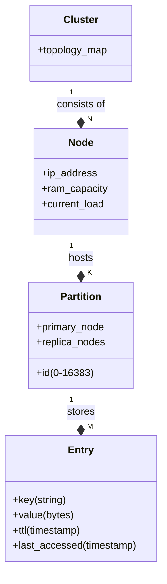

# Article 1: Why Caching Matters

**The hidden infrastructure behind every fast website.**

When Netflix recommendations load in 800ms instead of 10 seconds, or your Twitter feed refreshes instantly even during the Super Bowl—you aren't seeing a fast database: you're seeing a well-designed cache.

Caching is the art of cheating. It’s the art of giving users the right answer without doing the hard work of calculating it again. This article covers the *why*, the *what*, and the *design*. Because implementing a cache is easy; specificying the right one is hard.

---

## 1. The Core Problem: Databases Can't Scale (Like You Need Them To)

Here is the uncomfortable truth of system design: **Databases don't scale effortlessly. Your application traffic does.**

Modern databases like PostgreSQL are miracles of engineering, capable of handling 10,000+ complex queries per second. But your "viral" application generates 100,000 requests per second, and 99% of them are asking for the exact same Profile Page.

### The Physics of the Problem
*   **Database (Disk)**: To read a row, the disk head moves (or SSD controller seeks). Cost: **millions of CPU cycles**.
*   **Cache (RAM)**: To read a key, the CPU follows a pointer. Cost: **hundreds of CPU cycles**.

The difference isn't percentage points. It's orders of magnitude.

### Real-World Stakes
*   **Meta**: Deploys 30,000+ Memcached servers. Without this layer, their databases would receive 1 *billion* requests per second instead of a manageable 50 million.
*   **Netflix**: Serves 500,000 request/sec from their EVCache (Redis/Memcached) tier. Their database tier handles a fraction of that. Without caching, Netflix would need 10x more database hardware—or simpler, it would just be down.

> **The Math is Brutal:**
> *   **Traffic**: 1,000,000 users/sec.
> *   **Database Capacity**: 5,000 QPS.
> *   **Without Cache**: 200x overload. Immediate collapse.
> *   **With 99% Hit Ratio Cache**: Database sees 10,000 QPS. Still 2x overload.
> *   **With 99.9% Hit Ratio Cache**: Database sees 1,000 QPS. Safe.
>
> **Takeaway**: A cache isn't an optimization; it is a structural necessity for survival.

---

## 2. A Cautionary Tale: The Pinterest Incident

In 2013, Pinterest suffered a major outage during Black Friday. It wasn't a code bug. It was a cache failure.

1.  **The Trigger**: A configuration change made the cache cluster unstable.
2.  **The Drop**: Cache hit ratio dropped from **95%** to **40%**.
3.  **The Illusion**: 40% sounds okay, right? It's still caching almost half the traffic!
4.  **The Reality**: With 95% hit ratio, the DB takes 5% of traffic. With 40% hit ratio, the DB takes 60% of traffic. **That is a 12x load spike.**
5.  **The Result**: The databases melted. Pinterest was down for hours.

This series isn't about "making things fast." It is about **reliability engineering**.

---

## 3. What We Are Building

We are designing a **Distributed Cache System**. It's not just a `HashMap` on a server; it's a robust, multi-node service that powers your architecture.

### Functional Requirements (What it must do)
1.  **Values**: Get, Set, and Delete data (Text, JSON, Binary).
2.  **Control**: Expire data automatically (TTL).
3.  **Efficiency**: Retrieve multiple keys at once (MGET).

### Non-Functional Requirements (How it must perform)
*   **Latency**: p99 < **5ms**. (Compare to a DB's 20ms+).
*   **Availability**: **99.9%** (Allowing ~43 mins/month downtime).
*   **Hit Ratio**: Target **95%+**.
*   **Consistency**: **AP** (Availability & Partition Tolerance).
    *   *Translation*: We prefer giving a user *slightly stale* data (e.g., a Like count of 99 instead of 100) rather than showing them an error page.

---

## 4. The Data Model & Entities

Before writing code, we define our entities. A "Cache" isn't a nebulous cloud; it is a hierarchy.



*   **Cluster**: The logical group of all servers.
*   **Node**: A single physical server (e.g., `cache-01.us-east.prod`).
*   **Partition (Shard)**: The unit of data ownership. Key `user:100` hashes to Partition #42.
*   **Entry**: The actual data.

---

## 5. API Design: The Contract

A clean API makes the system usable. Here is the JSON-over-HTTP spec (though in production, we'd use a binary protocol like RESP or Protobuf for speed).

### GET: Retrieve Data
```http
GET /v1/cache/users:1001
Header: Auth-Token: <token>
```
**Response (Hit)**: `200 OK`
```json
{
  "key": "users:1001",
  "data": { "name": "Alice", "role": "admin" },
  "metadata": { "ttl_remaining": 305, "cached_at": "2023-10-25T10:00:00Z" }
}
```
**Response (Miss)**: `404 Not Found`

### SET: Store Data
```http
POST /v1/cache/users:1001
Content-Type: application/json
```
```json
{
  "value": { "name": "Alice", "role": "admin" },
  "ttl_seconds": 3600,
  "policy": "replace_if_exists" 
}
```
**Response**: `201 Created`

### MGET: The Performance Hack
Fetching 100 keys one-by-one requires 100 network round trips. `MGET` does it in one.

```http
GET /v1/cache/batch?keys=users:1001,users:1002,users:1003
```
**Response**:
```json
{
  "results": [
    { "key": "users:1001", "data": {...}, "hit": true },
    { "key": "users:1002", "data": null, "hit": false },
    { "key": "users:1003", "data": {...}, "hit": true }
  ]
}
```

---

## Summary

We have defined the **Problem** (Database overload), the **Goal** (95% hit ratio, <5ms latency), and the **Contract** (API).

In real life you can (and often should) buy a cache off the shelf. But for system design—and for building a platform you truly understand—we start from first principles.

In the next article, we build a cache node from scratch: storage layout, TTL expiration, eviction, and (critically) how these internals behave under concurrency.

**[Next: Building Your First Cache (MVP) →](02-mvp-architecture.md)**
