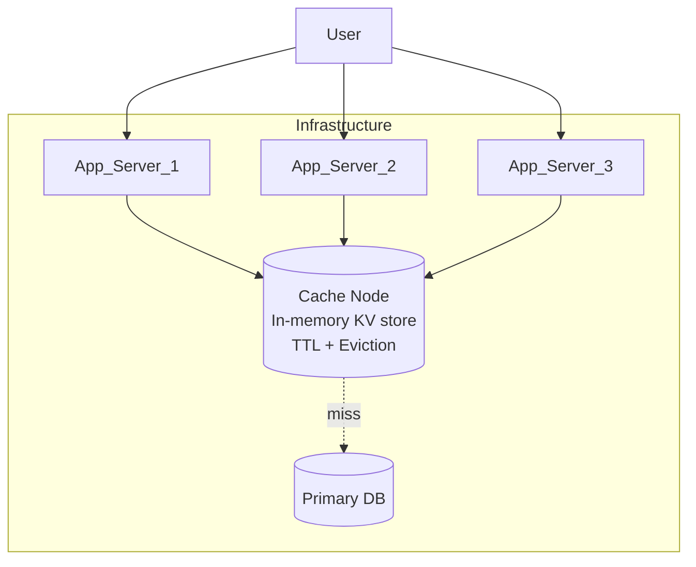

# Article 2: Building Your First Cache (MVP)

**Simplicity is the ultimate sophistication.**

Before we worry about sharding 500 nodes globally, we start where every distributed system starts: a single process.

This article is intentionally “from scratch”. We are not installing Redis. We are designing the internal mechanics that any cache server must have: a memory index, TTL expiration, and an eviction policy that still works when **100 threads are hammering `GET` at the same time**.

---

## 1. The Architecture: One Node to Rule Them All

We strip away the complexity. No clusters, no ZooKeeper, no consensus algorithms.



**The logic is simple:**
1.  **App** asks **Cache**: "Do you have user:123?"
2.  **Cache** says "No" (Miss).
3.  **App** asks **DB**: "Select * from users where id=123".
4.  **App** tells **Cache**: "Remember user:123 = {...}".

---

## 2. Under the Hood: The Index Card Catalog

How does a single server answer 100,000 questions a second? It doesn't use a file system. It uses a **Hash Table**.

Imagine a giant hotel with millions of mail slots.
*   **Key**: `user:123`
*   **Hash Function**: Converts `user:123` → Slot #4829.
*   **Lookup**: The CPU jumps directly to memory address for Slot #4829.

**This is O(1) complexity.** It takes the same amount of time to find a user whether you have 10 users or 10 million.

### The Problem of Infinity
You have infinite users, but finite RAM (64GB). Eventually, the hotel is full.
When you try to add `user:999` and memory is full, you must kick someone out. But who?
*   **Random?** Might delete popular data.
*   **Oldest?** Might delete a viral post from 5 minutes ago.
*   **Least Recently Used (LRU)**: The gold standard.

**LRU Logic**: "If you haven't been asked for recently, you leave first." In a textbook implementation, every `GET` “touches” the entry and updates recency.

That last sentence is where production systems get interesting.

---

## 3. Deep Dive: Internals & Concurrency (The LRU Lock Problem)

Let’s zoom in on a single node.

You described the standard LRU structure:
* Map for O(1) lookup
* Doubly linked list for recency order

The concurrency problem is real:
* In **strict LRU**, every `GET(key)` becomes a write to shared state (list pointers + head pointer).
* With many threads, the linked list lock becomes a hotspot.

The important design insight is:

> **In high-QPS caches, eviction policy must be cheap on the read path.**

Below are practical designs that preserve “reasonable LRU behavior” without turning every read into a contended write.

### Option A (Best interview answer): Sharded Single-Writer (Actor Model)

Instead of one shared `ConcurrentHashMap` + one shared LRU list, we build **N independent shards** inside the node.

* Each shard owns:
    * its own `HashMap`
    * its own eviction structure (LRU list / CLOCK / TinyLFU state)
    * its own capacity budget
* Requests are routed by `shard = hash(key) % N`.
* Each shard is processed by exactly **one worker thread** (single-writer), so it can maintain a strict LRU list **with zero locks**.

Why this works:
* You eliminate shared mutable structures.
* You scale linearly with cores (up to routing/serialization limits).

Trade-offs:
* `MGET` becomes a fan-out to multiple shards + join.
* Per-shard capacity can be slightly imbalanced (mitigate with more shards than cores).

### Option B: Segmented LRU (Lock Striping)

If you want a shared `ConcurrentHashMap` but reduced contention:

* Keep one global map: `key -> Entry`.
* Maintain **S independent LRU lists**, each with its own lock.
* Pick list by hash (same idea as lock striping).

Effect:
* Contention drops roughly by a factor of `S`.
* Still “LRU-ish” globally (it’s LRU per segment).

This is a very common compromise when strict global LRU is too expensive.

### Option C: Buffered Access Updates (Make `GET` Mostly Read-Only)

Strict LRU requires a list update on every read. Instead:

* On `GET`, do **not** move the node in the list.
* Record the access in a per-thread buffer (ring buffer / queue).
* A maintenance thread periodically drains buffers and applies batched list moves.

What you get:
* Read path avoids a contended lock.
* Recency becomes approximate (bounded staleness), which is usually acceptable.

This approach is a workhorse in high-performance in-process caches.

### Option D: CLOCK / Second-Chance (Atomic Bits, Not Pointer Surgery)

Replace LRU list maintenance with:

* Entries sit in a circular structure.
* Each entry has an `accessed` bit.
* On `GET`, set `accessed = 1` (atomic write).
* Eviction scans like a clock hand:
    * if `accessed == 1`, set it back to 0 and skip
    * if `accessed == 0`, evict it

Why it’s good:
* `GET` is a single atomic write, not a lock + list splice.
* Eviction work shifts to the eviction thread, not the hot read path.

This is a classic “approximate LRU” policy that scales well.

### What would I pick here?

Given your numbers (500 nodes, ~20k RPS/node):
* A **single global lock** might still work, but it’s a risky bottleneck and scales poorly with traffic spikes.
* The most robust design is **Option A (sharded single-writer)**: strict correctness inside each shard, no lock contention, simple to reason about.
* If you must support multi-threaded direct access, combine **Option B (segmented LRU)** with **Option D (CLOCK)**.

### Bonus: Efficient Expiration (TTL) Without Melting the CPU

TTLs look simple until you have millions of keys with different expiration times.

**Naive approach**: store `expiresAt` per entry and run a periodic scan.
* Works at small scale.
* Falls apart when the scan touches too much memory (CPU cache misses, GC pressure, lock contention).

Practical approaches:

**Option 1: Min-heap of expirations**
* Push `(expiresAt, key)` on `SET`.
* Background thread pops until `expiresAt > now`.
* Trade-off: heap ops are `O(log n)` and you still need to handle update/delete churn.

**Option 2: Hierarchical Timer Wheel (amortized O(1))**
* Bucket expirations into time slots (e.g., seconds → minutes → hours).
* Advancing time only touches the current bucket.
* Great fit when you have very high churn and lots of distinct TTLs.

This is a recurring theme in cache internals: **move “maintenance work” off the hot read path** and make it batchable.

### Bonus: Memory Management (Why `malloc()` Can Become Your Hidden Bottleneck)

In real caches, the allocator strategy is part of the design.

If you allocate variable-sized objects directly from the general heap:
* you increase fragmentation
* you get unpredictable pauses (allocator/GC)
* you make eviction more expensive (more scattered memory)

A common production technique is a **slab allocator** (memcached-style):
* reserve a large memory region for items
* split it into **fixed-size pages** (memcached defaults to **1MB pages**)
* assign pages to **slab classes** (each class has a chunk size)
* store each item in the “nearest fit” class (wasted space becomes bounded and predictable)

Two important edge cases to handle explicitly:
* **Large items**: do you reject them, compress them, or chunk them (and accept more complexity)?
* **Per-class pressure**: if one slab class fills up, eviction happens *within that class*, which can surprise you if you assumed one global LRU.

---

## 4. The Anatomy of Latency (1.14ms)

Why does a request take 1.14ms? Let's trace it.

| Step | Component | Time Cost | Bottleneck? |
|---|---|---|---|
| 1. Request leaves App | **Network** | 0.50 ms | 🔴 **YES** |
| 2. CPU parses command | CPU | 0.05 ms | |
| 3. Hash Lookup | RAM | 0.01 ms | |
| 4. Eviction Bookkeeping | RAM | 0.02 ms | |
| 5. Serialize Response | CPU | 0.05 ms | |
| 6. Response returns | **Network** | 0.50 ms | 🔴 **YES** |
| **TOTAL** | | **~1.14 ms** | |

**The Insight**: 80-90% of your latency is **Physics** (Network). Optimizing your code to be 2x faster saves 0.05ms. Upgrading your network/kernel saves 0.5ms.

---

## 5. The Write Path vs Read Path

**Reading (GET)** is safe. You just look things up.
**Writing (SET)** is dangerous. It changes the state of the world.

### The Race Condition
Startups often write code like this:
```python
# BAD CODE
val = cache.get("counter")
val = val + 1
cache.set("counter", val)
```
If two users hit this line at the exact same nanosecond:
1.  User A sees 10.
2.  User B sees 10.
3.  User A writes 11.
4.  User B writes 11.
**Result**: Counter is 11. Should be 12. **We lost data.**

**The Fix**: Atomic Operations.

In our cache, we expose atomic commands (or server-side scripting) so the server performs the read-modify-write as one indivisible operation.

---

## 6. When the MVP Breaks

This single-node design is beautiful, but it has two hard ceilings.

### Ceiling 1: Throughput (The "Traffic Jam")
A single process has a finite budget of CPU cycles and memory bandwidth.
*   **Symptom**: Latency spikes. CPU hits 100%.
*   **Reason**: You can't process requests faster than the CPU can cycle.

### Ceiling 2: Capacity (The "Bucket Overflow")
You have 64GB of RAM.
*   **Symptom**: Hit ratio drops.
*   **Reason**: Frequent evictions. You are deleting data (LRU) faster than you can use it. Your cache becomes a revolving door.

When you hit these ceilings, you have two choices:
1.  **Vertical Scaling (Scale Up)**: Buy a bigger machine (256GB RAM). Works for a while, but gets expensive quickly.
2.  **Horizontal Scaling (Scale Out)**: Buy more machines.

In the next article, we choose Option 2. And that is where the real headaches begin.

---

## Further Reading (for the internals above)

* Caffeine design notes (buffers, lock amortization, hierarchical timer wheel): https://github.com/ben-manes/caffeine/wiki/Design
* Memcached memory allocation (1MB pages, slab classes, chunk sizing): https://docs.memcached.org/serverguide/performance/

**[Next: Scaling & The Failure Modes →](03-scaling-challenges.md)**
