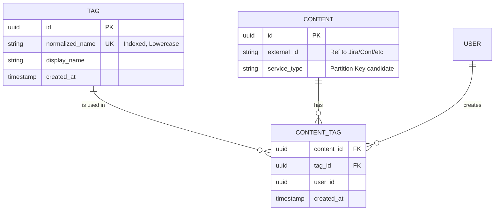

# Part 1: Requirements & Domain Model

## 1. Introduction: The Sticker on the Skyscraper
Imagine a library with millions of books but no index. The only way to find "Sci-Fi" is to walk every aisle. That is your content platform without tags.

Tags appear deceptively simple—just a digital sticky note attached to a Jira issue or a YouTube video. But at scale, this "simple" feature becomes a distributed systems nightmare. When 100 million users start tagging, you face massive write spikes, "hot" tags (like "bug" or "viral"), and queries that need to scan billions of rows in milliseconds.

In this series, we won't just build a tagging system; we'll build a **resilient Tag Management Engine** capable of handling 100M+ DAU across products like Jira and Confluence, surviving the chaos of viral traffic.

---

## 2. Requirements: Defining the Problem

### The Functional MVP (What users see)
We focus on the essential features that drive value:
- **FR1 (Add Tag)**: "Label this." Users attach tags to content.
- **FR2 (Remove Tag)**: "Oops, wrong label." Users dissociate tags.
- **FR3 (View Tags)**: "What is this?" Retrieve all tags for an item.
- **FR4 (Search by Tag)**: "Show me everything like this." Finds content by tag.
- **FR5 (Popular Tags)**: "What's trending?" A leaderboard of usage.

### The Non-Functional Reality (What keeps us up at night)
- **Scalability**: Support **100M Daily Active Users**.
  - *Writes*: 50k QPS (The "Monday Morning" Jira spike).
  - *Reads*: 100k QPS (The "Search" load).
- **Latency**:
  - Write: < 200ms p99 (Feels instant).
  - Read: < 500ms p99 (Search feels snappy).
- **Consistency**:
  - *Tagging*: **Strong**. If I tag a bug "Critical", my manager must see it immediately.
  - *Search*: **Eventual**. If a tag appears in search 30s later, nobody dies.

---

## 3. Core Entities & Components

To support the data model, we need the following core entities:

1.  **Tag**: The definition of a tag (name, id, metadata).
2.  **Content**: The external entity being tagged (Jira Issue, etc.). We only store a reference ID.
3.  **Tagging (Link)**: The many-to-many relationship between Content and Tags.
4.  **User**: The actor performing the action.

---

## 4. Entity Relationship (ER) Model

We normalize the data to reduce redundancy and handle tag renames efficiently.



**Key Modeling Decisions:**
1.  **Normalized Tags**: We store tags in a separate `TAG` table.
    *   *Pro*: Easy to rename "bug" -> "defect" globally.
    *   *Con*: Two writes (Tag creation + Link creation) for new tags.
2.  **Link Table**: `CONTENT_TAG` resolves the M:N relationship.
    *   *Pro*: Essential for querying both directions (get tags for content, get content for tags).

---

## 5. API Design

We assume a RESTful approach. All responses use JSON.

### 5.1 POST /v1/content/{content_id}/tags
Adds a tag to a content item.

**Request:**
```json
{
  "tag_name": "Performance-Issue"
}
```

**Response (201 Created):**
```json
{
  "tag_id": "550e8400-e29b-41d4-a716-446655440000",
  "name": "Performance-Issue",
  "entity_link": "/v1/content/123/tags/550"
}
```

### 5.2 GET /v1/content/{content_id}/tags
Retrieves all tags for a piece of content.

**Response (200 OK):**
```json
{
  "content_id": "123",
  "tags": [
    { "id": "550...", "name": "Performance-Issue" },
    { "id": "660...", "name": "Backend" }
  ]
}
```

### 5.3 GET /v1/tags/{tag_id}/content
Finds content with a specific tag.

**Query Params:** `?page=1&limit=20`

**Response (200 OK):**
```json
{
  "tag": "Performance-Issue",
  "content_items": [
    { "content_id": "123", "service": "Jira", "snippet": "Slow query..." },
    { "content_id": "456", "service": "Confluence", "snippet": "DB tuning guide" }
  ],
  "next_page": "cursor_xyz"
}
```

### 5.4 GET /v1/tags/popular
Returns trending tags.

**Response (200 OK):**
```json
{
  "period": "24h",
  "tags": [
    { "name": "bug", "count": 15043 },
    { "name": "feature", "count": 8900 }
  ]
}
```
