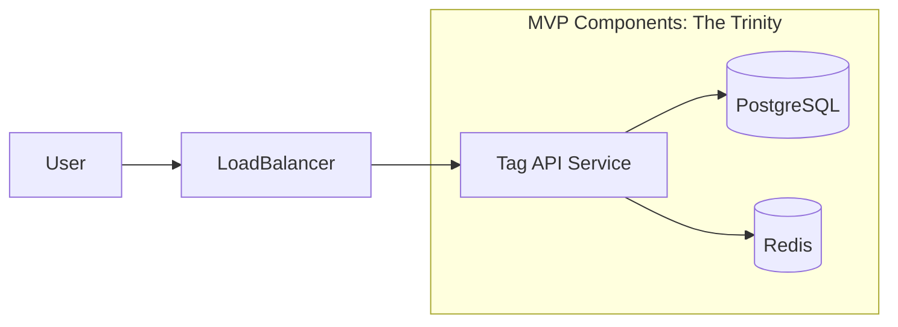
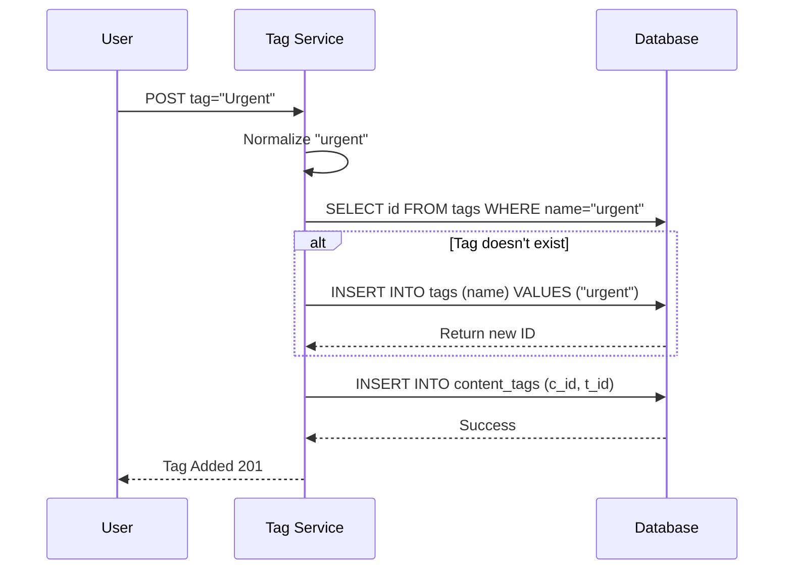

# Part 2: Basic System Design (MVP)

## 1. Introduction: Start Simple, Then Break It
Before we worry about sharding and eventual consistency, let's solve the core problem. How do we store a tag?

Refusing to over-engineer at the start is a seniority signal. We begin with a **Minimum Viable Product (MVP)**—a clean, monolithic design that satisfies the functional requirements. This establishes a baseline so we can see exactly where it breaks when we add load.

---

## 2. High-Level Architecture (The Naive Approach)

For the MVP, we use the industry standard "boring" stack:
1.  **Stateless Service**: A standard REST API (Go/Java).
2.  **Relational Database (PostgreSQL)**: Our single source of truth. Why SQL? Because relationships (Tags <-> Content) are the core of our domain, and ACID guarantees keep our data sane.
3.  **Read-Through Cache (Redis)**: To protect the DB from repetitive "Show tags for Issue X" calls.

---

## 3. Basic Design Details

### Component Breakdown
*   **Tag API Service**: A Go/Java microservice. It handles validation (e.g., tag length), normalization (lowercase), and DB transactions.
*   **PostgreSQL**: Handles relational data. Good consistency/ACID guarantees are helpful for the `TAG` + `CONTENT_TAG` writes.
*   **Redis**: Caches the "GET tags for content" response to offload the DB.

### Write Path: Adding a Tag (FR1)
1.  User sends `POST /content/123/tags` with `tag_name="Urgent"`.
2.  **App**: Normalizes "Urgent" -> "urgent".
3.  **App**: Checks if "urgent" exists in `TAG` table.
    *   If no: `INSERT INTO TAG ...` (returning ID).
    *   If yes: Get existing ID.
4.  **App**: `INSERT INTO CONTENT_TAG (content_id, tag_id) ...`
5.  **App**: Returns success.

### 3.1 Bonus: Implementing Typeahead (Autocomplete)
Users expect suggestions as they type "urg...". We can't run `LIKE 'urg%'` on Postgres at scale.
*   **Solution**: Redis Sorted Sets (`ZSET`).
*   **Mechanism**: Store all tags in a ZSET with `score=0`.
*   **Query**: Use `ZRANGEBYLEX [urg [urg\xff` to find all strings starting with "urg".
*   **Why**: It's O(log(N)) + M, extraordinarily fast (microseconds) for prefix lookups.

### Read Path: Get Content Tags (FR3)
1.  User sends `GET /content/123/tags`.
2.  **App**: Check Redis key `content:123:tags`.
3.  **Cache Hit**: Return JSON immediately.
4.  **Cache Miss**:
    *   JOIN `CONTENT_TAG` and `TAG` tables in DB.
    *   Write result to Redis (TTL 1 hour).
    *   Return JSON.

---

## 4. Basic Design Limitation/Tradeoffs

This MVP works well for ~1,000 requests/sec. But at our target scale (100k reads/sec, 50k writes/sec), it breaks:

1.  **Database Bottleneck**: A single Postgres instance cannot handle 50k writes/sec comfortably, especially with index overhead.
2.  **"Justin Bieber" Problem (Hot Tags)**: Searching for content by a popular tag (e.g., "bug") might return 10M rows. The DB query `SELECT * FROM content_tags WHERE tag_id = X` becomes huge and slow.
3.  **Popularity Calculation**: Running `SELECT count(*) GROUP BY tag_id` on the main transactional table will lock rows/tables and degrade write performance.
4.  **Single Point of Failure**: One DB instance means zero redundancy.

These limitations set the stage for our **Deep Dives** in the next parts of the series.
