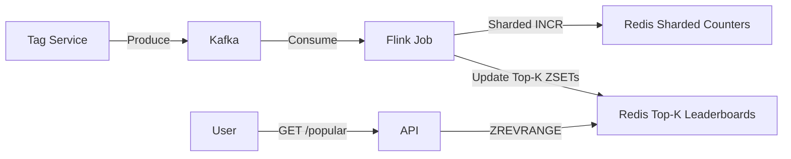

# Part 4: Deep Dive - Analytics & Popularity

## 1. Introduction: The "Counting" Problem
FR5 asks us to "Show Trending Tags". Sounds easy—just `SELECT tag, count(*) FROM tags GROUP BY tag ORDER BY count DESC`, right?

On a dataset of 3 billion records, that query will run for minutes. And while it runs, it locks rows and kills our write performance. We cannot run analytics on our primary transactional database (OLTP). We need a new path.

---

## 2. Approach: Log-Based Architecture (CDC)

Instead of asking the database "how many?", we listen to what it says. We treat every "Tag Added" action as an immutable event.

**Event Schema:**
```json
{
  "event": "TAG_ADDED",
  "tag_id": "550e...",
  "normalized_name": "urgent",
  "timestamp": 1674465000
}
```

### The Stream Pipeline
Refactoring to streams decouples our "Now" (Transactional) from our "History" (Analytics).

1.  **Producer**: When a tag is saved, the service emits an event to Kafka.
2.  **Processor (Flink)**: A stateful job consumes the stream. It keeps a "sliding window" (e.g., last 1 hour) in memory.
3.  **Sink (Redis)**: The processor maintains both:
    *   **Counts** (per tag, per window), and
    *   **Leaderboards** (Top-K tags per window).

### The "Sharded Counter" Optimization (Critical)
For normal tags, `INCR tag:count:java` is fine.
For `#viral` tags getting 10,000 updates/sec, a single Redis key becomes a bottleneck (Redis assumes single-threaded execution per key).

**The Fix**: Shard the counter.
*   **Write**: Pick a random shard `1..N`. `INCR tag:count:viral:3`
*   **Read**: `SUM(tag:count:viral:*)`
*   **Result**: We spread the write load across 10-20 Redis keys (or even cluster nodes), making the "hot tag" write-scalable.

One important detail: **sharded counters make counting scalable, but they don’t magically give you Top-K**. You still need a structure that answers:
> “What are the top 100 tags in the last 24 hours?”

That’s why we also maintain a **leaderboard** per time window.

### The Leaderboard (How we actually serve Top-K)
We keep a Redis Sorted Set per time window:

- Key: `tags:topk:1h`, `tags:topk:24h`
- Member: `tag_id` (or `normalized_name`)
- Score: the windowed count

The stream processor updates the ZSET periodically (batch every few seconds) or only when a tag is a candidate heavy-hitter. The API then serves Top-K with `ZREVRANGE`.



---

## 3. Alternative Architecture: Partitioned Top-K Heaps

For systems where setting up Kafka/Flink is overkill, or strictly real-time in-memory performance is required, we can use a **Partitioned Heap** (Scatter-Gather) approach.

### The Concept
We partition the stream of tags across $N$ aggregator nodes. Each node calculates the "Local Top-K" for its subset of tags. A central querier triggers a "Scatter-Gather" to merge these local results into a global "Top-K".

### Theory of Operation
1.  **Sharding**: Tags are hashed to aggregator nodes: `NodeID = hash(tag_string) % N`.
2.  **Local Storage**: Each node maintains:
    *   **HashMap**: Frequency table for strictly its assigned tags (`Map<Tag, Count>`).
    *   **Min-Heap**: A priority queue of size $K$ (e.g., 100) tracking the top tags on *this node*.
3.  **Read Path (Scatter-Gather)**:
    *   Client requests "Top 100".
    *   Coordinator queries **all N** nodes in parallel.
    *   Each node returns its local top 100 list.
    *   Coordinator merges $N \times 100$ items and returns the global top 100.

### Diagram: Partitioned Heap

```mermaid
graph TD
    LB[Load Balancer] -->|Hash Tag| Nodes
    
    subgraph "Aggregator Cluster"
        Node1[Node 1<br/>Map + Heap(K)]
        Node2[Node 2<br/>Map + Heap(K)]
        Node3[Node 3<br/>Map + Heap(K)]
    end
    
    Node1 -->|Local Top K| Merger
    Node2 -->|Local Top K| Merger
    Node3 -->|Local Top K| Merger
    
    Merger[Scatter-Gather Svc] -->|Global Top K| Dashboard
```

### Fault Tolerance via Replication
To recover from node failures (which would otherwise lose the in-memory counts), we deploy each shard as a **Replica Set** (Primary + 2 Updates).
*   **Write Path**: The Load Balancer sends the `TagAdded` event to the **Primary** and asynchronously to **Replicas**.
*   **Failover**: If a Primary node crashes, a Replica is promoted, preventing count resets.
*   **Straggler Mitigation**: The "Scatter-Gather" service can query *any* replica in the set, picking the fastest response to reduce tail latency.

### Trade-offs
*   **Pros**:
    *   **Simplicity**: No complex reliable streaming infrastructure (Kafka/Zookeeper) required initially.
    *   **Latency**: In-memory updates are micro-second scale.
*   **Cons**:
    *   **Operational Overhead**: Managing replication states and failover logic adds significant code complexity compared to a stateless Flink job.
    *   **Read Latency**: The "Scatter-Gather" step is limited by the slowest node (straggler problem), though replication helps mitigate this.
    *   **Memory Bound**: The HashMap must store *all unique tags*. If unique tags > RAM, this fails (unlike Count-Min Sketch).

---

## 4. Optimization: The "Heavy Hitter" Problem
A naive stream processor counting every occurrence of "bug" requires huge memory.

**Optimization: Count-Min Sketch**
For "Top N" lists where 100% precision isn't required (just identifying heavy hitters), probabilistic data structures like Count-Min Sketch are ideal.
*   **Memory**: Uses fixed small memory (KB) regardless of stream size.
*   **Error**: Tunable (e.g., 99% accurate).
*   **Usage**: The Flink job uses specific CMS to estimate counts, then only updates the Redis Leaderboard for tags exceeding a threshold.

In practice, many streaming Top-K systems pair CMS with a **candidate set** (min-heap) or use a dedicated heavy-hitters algorithm like **Misra–Gries / Space-Saving**:
- CMS answers “approximately how many?” cheaply.
- The heap/Space-Saving answers “which are the biggest right now?” efficiently.

---

## 5. Product Definition: What does “Popular” mean?
“Top tags” is ambiguous. Different products mean different things:

- **Most used**: total count over all time (easy, but boring).
- **Trending**: count over a sliding window (1h/24h) with time decay.
- **Unique popularity**: distinct content items tagged (reduces spam).
- **Unique users**: distinct users applying the tag (reduces bot amplification).

For most teams, **Trending (windowed)** is the right default. It’s also exactly how you keep the list fresh.

---

## 6. Correctness Details Most Systems Miss

### 6.1 Deletions and edits
If users can remove tags (FR2), the analytics pipeline needs a `TAG_REMOVED` event too.

- **Counts**: decrement the windowed counter.
- **Leaderboards**: update the ZSET score (or rebuild periodically).

If you don’t do this, “popular tags” slowly becomes a graveyard of tags users no longer use.

### 6.2 Exactly-once vs at-least-once
Streams are usually **at-least-once** (events may be replayed).

To avoid double-counting:
- Include an `event_id` and do de-dup in Flink state for a short TTL, or
- Use Kafka/Flink exactly-once semantics end-to-end (harder operationally).

### 6.3 Reconciliation (the YouTube-style trick)
Even with careful processing, counters drift (retries, bugs, backfills).
The standard solution is a **Lambda-style correction loop**:

- **Speed layer**: stream counts for freshness (seconds).
- **Batch layer**: periodic recompute from immutable logs for correctness (hourly/daily).
- Batch overwrites/repairs the serving store.

---

## 7. Why Eventual Consistency Works Here
For a "Trending" dashboard, it doesn't matter if the count for "Java" is 15,042 or 15,043, or if the data is 30 seconds old.
*   **Trade-off**: We accept ~1 minute latency for analytics.
*   **Gain**: We remove all read load from the primary write database.

---

## 8. Comparison: Top-K Tags vs YouTube Top-K

At a high level, YouTube’s “Top” problems come in two flavors:

1. **View count per video** (a counter problem)
2. **Trending / Top videos** (a ranking + fraud-resistance problem)

### 8.1 View counts (very similar to tag counts)
This is where YouTube-like systems converge on the same pattern we used:

- **Sharded counters** to handle hot keys (a viral video, a viral tag).
- **Stream processing** for near-real-time updates.
- **Periodic reconciliation** from logs to repair drift.

### 8.2 Trending ranking (more complex than “count desc”)
Trending is usually not “most views”. It’s a weighted function of:

- **Freshness** (time decay),
- **Velocity** (views per minute / tags per minute),
- **Uniqueness** (unique users/content),
- **Quality signals** (spam/bot detection).

For tags, you can adopt the same idea:

- Compute a trend score like $score = \frac{count_{1h}}{count_{24h} + 1}$, or apply exponential decay.
- Maintain leaderboards per segment: per product (Jira vs Confluence), per region, per tenant.

The key takeaway: **Top-K is a serving problem** (fast reads from a precomputed leaderboard), not a raw counting problem.
