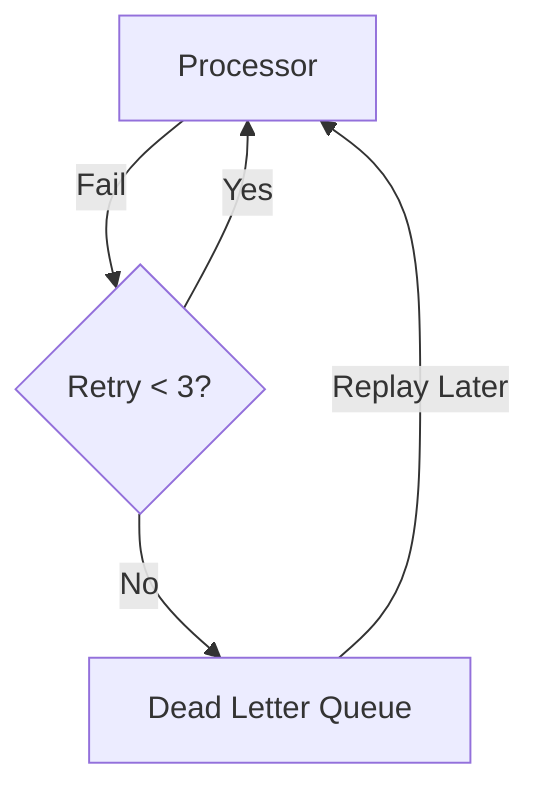

# Part 5: Deep Dive - Data Consistency & Failure

## 1. Introduction: Embracing Chaos
In a distributed system, "perfect" running conditions are a myth. At our scale, servers *will* die. Networks *will* partition.

The question isn't "how do we prevent failure?", but "how does the system behave when it fails?" This section explores the resilience patterns that keep the lights on.

---

## 2. Failure Scenarios

### Scenario A: The Database Shard Dies
*   **The Impact**: 1/64th of our users (those on Shard #42) see errors.
*   **The Defense**:
    *   **Replication**: We don't rely on one machine. Every Master has 2 async replicas ready to take over.
    *   **Automated Failover**: A tool like Patroni detects the silence and promotes a Replica to Master.
    *   **The Trade-off**: Since replication is async (for speed), we might lose the last ~1 second of writes during a crash. We accept this small data loss to gain massive performance (the "Availability over Consistency" choice).

### Scenario B: Cache Failure (Redis vanishes)
*   **The Impact**: The "Cache Shield" is down. 100k reads/sec suddenly hit the database.
*   **The Defense**:
    *   **Circuit Breakers**: The application sees the DB slowing down and "trips" the breaker. It stops asking the DB for non-critical data (like popular tags) and returns a friendly "Features Limited" response or stale data.
    *   **Why**: Better to have a degraded service than a thoroughly dead one.

---

## 3. Consistency Models

### Strong Consistency (Tag Association)
When I label a bug as "Critical", I need to see that label *now*.
*   **Strategy**: "Read-Your-Writes". For the user who just wrote data, we force a read from the Master DB (or a synchronous replica), bypassing the potentially stale async replicas.

### Eventual Consistency (Search)
If I search for "Critical" bugs, it's okay if the one I just tagged shows up 5 seconds later.
*   **Strategy**: We update the Search Index asynchronously via Kafka. The lag is a monitored metric, but it's an accepted part of the system contract.

---

## 4. Operational Fallbacks

**Dead Letter Queues (DLQ)**
If the message to update the Search Index or Analytics fails (e.g., transient network issue):
1.  Retry 3 times with exponential backoff.
2.  If still failing, push to a DLQ (Kafka topic).
3.  Secondary consumer processes DLQ later or alerts humans.

