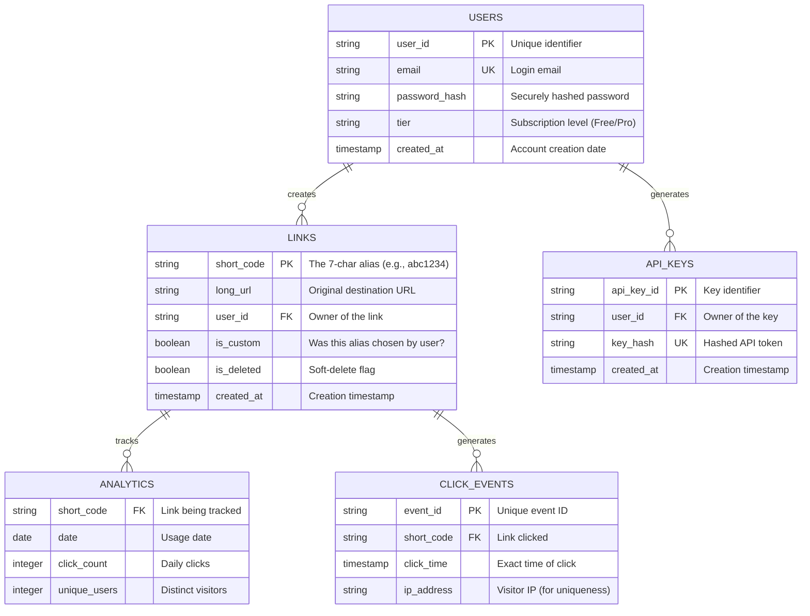

# Article 2: Core Entities & Architecture

## The Data Foundation

A great system design starts with a solid data model. If we get the entities right, the logic tends to follow naturally. If we get them wrong, we'll spend forever fighting our own database schema.

Our URL shortener is relatively simple in terms of relationships, but the scale demands precision. We need to store billions of links while keeping the "hot" path—the redirect—incredibly lightweight.

### Entity Relationships Diagram

This diagram visualizes how our data fits together. Notice that `LINKS` are the central hub, connecting users who create them to the click events they generate.



---

## 1. Deep Dive: Core Entities

Let's break down the three most critical data structures in our system.

### Entity 1: Links (The Crown Jewels)
This is the heart of our system. The `short_code` is our primary key because it's what we look up 99% of the time.
*   **Design Choice**: We use `is_deleted` (soft delete) instead of actually removing rows. This prevents a deleted short code from being immediately reused by another user (which could cause security confusion) and allows for data recovery.
*   **Scale**: We expect billions of rows here.

```text
Links Table:
  ├─ short_code (PK): "abc1234" (7 chars, Base62)
  ├─ long_url: "https://very-long-site.com/..."
  ├─ user_id (FK): Link owner
  ├─ created_at: Immutable timestamp
  ├─ is_custom: Boolean flag
  └─ is_deleted: Boolean flag
```

### Entity 2: Users (The Owners)
Users are standard account entities. We separate `API_KEYS` into their own table to allow users to rotate keys without losing their account history or links.
*   **Tier**: Crucial for rate limiting. A "free" user might get 10 links/hour, while "enterprise" gets 10,000.

### Entity 3: Analytics (The Value Add)
How do we store statistics for 500 million DAILY redirects?
*   **The Trap**: Storing every single click as a row in a relational database will kill it.
*   **The Solution**: We capture raw clicks in an event stream (like Kafka) and aggregate them into daily summaries. The `ANALYTICS` table above represents this *aggregated view* (e.g., "Link A got 50 clicks on Jan 1st"), which is much smaller and faster to query for dashboards.

---

## 2. High-Level Architecture

Now let's zoom out. How do the servers, databases, and caches talk to each other?

### Component Interactions
The diagram below shows the lifecycle of a request.
1.  **Traffic Entry**: All requests hit the **Load Balancer** first.
2.  **Logic**: The **API Servers** (stateless) handle the business logic.
3.  **Speed**: They check the **Cache (Redis)** immediately for redirects.
4.  **Truth**: If the cache misses, they check the **Database**.
5.  **Insights**: Analytics are sent asynchronously to a **Message Queue** so they don't slow down the redirect.

```text
┌──────────────────┐
│  Users/Browser   │
└────────┬─────────┘
         │
         │ 1. HTTP Request (GET short.app/abc)
         │
    ┌────▼──────────┐
    │ Load Balancer │ ◄────── Health checks (Is server alive?)
    │ (Nginx / ALB) │
    └────┬──────────┘
         │
    ┌────┴───────────────────────┐
    │   API Servers (Stateless)   │
    │   (Horizontally Scaled)     │
    └────┬──────────┬──────────┬──┘
         │          │          │
         │ 2. Read  │ 3. Miss? │ 4. Async Log
    ┌────▼──┐  ┌───▼────┐  ┌──▼────────┐
    │ Cache │  │Database│  │Msg Queue  │
    │ Redis │  │ Postgres   │ (Kafka)   │
    └───────┘  └────────┘  └────┬──────┘
                                 │
                            ┌────▼────────┐
                            │ Analytics   │
                            │ Worker      │
                            └─────────────┘
```

---

## 3. Data Flow: The Life of a Request

To truly understand the system, we must follow the path of data.

### Path 1: Creating a Link (The Write Path)
This path is slower but consistent. We cannot afford to lose data here.
1.  **Validation**: Is the URL valid? Is it malicious?
2.  **Deduplication**: Has this user already shortened this link?
3.  **Generation**: create a unique 7-character string.
4.  **Storage**: Save to DB first (source of truth), *then* cache it.

```text
User Request
    │
    ├─ 1. Validate: Check URL format & safety blacklists
    │
    ├─ 2. Deduplicate: (Optional) Check if exact link exists for user
    │
    ├─ 3. Generate:
    │   └─ Random: Generate unique Base62 ID
    │   └─ Custom: Verify "my-alias" is not taken
    │
    ├─ 4. Persist (DB): Write to primary database (Master)
    │
    ├─ 5. Cache (Redis): Add to cache for immediate read availability
    │
    └─ 6. Respond: Return { "short_url": "..." }
```

### Path 2: The Redirect (The Read Path)
This is the "Hot Path". It must be blazing fast (<100ms).
1.  **Cache First**: We check RAM (Redis) first. 90%+ of traffic should stop here.
2.  **Database Fallback**: Only if the cache is empty do we hit the disk (DB).
3.  **Fire-and-Forget**: We log the analytics event *after* sending the response (or asynchronously) so the user doesn't wait for us to count the click.

```text
User Clicks Link
    │
    ├─ 1. Cache Lookup (Redis):
    │   └─ HIT: Return URL immediately (Speed: < 5ms)
    │   └─ MISS: Continue to DB
    │
    ├─ 2. Database Lookup (Postgres):
    │   └─ Fetch URL and populate Cache for next time
    │   └─ (Speed: 10-50ms)
    │
    ├─ 3. Async Analytics:
    │   └─ Send "Click Event" to Kafka queue (Don't wait for confirmation)
    │
    └─ 4. HTTP 301 Redirect: Use "Location" header
```

---

## Summary

We have designed a system that separates concerns:
*   **Entities** focus on correctness and relationships.
*   **Architecture** focuses on speed (Caching) and reliability (Queues).
*   **Data Flows** ensure that "Writes" are safe and "Reads" are fast.

In the next article, we will get into the nitty-gritty of the **API Design**, strictly defining exactly how the outside world talks to these components.
