# Article 4: The Core Engine (Minimal Viable Product)

## Building the Foundation

Before we worry about handling a billion users, we must ensure our system works correctly for just one. This article focuses on the "First Principles" of our design: correctness, data integrity, and solving the fundamental logical challenges of URL shortening.

Our goal is a **Minimum Viable Product (MVP)** that:
1.  Generates truly unique short codes key.
2.  Redirection works reliably.
3.  Analytics are counted accurately.
4.  Data is never corrupted by race conditions.

---

## 1. The Critical Challenge: Generating Unique Short Codes

The heart of a URL shortener is the algorithm that turns a long URL into a short, unique string (e.g., `abc1234`). If two different URLs get the same short code, we have a "Collision," and one user's link will redirect to the wrong place. This is catastrophic.

We have two main strategies to solve this.

### Strategy A: Random String Generation (The "Try & Check" Method)
This is intuitive: just roll the dice.
1.  Generate a random 6-character string from `[a-z, A-Z, 0-9]`.
2.  Check the database: "Does this code exist?"
3.  If **No**: Insert it.
4.  If **Yes** (Collision): Generate a new one and retry.

*   **Pros**: Unpredictable URLs (good for security, competitors can't guess your volume).
*   **Cons**: As the database fills up, collisions become frequent, leading to multiple retries and slower performance.

### Strategy B: Base62 Conversion (The "Counter" Method)
This is the mathematical approach. We treat the database ID as a number and convert it to Base62.
*   **Base62 Alphabet**: `0-9` (10) + `a-z` (26) + `A-Z` (26) = 62 characters.
*   **Mechanism**:
    *   Database ID `1` -> Code `1`
    *   Database ID `100` -> Code `1C`
    *   Database ID `1,000,000` -> Code `4c92`
    *   Database ID `10,000,000,000` -> Code `aUKYO`

*   **Pros**: **Zero collisions guaranteed**. Every number maps to exactly one string. It is extremely fast.
*   **Cons**: Predictable. If a user sees `code: 1C` and next is `code: 1D`, they know you only have small traffic.

### The Verdict for MVP
We will use **Strategy B (Base62)** because it eliminates the need for complex collision handling and retries. To fix the "predictability" issue, we can simply start our Database Auto-Increment ID at a large number (e.g., 1,000,000,000) so all codes look like "random" 6-character strings (`15FTGg`).

---

## 2. Solving Concurrency (The Race Condition)

What happens if two users try to claim the custom alias `summer-sale` at the exact same millisecond?

**The "Check-Then-Act" Trap**
A naive implementation might look like this:
```javascript
// DON'T DO THIS
if ( db.find(code: 'summer-sale') == null ) {
   // It's free! I'll take it.
   // <--- Race Condition happens here! another thread might insert right now
   db.insert(code: 'summer-sale')
}
```
If two requests run the `check` at the same time, both will see "null", and both will try to insert. One will overwrite the other, or you'll have duplicate data.

**The Solution: Database Constraints**
We rely on the database to be the referee. We define the schema with a `UNIQUE` constraint.

```sql
CREATE TABLE links (
    short_code VARCHAR(10) PRIMARY KEY,
    -- other fields...
);
```

Now, we just try to insert.
1.  Thread A inserts `summer-sale`. **Success**.
2.  Thread B inserts `summer-sale`. **DB Error: Unique Violation (409 Conflict)**.

We catch the error in our code and return a polite "Sorry, taken" message to User B. This is ACID compliance in action.

---

## 3. The MVP Architecture

For our MVP, a simple, monolithic approach is best. It minimizes operational complexity ("moving parts").

```mermaid
graph TD
    User["👤 User"]
    LB["Load Balancer (Nginx)"]
    App["API Server (Node.js)"]
    DB[(PostgreSQL)]

    User -->|HTTPS| LB
    LB -->|Round Robin| App
    App -->|SQL Queries| DB
```



*   **Load Balancer**: Distributes traffic across servers.
*   **API Server**: Stateless Node.js server. Validates inputs and runs the logic.
*   **PostgreSQL**: Single "Source of Truth". Handles data storage and enforces uniqueness.

---

## 4. Detailed Data Flows

### Flow 1: Creating a Link (Write)
1.  **Receive**: `POST /links` with `long_url`.
2.  **Idempotency Check**: Hash the `long_url` (MD5). Query DB: "Do we have a link with this hash for this User?".
    *   *Why?* prevents users from creating 100 copies of the same link.
3.  **Generate ID**:
    *   Insert a new row into database to get a unique `id` (e.g., 1005).
    *   Convert `1005` to Base62 -> `g7`.
    *   Update the row with `short_code = 'g7'`.
    *   *Optimization*: Use a PL/SQL function to do this in one step, or use a pre-generated ID service (discussed in later articles).
4.  **Respond**: Return `short.app/g7`.

### Flow 2: Redirection (Read)
1.  **Receive**: `GET /g7`.
2.  **Lookup**: `SELECT long_url FROM links WHERE short_code = 'g7'`.
3.  **Validate**:
    *   Is it found? If no -> 404.
    *   Is `is_deleted` true? If yes -> 404 (or 410 Gone).
    *   Is `expires_at` passed? If yes -> 404.
4.  **Record Analytics (Synchronous)**:
    *   `UPDATE analytics SET clicks = clicks + 1 WHERE code = 'g7'`.
    *   *Note*: This makes the redirect slower (User waits for the write). We accept this for MVP simplicity.
5.  **Redirect**: Return HTTP 301 to `long_url`.

---

## 5. MVP Schema Design

```sql
-- 1. Users: Standard account info
CREATE TABLE users (
    user_id UUID PRIMARY KEY DEFAULT gen_random_uuid(),
    email VARCHAR(255) UNIQUE NOT NULL,
    tier VARCHAR(50) DEFAULT 'free' -- limits usage
);

-- 2. Links: The core mapping
CREATE TABLE links (
    id BIGSERIAL PRIMARY KEY, -- Auto-incrementing ID for Base62
    short_code VARCHAR(10) UNIQUE, -- The public alias
    long_url TEXT NOT NULL,
    long_url_hash CHAR(32), -- Index this for fast duplicate checks
    user_id UUID REFERENCES users(user_id),
    created_at TIMESTAMP DEFAULT NOW(),
    is_active BOOLEAN DEFAULT TRUE
);

-- Index for the "Hot Path" (Redirects)
CREATE INDEX idx_short_code ON links(short_code);

-- Index for the "Write Path" (Duplication Check)
CREATE INDEX idx_long_url_hash ON links(long_url_hash);
```

---

## Summary: What we have built
We have a robust system that guarantees:
*   **Uniqueness**: Via Base62 + Database IDs.
*   **Integrity**: Via Database Constraints.
*   **Simplicity**: Easy to debug and deploy.

**The Problem?**
It doesn't scale.
1.  **The Analytics Bottleneck**: Every click requires a database *write*. At 1000 clicks/sec, our database will lock up.
2.  **The ID Bottleneck**: We depend on a single database counter for IDs.
3.  **Latency**: Users in Asia hitting a variety in US-East will be slow.

In the next part, we will break these bottlenecks.

**Architecture**:
- 3 API servers (load balanced)
- PostgreSQL single master with replica
- Synchronous all operations
- No caching

**Database**:
- 3 tables: users, links, daily_analytics
- Indexes on user_id, created_at, long_url hash
- ACID transactions for consistency

**Flows**:
- Create: Validate → Deduplicate → Generate → Insert
- Redirect: Query → Update analytics → Return

**Limitations** (Why MVP isn't production):
1. Database is bottleneck at 200+ RPS
2. Synchronous analytics kills redirect latency
3. No resilience (single point of failure)
4. No geographic redundancy (can't survive regional outages)
5. No caching (wastes database resources)

**When to scale**:
- When traffic hits 100+ RPS consistently
- When redirect latency exceeds 50ms p95
- When database CPU > 70%

**Next Article**: Basic design details and where it breaks.
