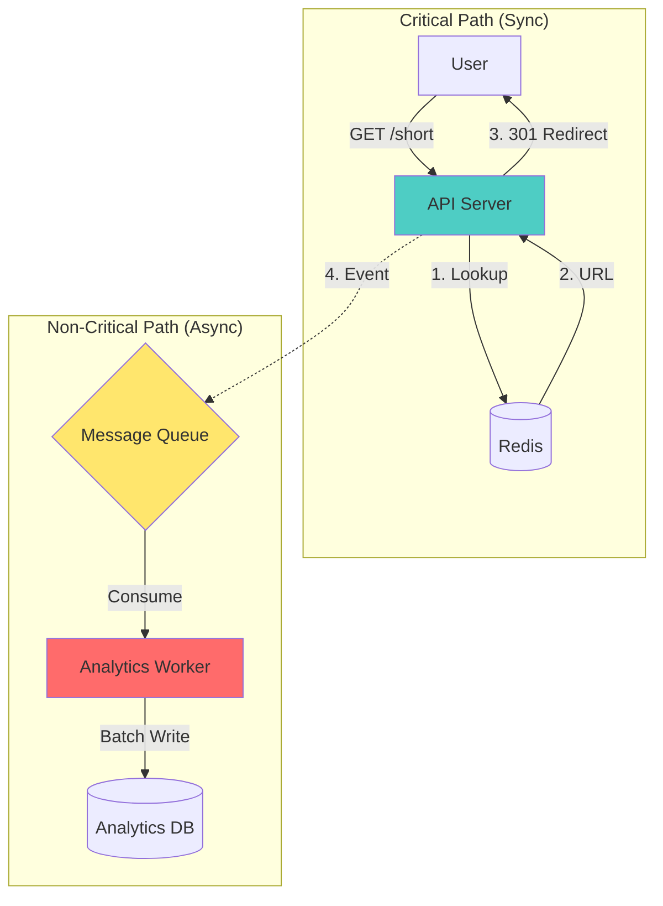

# Article 9: Deep Dive - Asynchronous Processing

## The Blocking Problem

In a standard web application, when a user asks for something, the server does all the work right then and there.

**The "Synchronous" Flow (The Anti-Pattern for Scale):**
1.  User clicks a link.
2.  Server receives request.
3.  Server writes to Database "Click +1". **(Cost: 10ms)**
4.  Server waits for Database to say "OK".
5.  Server calculates "User is from Tokyo". **(Cost: 2ms)**
6.  Server redirects User.

**Total Latency**: 12ms + Network.
**The Problem**: If the database slows down to 100ms, the *user* waits 100ms. If the database locks up, the user sees a spinner. **Analytics should never block the user experience.**

---

## 1. The Asynchronous Architecture

We decouple the "Critical Path" (Redirect) from the "Non-Critical Path" (Analytics).

### The "Fire-and-Forget" Flow
1.  **Critical Path (Priority 1)**: Get the user to their destination.
2.  **Non-Critical Path (Priority 2)**: Count the click, analyze the geo-location, update dashboards, check for fraud.

We use a Message Queue (Kafka or RabbitMQ) to bridge these two worlds.

### Architecture Diagram


---

## 2. The Message Queue (Kafka)

### Why Kafka?
For a URL shortener, we produce massive amounts of data. If we have 10,000 clicks/sec, we generate 10,000 events/sec.
*   **RabbitMQ**: Good for complex routing, but can struggle with massive throughput.
*   **Kafka**: Designed for massive throughput (millions of events/sec). It's a "distributed commit log". It writes events to disk sequentially, making it incredibly fast.

### The Event Payload
When a redirect happens, the API server places a simple JSON message into Kafka. It doesn't process it. It just drops it in the mailbox.

```json
{
  "event_type": "CLICK",
  "short_code": "abc1234",
  "timestamp": 1715000000,
  "visitor_ip": "203.0.113.1",
  "user_agent": "Mozilla/5.0...",
  "referer": "https://twitter.com/"
}
```

---

## 3. The Worker Logic (Consumer)

The "Worker" is a separate service. It can be a Go script, a Python script, or a Java application. It runs in the background, completely invisible to the user.

### Batch Processing
Writing to the database one by one is slow.
*   **Bad**: 100 events -> 100 DB Inserts.
*   **Good**: Accumulate 100 events in memory -> 1 DB Bulk Insert.

The worker reads from Kafka:
1.  Read 1,000 messages.
2.  Aggregate them in memory (e.g., "Link A was clicked 50 times").
3.  Write a single update to the DB: `UPDATE stats SET clicks = clicks + 50 WHERE id = 'LinkA'`.

**Result**: We reduced DB load by 50x.

---

## 4. Advanced: Event Sourcing & CQRS

By moving all writes to a queue, we accidentally stumbled upon a powerful pattern: **Event Sourcing**.

Instead of storing just the *current state* ("Link A has 5 clicks"), we store the *events* ("Click happened at 12:00", "Click happened at 12:01").

**Benefits**:
1.  **Time Travel**: We can replay events. "What was the click count yesterday at 2 PM?"
2.  **Audit Trail**: We have a perfect log of every single interaction.
3.  **Multiple Consumers**:
    *   **Consumer A**: Updates the "Total Clicks" dashboard.
    *   **Consumer B**: Checks for "Click Fraud" (same IP clicking 100 times).
    *   **Consumer C**: Feeds a Machine Learning model for recommendations.
    All consumers read from the same Kafka stream without affecting each other or the user.

---

## 5. Trade-offs and Risks

### Complexity
We introduced new infrastructure (Kafka, Zookeeper, Worker nodes). This is harder to maintain than a simple monolith. If Kafka goes down, analytics stop (but redirects still work!).

### Eventual Consistency
The dashboard is not "Real-time" in the strict sense. It might lag by 1-5 seconds.
*   **User**: "I just clicked it, why isn't the counter 101?"
*   **Engineer**: "Wait 2 seconds. The worker is processing the batch."
For analytics, a 5-second delay is perfectly acceptable.

---

## Summary
The **Async Architecture** is the secret weapon for scaling. It protects the sensitive user-facing latency from the heavy lifting of data processing. 

By treating "Redirects" and "Analytics" as two separate problems connected by a queue, we allow each to scale independently.
