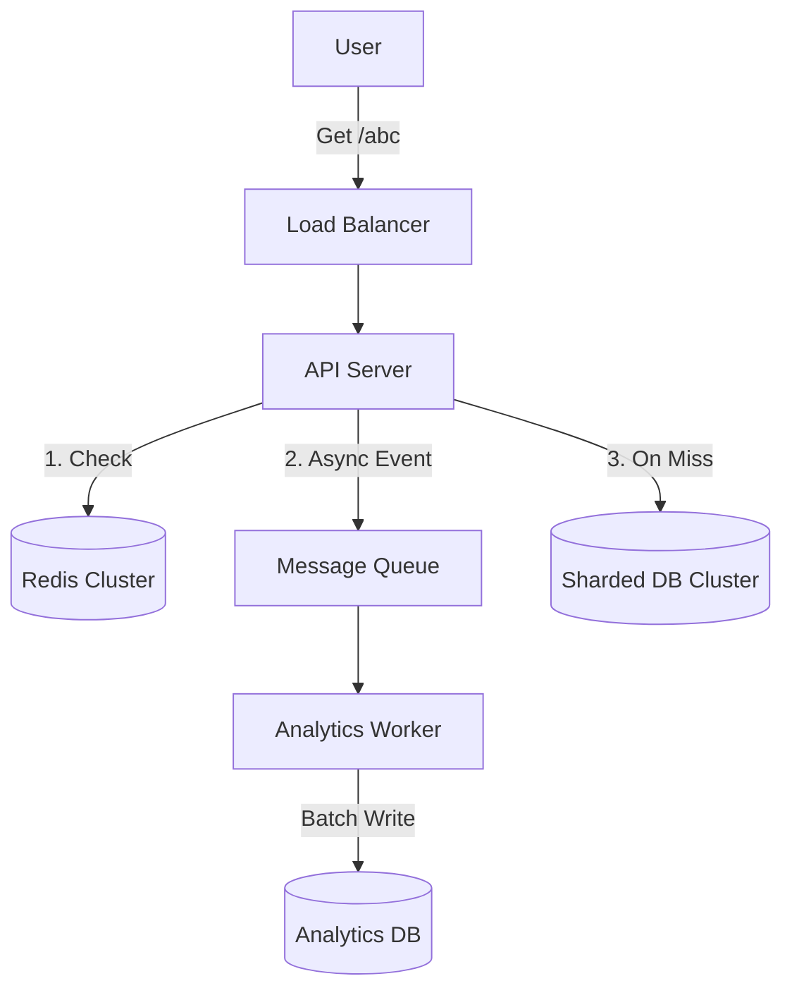

# Article 5: Analysis of the Basic Approach (Limitations & Solutions)

## 1. Critique of the MVP Implementation

In the previous article, we built a functional URL shortener using a single PostgreSQL database and synchronous logic. While it works for a small startup, it has critical flaws that will cause it to collapse under scale.

Let's rigorously analyze this "Basic Approach".

### A. The Scalability Bottleneck
**Scenario**: Traffic spikes from 100 RPS to 10,000 RPS (e.g., a link goes viral on social media).

*   **Failure Point 1: Database Connections**: A standard Postgres database can handle ~500-1000 active connections. If 10,000 users click at once, 9,000 of them will get "Connection Refused" errors.
*   **Failure Point 2: Write Lock Contention**: Our MVP synchronously updates the `analytics` table on every click (`UPDATE analytics SET clicks = clicks + 1`). This locks the row. If 1,000 users click the *same link* simultaneously, they form a queue, waiting for the lock. This causes the API to hang and eventually time out.

### B. The CAP Theorem Checklist
According to the CAP Theorem, a distributed data store can effectively provide only two of the following three guarantees: Consistency, Availability, and Partition Tolerance.

**Our MVP Analysis:**
*   **Consistency (C)**: **Strong**. We read directly from the Postgres master. Users always see the latest data.
*   **Availability (A)**: **Weak**. If the single Postgres instance goes down (maintenance or crash), the entire system stops. We have 0% availability during outages.
*   **Partition Tolerance (P)**: **None**. We live in a single data center. If the network to `us-east-1` has issues, the application fails.

**The Verdict**: Ideally, a URL shortener should prioritize **Availability (A)** and **Partition Tolerance (P)**. If a user creates a link, it's okay if it takes 1 second to become visible globally (Eventual Consistency), but it is *not* okay if the service is down. Our MVP makes the wrong trade-off by prioritizing Consistency over Availability.

### C. Latency Analysis
Let's break down the "Hot Path" (Redirect) latency in our MVP.

| Step | Time Cost | Notes |
| :--- | :--- | :--- |
| Network (User ↔ Server) | 20-300ms | Depends on user location vs `us-east-1` |
| SSL Handshake | 50-100ms | Occurs once per connection |
| DB Connection Checkout | 5-10ms | Limited pool size |
| Query `links` table | 10ms | Fast index lookup |
| **Write Analytics** | **30-50ms** | **The silent killer** (Synchronous write) |
| **Total Server Processing**| **~60ms** | |
| **Total User Wait** | **80-500ms** | Acceptable? Barely. Good? No. of which 50% is creating analytics. |

**Conclusion**: The synchronous write for analytics doubles our server-side latency.

---

## 2. Proposed Improvements (Standard Solutions)

To fix these issues, we need to introduce standard distributed system patterns.

### Improvement 1: Cache-Aside Pattern (Speed)
**Problem**: Reading from the database every time is slow and unscalable.
**Solution**: Introduce a distributed cache like **Redis**.

1.  **Read Path**: API checks Redis first.
    *   *Hit*: Return immediately (~1ms).
    *   *Miss*: Read from DB, store in Redis, return.
2.  **Write Path**: When a link is created/deleted, update DB first, then invalidate/update Redis.

**Benefit**:
*   Reduces DB load by 90-99%.
*   Reduces latency to sub-millisecond for hot links.

### Improvement 2: Asynchronous Processing (Throughput)
**Problem**: Writing analytics synchronously blocks the user.
**Solution**: Use a Message Queue (e.g., Kafka, RabbitMQ) for "Fire and Forget".

1.  **New Flow**:
    *   User clicks link.
    *   API looks up URL (Cache/DB).
    *   API *publishes* a message `{"code": "abc", "time": "12:00"}` to a queue.
    *   API returns 301 Redirect immediately.
2.  **Background Worker**: A separate service reads from the queue and updates the database in batches (e.g., update 100 clicks in one SQL query).

**Benefit**:
*   Removes "Write Analytics" time from the user's wait.
*   Protects the database from write spikes (the queue acts as a buffer).

### Improvement 3: Database Sharding (Scale)
**Problem**: One database cannot store billions of links or handle 100k writes/sec.
**Solution**: Partition the data across multiple database servers.

*   **Strategy**: Hash-based sharding on `short_code`.
*   **Logic**: `Shard_ID = hash(short_code) % Number_of_Nodes`.
*   Users with code `a` go to DB_1, users with code `b` go to DB_2.

**Benefit**:
*   Linear scalability. To handle 2x traffic, add 2x nodes.

---

## 3. The New "Scalable" Architecture

Based on these proposals, our next generation design will look like this:



In the next part, we will detail how to implement the **Cache Layer** effectively.
         User doesn't care about analytics
         Should be async!
```

---

## Where the MVP Breaks (Detailed Analysis)

### Breaking Point 1: Database Overload (100 RPS)

```
PostgreSQL single master with one replica

Capacity: ~1000 concurrent connections, ~1000 RPS (read-heavy)

At 50 RPS:  CPU 10%, Memory 5% → Healthy
At 100 RPS: CPU 50%, Memory 15% → Getting tight
At 200 RPS: CPU 80%, Memory 30% → Queries slow
At 300 RPS: CPU 100%, Memory 50% → Timeouts occur

Causes of slowdown:
  ├─ Lock contention (UPDATE daily_analytics)
  ├─ Query queue buildup
  ├─ Cache misses (working set > buffer pool)
  └─ Replication lag
```

### Breaking Point 2: Analytics Update Latency (100 RPS)

```
Before caching analytics:

Each redirect = 1 read + 1 write to database

At 100 RPS:
  ├─ 100 read operations/sec
  ├─ 100 write operations/sec
  ├─ Lock contention on daily_analytics table
  ├─ UPDATE daily_analytics SET clicks = clicks + 1
  │  └─ Locks row, reads current value, increments, writes
  │  └─ Under contention: 10ms+ per operation
  └─ p99 latency becomes 50-100ms (unacceptable)

Solution: Move analytics to async (next evolution)
```

### Breaking Point 3: Single Region Failure (Any time)

```
Production scenario:

AWS us-east-1 region experiences issues
  ├─ Network latency spikes
  ├─ Replica falls behind (replication lag)
  ├─ Master can't sync to replica
  └─ All writes now synchronous (2x latency!)

Options:
  1. Manual failover to replica (hours)
  2. Accept replication lag (stale reads)
  3. Wait for region to recover (hours)

No automatic failover = unacceptable for 99.9% SLA
```

---

## Critical: Race Condition in Custom Code Creation

**VULNERABILITY IDENTIFIED**: Current implementation has a TOCTOU (Time-of-Check to Time-of-Use) race condition.

The code checks if a custom code exists (line 78), then inserts it much later (line 94). Between check and insert, another concurrent request can insert the same code.

**Vulnerable Code**:
```python
# Line 78-79: CHECK
if db.query(Link).filter(Link.short_code == request.custom_code).exists():
    raise HTTPException(409, "Code already taken")

# ... 10-20ms of processing ...

# Line 94: INSERT (separate operation)
db.add(link)
db.commit()
```

**Race Condition Timeline**:
```
Thread 1 (User A):
  T=0ms:   SELECT COUNT(*) FROM links WHERE short_code='abc123'
           Result: 0 rows (not found) ✓ available
  
  T=10ms:  INSERT INTO links (short_code='abc123', ...)
           Success ✓

Thread 2 (User B):
  T=1ms:   SELECT COUNT(*) FROM links WHERE short_code='abc123'
           Result: 0 rows (still not found!) ✓ available
  
  T=11ms:  INSERT INTO links (short_code='abc123', ...)
           Success ✓ (both succeeded!)

Result: TWO rows with short_code='abc123' in database
        Queries return unpredictable link (data corruption)
```

**Severity**: 🔴 CRITICAL
- Two users can receive the same custom code
- Queries for `/abc123` return random link (undefined behavior)
- Difficult to debug in production

### Solution 1: Add UNIQUE Constraint (Recommended for MVP)

```sql
ALTER TABLE links ADD CONSTRAINT unique_short_code UNIQUE(short_code);
```

Database enforces uniqueness atomically:
```
Thread 1: INSERT short_code='abc123' → Success ✓
Thread 2: INSERT short_code='abc123' → UNIQUE violation! ✗
         ERROR: duplicate key value violates unique constraint
```

Application code handles constraint violation:
```python
try:
    db.add(link)
    db.commit()
    return link
except IntegrityError as e:
    if 'unique_short_code' in str(e):
        db.rollback()
        if custom_code:
            raise HTTPException(409, f"Code '{custom_code}' already taken")
        else:
            # Retry with different random code
            return create_link(long_url, custom_code=None)
    else:
        raise
```

**Why this works**: Database constraint is checked atomically as part of INSERT, eliminating TOCTOU window.

### Solution 2: Deterministic Codes (Recommended for Scale)

Instead of random codes, generate deterministically:
```python
import hashlib

def generate_deterministic_code(long_url, user_id):
    """Same input → same output (no collisions)"""
    data = f"{user_id}:{long_url}"
    hash_int = int(hashlib.md5(data.encode()).hexdigest(), 16)
    code = base62.encode(hash_int)[:6]
    return code
```

**Advantages**:
- ✅ Zero collisions (hash-based)
- ✅ No retries needed
- ✅ Idempotent (creating same link twice returns same code)

**Disadvantages**:
- ❌ User can't choose custom code
- ❌ Code reveals URL hash (slight privacy concern)

### Summary Table

| Approach | Race-Safe | Collisions | Complexity | Use When |
|----------|-----------|-----------|-----------|----------|
| Current (check-then-insert) | ❌ VULNERABLE | N/A | Low | NEVER |
| UNIQUE constraint + retry | ✅ SAFE | Handled | Low | MVP → 100M codes |
| Deterministic hash | ✅ SAFE | 0 by design | Medium | 100M+ codes |
| Distributed locks | ✅ SAFE | None | High | OVERKILL |

**Action**: Add UNIQUE constraint immediately in production. Switch to deterministic codes at 10M+ URLs.

---

### Breaking Point 4: Collision Handling (Rare but Exists)

```
With 6-char base62 codes:
  Total combinations: 62^6 = 56.8 billion
  After 1M codes: collision probability ≈ 0.00001%
  
But retry loop:

generate_and_check():
  for i in range(100):  # max retries
    code = generate_random_code()
    if exists(code):
      continue  # Retry
    return code

Problem at scale:
  ├─ After 10M codes: ~1% of insertions retry
  ├─ After 100M codes: ~10% of insertions retry
  ├─ Retry loop adds latency
  └─ Concurrent inserts amplify contention
```

---

## Summary: MVP Limitations

| Problem | At What Scale | Impact | Solution |
|---------|--------------|--------|----------|
| **DB Bottleneck** | 100+ RPS | Timeouts, errors | Add caching layer |
| **Analytics Latency** | 50+ RPS | p99 > 50ms | Move to async |
| **Sync Writes** | 200+ RPS | Lock contention | Async queue |
| **No HA** | Any time | Downtime = failure | Multi-region |
| **Collision Retries** | 10M+ codes | Latency spikes | Deterministic codes |
| **No Resilience** | Any failure | Cascading fail | Circuit breakers |

---

## Next Article: Proposed Solutions

Three distinct approaches to scale:

1. **Solution 1: Caching-First** (simple, proven)
   - Add Redis in-memory cache
   - Move analytics to queue
   - Keep database simple

2. **Solution 2: Async-Everything** (complex, scalable)
   - Make all writes async via Kafka
   - Event-driven architecture
   - CQRS pattern

3. **Solution 3: Distributed Database** (expensive, complex)
   - Shard PostgreSQL
   - Or switch to NoSQL (DynamoDB, Cassandra)
   - Handle consistency challenges
