# Article 6: Scaling Strategy & Proposed Solutions

## The Evolution of Architecture

We have analyzed our "Basic Approach" and found it wanting. The single database limits our throughput, and synchronous writes kill our latency. The system works for a prototype, but it won't survive a product launch.

Now, we face the classic engineering question: **How do we scale?**

There isn't just one answer. We can scale for **read speed** (caching), **write throughput** (async processing), or **data volume** (sharding). Below, we propose three distinct architectural evolutions.

---

## 1. The Core Constraint: The Analytics vs. Speed Trade-off
Before picking a solution, we must address a unique constraint of URL Shorteners: **The 301 vs. 302 Trap**.

*   **Option A (301 Permanent Redirect)**: The browser caches the mapping. Fast for users, but **we lose analytics** because subsequent clicks never hit our server.
*   **Option B (302 Temporary Redirect)**: The browser hits our server *every single time*. We get perfect analytics, but our server load explodes (100% of traffic).

**The Verdict**: For a business like Bitly, Analytics is the product. We **must** use Option B (or 301 with short expiry). This means we cannot rely on browser caching. We *must* build a massive server-side caching layer.

---

## Solution 1: "Separation of Concerns" (The Standard Pattern)
**The Pragmatic Approach: Caching & Asynchronous Queues**

This is the industry-standard pattern for read-heavy applications like ours. Most mid-sized systems (handling 1k - 10k RPS) stop here.

### 1. The Strategy
*   **Fix Reads (The Cache)**: Since we force traffic to our server (see 302 Trap above), we protect the database by placing **Redis** in front. 90% of requests never touch the disk.
*   **Fix Writes (The Queue)**: We stop blocking the user for non-critical tasks. We move analytics to a "Fire-and-Forget" background queue (**Kafka/RabbitMQ**).

### 2. Architecture Diagram



```mermaid
graph TD
    User[User] -->|GET /abc| LB[Load Balancer]
    LB --> API[API Server]
    
    %% The Read Path
    subgraph Read Path [Optimization: Caching]
    API -->|1. Check| Redis[(Redis Cache)]
    Redis -.->|Hit: Return| API
    Redis -.->|Miss| API
    end
    
    %% The Write Path
    subgraph Write Path [Optimization: Async]
    API -->|2. Miss: Read DB| DB[(PostgreSQL)]
    API -->|3. Async Event| Queue[Message Queue]
    Queue --> Worker[Analytics Worker]
    Worker -->|Batch Write| AnalyticsDB[(Analytics DB)]
    end
    
    style Redis fill:#6BCB77
    style Queue fill:#FF9F1C
```

### 3. Why this is the Standard
*   **Latency**: Reads hitting Redis take <1ms. Writes return immediately.
*   **Cost**: Redis is cheaper than scaling a master database.
*   **Simplicity**: It keeps the reliable PostgreSQL as the source of truth.

---

## Solution 2: "The Hyperscale Pivot" (NoSQL)
**The High-Scale Approach: DynamoDB / Cassandra**

When you reach "Bitly scale" (billions of links), a single PostgreSQL master hits a hard limit on storage size and connection count.

### 1. The Strategy
*   **Key-Value Fit**: URL Shortening is the perfect use case for NoSQL. The data model is a simple Key-Value pair (`short_code` -> `long_url`). We don't need complex JOINs.
*   **Key Generation Service (KGS)**: Since NoSQL lacks "Auto-Increment", we often introduce a separate "Key Generation Service" that pre-generates unique 6-char strings and stores them in a database, ready to be grabbed.

### 2. Architecture Diagram


### 3. The Trade-off
*   **Pros**: Virtually infinite scale. AWS handles the operational burden.
*   **Cons**: No interactions/joins. Analytics queries ("Count clicks for User X") become very hard and usually require a separate data warehouse (like Snowflake/Redshift).

---

## Solution 3: "The Sharded Monolith" (Legacy/Manual)
**The Engineering Heavyweight: Manual Sharding**

What if we need SQL features (ACID compliance, complex queries) but have too much data for one machine? This was the standard before NoSQL matured.

### 1. The Strategy
*   **Manual Sharding**: We run 10 separate PostgreSQL instances.
*   **Routing Logic**: The application code decides where data lives. `Shard_ID = Hash(short_code) % 10`.

### 2. The Trade-off
*   **Pros**: We keep SQL relationships.
*   **Cons**: **Operational Nightmare**. Resharding data (moving from 10 to 20 DBs) without downtime is one of the hardest problems in distributed systems operations.

---

## Recommendation: The Path Forward

| Feature | Solution 1 (Cache + Async) | Solution 2 (NoSQL) | Solution 3 (Sharding) |
| :--- | :--- | :--- | :--- |
| **Throughput** | High | Very High | High |
| **Complexity** | Low | Low (if Managed) | **Very High** |
| **Analytics** | Easy (SQL) | Hard (Need Warehouse) | Easy (SQL) |

### Our Choice: Solution 1 (Cache + Async)
For 99% of interviews and real-world startups, **Solution 1 is the correct answer**.
1.  It solves the immediate bottlenecks (Latency).
2.  It allows us to keep using SQL for easy analytics queries.
3.  It introduces the critical concepts of **Caching** and **Queues** which are fundamental to all system design.

**In the next articles, we will implement Solution 1:**
*   **Part 7**: Designing the Caching Layer (Redis) & Handling "The Thundering Herd".
*   **Part 8**: High-performance Analytics (Kafka/Queues).
| **Recommended?** | ⚠️ Overkill | ✗ Overkill | ✅ **BEST** |

**At 100 RPS**: DynamoDB wins (lowest cost, least ops)

---

### At 600 RPS (Year 2 Scale)

| Factor | Caching | Async | DynamoDB | Edge |
|--------|---------|-------|----------|------|
| **Monthly Cost** | $1,728 | $1,450 | $385 | $600 |
| **Cost per Redirect** | $0.017 | $0.014 | $0.004 | $0.006 |
| **Latency (p99)** | 12ms avg | 5ms avg | 100ms | 5ms global |
| **RPS Capacity** | 600 | 10K+ | 600 | Auto-scale |
| **Complexity** | Low | High | Low | Medium |
| **Operational Burden** | Medium | High | Low | Low (managed) |
| **Good for?** | ✓ Proven | ✓ Future-proof | ✅ **BALANCED** | ✅ Global |

**At 600 RPS**: Choose based on priorities:
- **Cheapest**: DynamoDB ($385/mo)
- **Simplest Ops**: DynamoDB
- **Best Latency**: Async or Edge
- **Global Coverage**: Edge Computing

---

### At 5,800 RPS (Year 5 Scale)

| Factor | Caching | Async | DynamoDB | Edge |
|--------|---------|-------|----------|------|
| **Monthly Cost** | $8,640+ | $7,200 | $2,350 | $3,500 |
| **Cost per Redirect** | $0.009 | $0.007 | $0.002 | $0.004 |
| **RPS Capacity** | 600 (→ limit) | 50K+ | Auto-scale | Auto-scale |
| **Complexity** | High (multi-Redis) | High | Low | Medium |
| **Operational Burden** | High | High | Low | Low |
| **Recommended?** | ✗ Hitting limits | ✅ **BEST** | ✅ **BEST** | ✓ Good |

**At 5,800+ RPS**: Must choose Async or DynamoDB (caching hits scaling limits)

---

## Cost-Benefit Analysis

**Decision Framework**:

```
START: Where are you today?
│
├─ < 100 RPS?
│  └─ Choose: DynamoDB (cheapest) or Caching (proven)
│
├─ 100-600 RPS?
│  ├─ Is budget constrained?
│  │  └─ YES: DynamoDB
│  │  └─ NO: Caching-First (proven at this scale)
│  └─ Need global latency?
│     └─ YES: Edge Computing
│     └─ NO: DynamoDB or Caching
│
├─ 600-5K RPS?
│  └─ Choose: Async-Everything or DynamoDB
│     (Caching starts hitting limits)
│
└─ > 5K RPS?
   └─ MUST use: Async or DynamoDB
```

**Cost Progression** (What you'll pay as you grow):

```
MVP Phase      (100 RPS):   $226 → $295 (add DynamoDB)
Growth Phase   (600 RPS):   $295 → $385 (stay DynamoDB)
                             OR $295 → $1,728 (switch to Caching)
Scale Phase    (5.8K RPS):  $385 → $2,350 (DynamoDB auto-scales)
                             OR $1,728 → $7,200 (Async-Everything)
```

### Cost-Saving Tips

1. **Start with DynamoDB on-demand** (~$300/mo at 600 RPS)
2. **Switch to provisioned at 600+ RPS** (save 30-40%)
3. **Use caching only if** latency < 15ms required (DynamoDB → 100ms)
4. **Global expansion?** Switch to Edge Computing ($600-700/mo)
5. **Never pay for unused capacity** (use on-demand until you have predictable traffic)

---

## Recommendation for Different Scenarios

### Scenario A: Startup with Limited Engineering
**Choose**: Solution 3B (DynamoDB) first, then upgrade to Caching or Async
```
Why:
  - Absolute cheapest at start: $295/month at 600 RPS
  - Easy to implement (managed service)
  - No operational burden (AWS handles scaling)
  - Proven approach with low risk
  - Perfect for MVP → Growth phase
  - Upgrade path: DynamoDB → Add caching → Async later
```

### Scenario B: Building for Scale from Day 1
**Choose**: Solution 2 (Async-Everything with Kafka)
```
Why:
  - Future-proof for 50K+ RPS
  - Handles bursty traffic efficiently
  - Complete control over consistency
  - Real-time analytics pipeline built-in
  - Pay proportionally to scale ($1,450/mo at 600 RPS)
  - Team ready to handle complexity
```

### Scenario C: Global SaaS with Performance Needs
**Choose**: Solution 4 (Edge Computing with local caching)
```
Why:
  - Lowest latency globally (<5ms)
  - No need for geo-replication
  - Automatic DDoS protection
  - Cost-effective at scale ($600-700/mo)
  - Handle viral content spikes
```

### Scenario D: Enterprise with Compliance Requirements
**Choose**: Solution 3A (Sharded PostgreSQL)
```
Why:
  - Full control over data
  - Strong ACID consistency
  - Audit trail capabilities
  - On-premise/private cloud options
  - Complex compliance requirements
```

---

## What We'll Deep Dive Into

**Next 3 Articles** (Deep Dives):

1. **Deep Dive 1: Caching-First** (Most common)
   - Redis architecture
   - Cache invalidation strategies
   - Handling hotspots
   
2. **Deep Dive 2: Async-Everything** (Most scalable)
   - Kafka architecture
   - Event design
   - Consumer patterns

3. **Deep Dive 3: DynamoDB** (Best operational)
   - Schema design
   - Global secondary indexes
   - Cost optimization

---

## Summary

**Three solutions with different focuses**:
- **Solution 1**: Simple, proven, cost-effective (recommended for MVP scale)
- **Solution 2**: Extreme performance, complex operations
- **Solution 3**: Ultimate scalability, varies by choice (SQL vs NoSQL)

**Decision factors**:
- Your team's expertise
- Cost constraints
- Scale projections
- Time to market
- Operational capabilities

Each solves the MVP limitations, but with different trade-offs.

**Next**: Deep dive into Caching-First approach (the recommended path forward).
