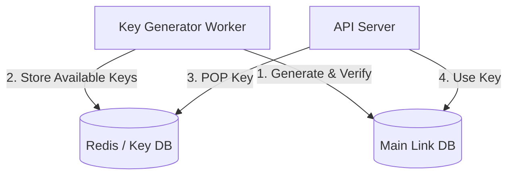

# Article 7: Deep Dive - ID Generation & Hashing Strategies

## The "Collision" Problem

The most critical algorithmic challenge in a URL shortener is generating the `short_code`.
If two users get the same code, one link breaks. If the generation is slow, the write-latency spikes.

We need a strategy that is:
1.  **Unique**: Zero collision probability.
2.  **Short**: Ideally 6-7 characters.
3.  **Distributed**: Can be generated by 100 servers simultaneously without coordination.

---

## Strategy A: The "Random String" (Naive Approach)

### The Algorithm
1.  Generate a random 7-character string using `[A-Z, a-z, 0-9]`.
2.  Check Database: `SELECT count(*) FROM links WHERE code = $code`.
3.  If `0`, Insert.
4.  If `> 0` (Collision), Loop back to Step 1.

### The Problem
As your database fills up, the probability of collision increases (The Birthday Paradox).
*   At 1M links: ~0% chance.
*   At 100B links: High chance.
*   **Result**: Latency becomes unpredictable. A request might need 1 query (fast) or 5 queries (slow) to find a free slot.

---

## Strategy B: Hashing the URL (MD5/SHA)

### The Algorithm
1.  Hash the long URL: `MD5("https://google.com")` -> `a1b2c3d4...` (32 chars).
2.  Truncate to 7 characters: `a1b2c3d`.

### The Problem
1.  **Collisions**: Truncating a hash destroys its uniqueness properties. Using only the first 7 chars of MD5 effectively reduces the space significantly.
2.  **Input Sensitivity**: Two users might shorten the *same* URL.
    *   User A shortens `google.com` -> `a1b2c3d`.
    *   User B shortens `google.com` -> `a1b2c3d`.
    *   We cannot distinguish between User A's link and User B's link (if we need to track them separately).
    *   *Fix*: Add a "salt" or User ID to the hash input? `MD5(url + userId)`.

---

## Strategy C: Base62 Conversion (The Mathematical Approach) ⭐ Recommended

This strategy treats the `short_code` not as a string, but as a **Number** displayed in a different format.

### The Concept
*   **Base10 (Decimal)**: Uses digits `0-9`.
*   **Base62**: Uses `0-9`, `a-z`, `A-Z`.

We simply convert a unique **Database Auto-Increment ID** into Base62.

| Database ID (Base10) | Base62 Short Code |
| :--- | :--- |
| 1 | `1` |
| 100 | `1C` |
| 1,000,000 | `4c92` |
| 999,999,999,999 | `1tclXv` |

### The Algorithm
```python
def encode(num):
    alphabet = "0123456789abcdefghijklmnopqrstuvwxyzABCDEFGHIJKLMNOPQRSTUVWXYZ"
    if num == 0:
        return alphabet[0]
    arr = []
    base = len(alphabet)
    while num:
        num, rem = divmod(num, base)
        arr.append(alphabet[rem])
    arr.reverse()
    return ''.join(arr)

# Example: encode(1000000) -> "4c92"
```

### The Challenge: Distributed ID Generation
This works perfectly if you have **ONE** database generating IDs (1, 2, 3...).
But what if you have sharded databases? You might get ID `100` from DB-1 and ID `100` from DB-2. Now you have a collision (`1C` vs `1C`).

### Solution: Snowflake IDs or Ranges
We need a **Distributed Unique ID Generator**.
1.  **Twitter Snowflake**: Generates sortable, unique 64-bit integers based on Time + Machine ID.
    *   Server A (ID 1) generates: `[Timestamp][001][Sequence]`
    *   Server B (ID 2) generates: `[Timestamp][002][Sequence]`
    *   Result: Unique numbers across all servers.
2.  **Range Allocation**:
    *   A central "Coordinator" (ZooKeeper/Etcd) assigns ranges.
    *   Server A gets range `1,000,000 - 2,000,000`. It generates IDs locally in memory.
    *   Server B gets range `2,000,000 - 3,000,000`.
    *   Fast, zero-coordination during runtime.

---

## Strategy D: Key Generation Service (KGS) (The "Pre-Gen" Approach)

### The Algorithm
Why generate keys *during* the request? Let's verify and generate them beforehand.

1.  **Offline Worker**: Generates random 6-char strings, checks DB for uniqueness, and stores them in a "Key DB" (or Redis set).
2.  **Application**: When a user wants a link:
    *   `POP` a key from the Key DB.
    *   Use it.
    *   Mark it as "used".

### Architecture


### Trade-offs
*   **Pros**: Lowest possible latency. Zero collisions guaranteed at runtime.
*   **Cons**: Complexity. You must ensure you don't lose keys if the KGS crashes (need backups). You must handle concurrency (two servers popping same key).

---

## Summary Recommendation

For the **System Design Interview**, the strongest answer combines **Strategy C (Base62)** with **Snowflake IDs**.

1.  It is **mathematically proven** to be unique.
2.  It is **Distributed** (Snowflake handles multi-server).
3.  It produces **Sortable** IDs (useful for "Get latest links").
4.  It avoids the operational overhead of maintaining a separate Key Generation Service (KGS).

### Interview Soundbite
> "I recommend using a distributed ID generator like Twitter Snowflake to create unique 64-bit integers. We then convert these integers to Base62 to get our compact short strings. This guarantees uniqueness across our sharded architecture without the latency penalty of checking the database for collisions."
